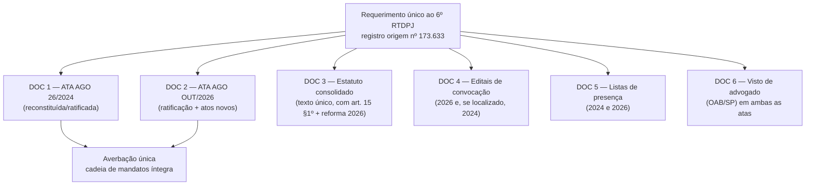
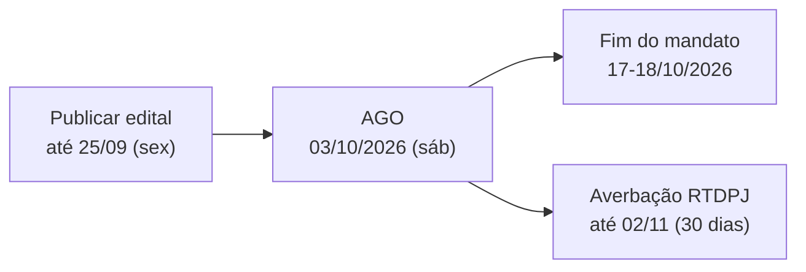

# ⚖️ Análise Integral do Estatuto + Reforma Estatutária para a AGO de Outubro/2026

> **Base:** texto integral do Estatuto Social (38 artigos) lido a partir do arquivo
> `PROJETO AME - ESTATUTO - 20240626_181102_OCR.pdf` (6 págs., OCR Adobe Paper Capture,
> `F:\OneDrive\Projeto A.M.E\01_Institucional_e_Legal\ATA E ESTATUTO ATUAL\`).
> **Complemento:** ATA da AGO de 04/10/2024 (texto integral extraído do `.docx`) e
> Requerimento de Averbação ao 6º RTDPJ (registro de origem nº 173.633).
>
> ⚠️ **Ressalva técnica:** o texto abaixo foi reconstruído por OCR de documento digitalizado.
> Números de artigo e parágrafos conferem com o Parecer de 09/09/2026, mas a **numeração
> romanográfica** (I, II, III) aparece corrompida no OCR (lida como `1`, `li`, `Ili`).
> Toda alteração proposta aqui **exige conferência e visto de advogado antes de ir a plenário.**

---

## 1. Parecer sobre a ratificação da ATA de 04/10/2024

### 1.1 A pergunta

> *"A ratificação da ATA de 04/10/2024 permite regularizar a lacuna que ficou por não termos
> registrado no tempo certo? E entregamos as duas juntas agora?"*

### 1.2 Resposta curta

**Sim, a ratificação é o caminho correto — mas ela não substitui o edital de 2024, e as duas atas
devem ser averbadas no mesmo requerimento.** A ratificação **não retroage** para "consertar" o
prazo perdido; ela **produz um novo título registrável**, gerado em assembleia regularmente
convocada, que **confirma e convalida** os atos de 2024.

### 1.3 Por que a ratificação funciona (e por que não basta)

| Pergunta | Resposta |
|---|---|
| Pode-se averbar a ata de 2024 hoje? | **Não diretamente.** Falta o **edital de convocação** da AGO de 04/10/2024, exigido como anexo do próprio requerimento. Sem ele o Oficial indefere por falta de prova da regularidade da convocação. |
| A ata de 2026 "cura" o vício de 2024? | **Cura o efeito, não o ato.** O registro em RTDPJ é **declarativo** e produz efeitos **ex nunc** (a partir do registro). O que a ratificação faz é dar **base registral nova** aos atos praticados, encerrando a insegurança quanto a eles. |
| Efeitos práticos: | Banco (Itaú — precedente da ATA 2020), convênios (SMPED/Prefeitura), Receita Federal (DBE) e parceiros passam a ter **prova da composição da diretoria** em título averbado. Dívidas/atos praticados pela diretoria 2024–2026 ficam cobertos pela aparência de mandato. |
| Risco residual | Se algum ato dependia de **autorização específica de assembleia** em 2024 e não a teve, a ratificação de 2026 **pode sanar** esse ponto — desde que **constem expressamente do edital de 2026** os itens a ratificar. Isso é o que se chama *convalidação por deliberação posterior*. |

### 1.4 Estrutura recomendada do requerimento conjunto

**Redação a incluir na ata de 2026 (cláusula de ratificação):**

> *"A Assembleia Geral, por unanimidade dos Associados Família presentes, **RATIFICA**, para todos
> os fins de direito, especialmente para fins de averbação no 6º Registro de Títulos e Documentos e
> Civil de Pessoa Jurídica, todos os atos praticados na Assembleia Geral Ordinária realizada em
> 04 de outubro de 2024 — a saber: (a) a aprovação da prestação de contas do período de outubro de
> 2022 a setembro de 2024; (b) a alteração do artigo 15, §1º do Estatuto Social; e (c) a eleição e
> posse da Diretoria Executiva para o mandato 2024–2026 —, **convalidando-os integralmente** e
> autorizando a lavratura e o registro da presente ata em conjunto com a ata daquela Assembleia,
> ratificando igualmente a composição da Diretoria nela eleita e os atos de gestão praticados no
> período de 19 de outubro de 2024 a 18 de outubro de 2026."*

### 1.5 Ação imediata obrigatória (paralela)

1. **Continuar a busca do edital de 04/10/2024** (e-mails, listas de WhatsApp, Google Drive,
   pastas de eventos de setembro/2024). Localizá-lo permite a **Via 1** (averbação direta) e reduz
   a dependência da ratificação.
2. **Confirmar o status/protocolo da averbação** no 6º RTDPJ — o requerimento existe **sem data
   de protocolo**, o que indica processo **não protocolado**.
3. **Solicitar à Dra. Marta Rizzi Daniel (OAB/SP 383.991)** ou a seu sucessor a entrega do acervo:
   protocolos, vistos anteriores e cópias averbadas.

---

## 2. Novo calendário da AGO (início de outubro/2026)

### 2.1 Restrição dura

O **mandato 2024–2026 encerra em 17 ou 18 de outubro de 2026** (a ATA de 2022 fixou o biênio
anterior como 19/10/2022 a 18/10/2024; a ATA de 2024 elegeu o mandato sem datas explícitas). A AGO
deve ocorrer **antes desse marco** — sem assembleia, a Diretoria fica sem mandato vigente.

### 2.2 Aritmética do prazo (art. 14, §2º — **antecedência mínima de 7 dias**)

| Marco | Data | Observação |
|---|---|---|
| **Fechar ordem do dia + minutas** | **23–24/09** | Última janela para decidir o conteúdo do edital |
| **Advogado revisa edital, ata e estatuto** | **22–24/09** | Precisa do visto para ambas as atas |
| **Publicar o edital** (sítio + afixação na sede) | **até 25/09 (sex)** | 8 dias antes → cumpre os 7 dias com margem |
| Envio por e-mail/WhatsApp + arquivo de comprovantes | 25–26/09 | Prova complementar |
| Prestação de contas out/2024–set/2026 fechada | **até 30/09** | Insumo obrigatório da pauta |
| **AGO — 1ª convocação 14h / 2ª convocação 14h30** | **03/10/2026 (sáb)** | Mesmo dia da semana do histórico (AGO 2022 = sábado) |
| Lavratura, assinaturas e **averbação no 6º RTDPJ** | **06–09/10** | Prazo legal: 30 dias após a assinatura |
| Posse do novo mandato / transição | **até 17/10** | Antes do fim do mandato atual |
| Publicação em Transparência (site) | **out/2026** | Atas, estatuto consolidado, balanços e edital |

**Alternativas caso 03/10 não seja viável:**

| Data da AGO | Publicar o edital até |
|---|---|
| 03/10/2026 (sáb) | **25/09/2026** ← recomendada |
| 10/10/2026 (sáb) | 02/10/2026 |
| 14/10/2026 (qua) | 06/10/2026 ← **limite extremo** (3 dias antes do fim do mandato) |

> ⚠️ **Alerta:** quanto mais próxima do dia 17/10, maior o risco de a entidade atravessar a
> virada de mandato **sem ata averbada**, repetindo exatamente o problema de 2024.

---

## 3. Situação atual do quadro social e a alavanca de quórum

### 3.1 O achado que muda o jogo

O **art. 8º, §1º** do Estatuto vigente é expresso:

> *"**Votar é direito restrito aos associados família**."*

Isso significa que **só os Associados Família votam**. Honorários e Mantenedores participam,
contribuem, podem ser votados (art. 8º, III) — mas **não votam**.

### 3.2 Efeito prático sobre o quórum (art. 13, §1º)

| Cenário | Base de Associados Família | Presença mínima (30%) | Deliberação (50%+1 dos presentes) |
|---|---|---|---|
| **Quadro restrito aos fundadores** (5 pessoas) | 5 | **2 pessoas** | **2 votos** |
| Quadro com 10 famílias | 10 | 3 pessoas | 3 votos |
| Quadro com 30 famílias | 30 | 9 pessoas | 5 votos |

> ✅ **Conclusão estratégica:** manter a AGO de outubro com o quadro social **ainda restrito aos
> fundadores/Associados Família já reconhecidos** torna o quórum **plenamente alcançável e
> juridicamente defensável** — inclusive para **alteração estatutária**, que exige o quórum
> qualificado do art. 13, §1º.
>
> ⚠️ **Mas há um efeito colateral:** se aprovarem a reforma e as admissões **na mesma assembleia**,
> a base de quórum se amplia. **Ordem dos trabalhos obrigatória:** (1) instalar a assembleia com a
> base **atual**; (2) aprovar as **alterações estatutárias**; (3) aprovar o **Regimento Interno**;
> (4) **só então** referendar as admissões. Consignar esse critério na ata.

### 3.3 Situação cadastral atual (o problema a resolver)

| Fonte | Registros | Categorização estatutária |
|---|---|---|
| Tabela `usuarios` (VPS1) | 107 | ❌ inexistente |
| Tabela `candidatos` (VPS1) | 112 | ❌ inexistente |
| **Livro de Associados** | **0** | ❌ **não existe** |
| Associados Fundadores (Ata de Constituição 2018) | 5 | ⚠️ categoria extinta no estatuto vigente |

**Associados Fundadores nominados na Ata de Constituição (02/08/2018):**
Paulo Addair Daniel Filho · Jorge Antonio Villalobos Briones · Regina Aparecida Justo Daniel ·
Maria de Lourdes Campos Bistafa · Alessandro Martins de Oliveira

**Presentes na AGO de 04/10/2024 (13 nomes):** Adriane Russo de Mendonça Chiocchetti ·
Hedila do Carmo Giovedi · Jorge Luiz Pelarin · José Pires Araújo Jr. · Maria de Lourdes Campos
Bistafa · Maria Elisa Provenzano · Mena Teixeira · Nilceli Santos Silva · Paulo Addair Daniel
Filho · Regina Aparecida Justo Daniel · Rejane Sampaio · Rosely Carollo Hernandes ·
Solange Aparecida Brigo

> 🔎 **Trabalho pendente:** cruzar as duas listas, classificar cada nome como **Associado Família**
> (pai/mãe/responsável direto de atendente) ou **Honorário**, e produzir o **Livro de Associados**
> com data de admissão. É o documento que sustenta o quórum perante o RTDPJ.

---

## 4. Análise artigo por artigo do Estatuto vigente (38 artigos)

### 4.1 Mapa estrutural

| Capítulo | Artigos | Situação |
|---|---|---|
| Denominação, Sede e Duração | 1º–2º | ⚠️ Endereço desatualizado (Av. Paula Ferreira, 2571 — Pirituba) |
| Objeto | 3º–5º | ⚠️ Objeto restrito a "Síndrome de Down"; falta previsão de geração de receita própria |
| **Associados** | **6º–10º** | 🔴 **Núcleo do problema** — sem Livro, sem Regimento, sem ingresso regulado |
| Administração | 11 | ⚠️ Veda cargo público à Diretoria; trabalho voluntário não remunerado |
| **Assembleia Geral** | **12–14** | 🔴 Sem previsão eletrônica/híbrida; conflito Diretoria × Conselho Consultivo |
| **Diretoria** | **15–23** | 🔴 Veda parentes na mesma Diretoria; nomenclatura inconsistente |
| **Conselho Fiscal** | **24–25** | 🔴 Vago desde out/2024; composição "associados ou não" é atípica |
| **Conselho Consultivo** | **26** | 🔴 Nunca constituído; sem presidente definido; sem atribuições |
| Patrimônio | 27–32 | ✅ Adequado; falta previsão de receita de produtos/licenciamento |
| Prestação de Contas | 33 | ✅ Bom (já exige publicidade e auditoria externa) |
| Exercício Social | 34–35 | ✅ Ano civil (1º/jan a 31/dez) |
| Disposições Gerais | 36–38 | ✅ Vedação à distribuição de resultados; foro de SP |

---

## 5. PROPOSTA DE REFORMA ESTATUTÁRIA

> **Como usar:** cada item traz **artigo**, **texto atual**, **problema** e **redação proposta**.
> O bloco **6. Ata de alterações** deste documento serve de base ao edital — que precisa listar
> **artigo por artigo** o que será alterado (convocação específica).

### BLOCO I — Objeto e finalidade (art. 3º e 4º)

| # | Artigo | Texto atual | Problema | Redação proposta |
|---|---|---|---|---|
| **I.1** | Art. 3º | "promover a inclusão através do trabalho **prioritariamente** às pessoas com Síndrome de Down" | Imprecisão sobre o público e ausência de autorização para **gerar receita própria** (álbuns, produtos, licenciamento) | Manter o público prioritário e **acrescentar** que a Associação pode, para custeio das finalidades, *"desenvolver atividades econômicas acessórias e meios próprios de arrecadação — inclusive a comercialização de publicações, materiais, álbuns, produtos personalizados e o licenciamento de sua marca —, cujos resultados serão integralmente aplicados nos objetivos institucionais, vedada qualquer distribuição de resultados."* |
| **I.2** | Art. 4º, VI | "solicitar e receber recursos e contribuições de pessoas físicas e jurídicas" | Não prevê **patrocínio** com contrapartida de divulgação, **crowdfunding** nem **termos de fomento/concessão de uso de espaço** | Ampliar para incluir *"patrocínio, co-patrocínio, apoio institucional e doações de qualquer natureza, observada a legislação aplicável; campanhas de financiamento coletivo; termos de fomento, colaboração e parcerias (Lei 13.019/2014); concessões, comodatos e permissões de uso de bens e espaços públicos ou privados."* |
| **I.3** | **novo** | — | Ausência total de previsão sobre **marca, propriedade intelectual e uso de imagem** — bloqueia o licenciamento de mochilas, necessaires, cadernos, agendas, álbuns de figurinhas e portfólios | Criar **artigo novo** (sugestão: art. 4º-A) — ver Bloco VI. |
| **I.4** | Art. 4º, §5º | "deverá ter um Regimento Interno que, aprovado em Assembleia Geral, disciplinará o seu funcionamento" | Base existe e é boa — **mas o Regimento nunca foi feito** | Manter; **aprovar o Regimento Interno na AGO** (peça em elaboração). |

### BLOCO II — Sede, denominação e agilidade operacional

| # | Artigo | Problema | Redação proposta |
|---|---|---|---|
| **II.1** | Art. 1º | Endereço físico fixo (Av. Paula Ferreira, 2571). Toda mudança exige **alteração estatutária + averbação**. Além disso, o art. 14, §2º exige **afixação na sede** — e a associação opera de forma itinerante (WTC, SENAI, Sheraton) | Alterar para: endereço atual **mais** a cláusula *"podendo a Diretoria, sem necessidade de alteração estatutária, deliberar e comunicar a mudança de endereço dentro do mesmo Município, averbando-se a comunicação"*; e acrescentar **"sede eletrônica"** — *"a Associação mantém sede eletrônica no endereço https://www.projetoame.org, onde serão publicados todos os atos cuja publicidade seja exigida por lei ou por este Estatuto."* |
| **II.2** | Art. 1º | Cita "abrir, manter e encerrar estabelecimentos de apoio" — ok | Manter. |
| **II.3** | Art. 2º | Prazo indeterminado | Manter. |

### BLOCO III — Quadro social (arts. 6º–10º) — **o coração da reforma**

| # | Artigo | Problema | Redação proposta |
|---|---|---|---|
| **III.1** | Art. 6º | Categorias atuais (Família / Honorário / Mantenedor) são **adequadas**. Falta previsão de **Associado Fundador** (categoria histórica extinta em 2018) e de **Associado Atendente** (protagonismo do público-alvo) | Manter as 3 categorias e acrescentar: *"§ Parágrafo único — Os sócios que subscreveram a Ata de Constituição de 02 de agosto de 2018 são reconhecidos como **Associados Fundadores**, título de caráter honorífico e histórico, registrado no Livro de Associados, sem prerrogativa de voto distinta da de sua categoria de origem."* |
| **III.2** | Art. 6º, §1º | Remete ingresso ao **Regimento Interno** — que não existe → **não há como admitir ninguém regularmente** | Manter a remissão **e** fixar o **núcleo mínimo no Estatuto** (segurança jurídica): admissão por **proposta escrita à Diretoria + aprovação em Assembleia Geral**, com registro em **Livro de Associados** com número, data, categoria e termo de associação assinado. |
| **III.3** | Art. 7º | Rol de deveres é **curto demais**: falta **contribuição** (se houver), **comparecimento às assembleias**, **sigilo sobre dados de atendentes** (LGPD) e **respeito à imagem** dos atendentes e famílias | Ampliar com: *"IV – contribuir, quando aplicável, com a contribuição social fixada pela Assembleia; V – comparecer às Assembleias Gerais, justificando a ausência; VI – guardar sigilo sobre dados pessoais e sensíveis de atendentes, famílias e terceiros de que venha a ter conhecimento em razão da condição de associado; VII – zelar pela imagem, privacidade e dignidade dos atendentes e de seus responsáveis."* |
| **III.4** | Art. 8º | Rol de direitos: participar das atividades, participar das assembleias, ser votado. **Falta o direito de votar como inciso expresso** (está só no §1º) e falta **voz** em assembleia para não-votantes | Reescrever: *"I – participar das atividades; II – comparecer e **usar da palavra** nas Assembleias Gerais; III – **votar**, nos termos do §1º; IV – ser votado para cargos da administração, nos termos do art. 15; V – requerer informações sobre a gestão e examinar os registros contábeis e as demonstrações financeiras, na forma do art. 4º, §3º."* |
| **III.5** | Art. 8º, §1º | *"Votar é direito restrito aos associados família"* — **cláusula boa** (garante que o controle fica com as famílias). **Mas** ela é a razão pela qual o quórum é hoje baixo | **MANTER** (é proteção institucional). Acrescentar §2º: *"Cada Associado Família tem direito a **um voto**, sendo vedada a representação por procuração, salvo…"* — ver Bloco IV.4 sobre voto por procuração/eletrônico. |
| **III.6** | Art. 9º | Desligamento "conforme o Regimento Interno" — Regimento inexistente | Estabelecer: *"por comunicação escrita à Diretoria, com efeitos a partir do protocolo, sem prejuízo das contribuições vencidas; o desligamento será averbado no Livro de Associados."* |
| **III.7** | Art. 10, §1º | Exclusão decidida pelo **"Conselho de Administração"** — **órgão que não existe** no estatuto (é a Diretoria) | Substituir "Conselho de Administração" por **"Diretoria"**, com **apuração prévia em processo com contraditório e prazo de defesa de 15 dias**. |
| **III.8** | Art. 10 | **Faltam** hipóteses de **suspensão** (medida mais branda) e o **registro da exclusão** no Livro | Acrescentar suspensão temporária e a averbação no Livro de Associados. |
| **III.9** | **novo** | Não há previsão de **Associado Pessoa Jurídica** apoiador com **direito a voto** — correto, mas falta clareza sobre **participação em conselhos** | Deixar expresso: *"Associados Honorários e Mantenedores, inclusive pessoas jurídicas, podem integrar o Conselho Consultivo (art. 26), sem direito a voto."* |

### BLOCO IV — Assembleia Geral (arts. 12–14) — **agilidade**

| # | Artigo | Problema | Redação proposta |
|---|---|---|---|
| **IV.1** | Art. 13, III e IV | Fala em **"Conselho de Administração"** — órgão inexistente. Gera dúvida sobre o que a assembleia elege | Substituir por **"Diretoria Executiva (art. 15)"** em **todo** o estatuto; padronizar nomenclatura (achado 6.7 do parecer anterior). |
| **IV.2** | Art. 13, V | *"apreciar o relatório anual do Conselho de Administração"* | Trocar por **"apreciar e aprovar o relatório anual de atividades e as contas da Diretoria, precedidos de parecer do Conselho Fiscal (art. 25)"**. |
| **IV.3** | Art. 13 | **Falta** competência para: aprovar o **Regimento Interno**; aprovar **políticas institucionais** (LGPD, uso de imagem, transparência, conflito de interesses); **referendar** conselheiros; **fixar contribuições**; **autorizar licenciamento de marca e contratos de longo prazo**; **ratificar atos** de gestões anteriores | Acrescentar incisos: *(viii)* aprovar e alterar o **Regimento Interno** e os **regimentos, políticas e códigos** institucionais; *(ix)* **referendar** os membros do Conselho Consultivo (art. 26) e eleger o Conselho Fiscal (art. 24); *(x)* **fixar as contribuições** dos associados; *(xi)* autorizar **contratos de licenciamento de marca, patrocínio e exploração de produtos** com prazo superior a 24 meses ou valor superior a limite fixado em Assembleia; *(xii)* **ratificar, convalidar ou retificar** atos de assembleias e gestões anteriores. |
| **IV.4** | Art. 14, §2º | 🔴 **Só prevê edital físico** ("afixação na sede") + sítio. Não permite **convocação por e-mail/WhatsApp**, o que num quadro social disperso é o gargalo prático | Reescrever: *"As Assembleias Gerais serão convocadas pelo Presidente e, na sua falta, por qualquer outro Diretor ou pelo Conselho Fiscal (art. 25, V), mediante **edital publicado na sede eletrônica da Associação (sítio) e afixado na sede**, com **antecedência mínima de 10 (dez) dias**, e **complementarmente comunicado a todos os associados por meio eletrônico** (correio eletrônico, aplicativo de mensagens ou carta com aviso de recebimento), no qual constará a **ordem do dia, data, hora e local/formato** de realização. **§** A comprovação da publicação e dos envios será arquivada pela Secretaria."* |
| **IV.5** | Art. 14, caput | 🔴 **Conflito real:** a assembleia é presidida pelo **Presidente do Conselho Consultivo** — órgão **nunca constituído**. E o art. 17, IV diz que compete ao **Presidente** "convocar e presidir reuniões e assembleias". Insustentável na prática | Reescrever: *"A Assembleia Geral será **instalada e presidida pelo Presidente da Diretoria Executiva** e, na sua ausência ou impedimento, pelo Diretor Administrativo e, na ausência deste, por associado eleito na hora entre os presentes. **§** O **Presidente do Conselho Consultivo**, quando constituído, terá assento na mesa e fará a abertura dos trabalhos, sem prejuízo da condução e do voto de desempate, que cabem ao presidente da mesa."* |
| **IV.6** | Art. 14 | **Não há previsão de assembleia híbrida ou 100% eletrônica**, nem de **votação eletrônica**, nem de **voto por procuração**. O histórico de 2020 já foi 100% virtual (por causa da pandemia) e a de 2024 foi híbrida | Acrescentar §: *"As Assembleias Gerais poderão ser realizadas de forma **presencial, híbrida ou integralmente eletrônica**, por videoconferência ou plataforma digital que permita a identificação dos participantes, a manifestação e a **votação em tempo real**, cuja gravação será arquivada pela Secretaria. **§** Será admitido o **voto por procuração** outorgada a outro Associado Família, com poderes específicos e prazo de validade de 30 (trinta) dias, limitada a **uma procuração por procurador**, mediante instrumento arquivado na Secretaria."* |
| **IV.7** | Art. 14, §3º | Instalação: maioria absoluta em 1ª convocação, qualquer número na seguinte — **adequado** | Manter. Acrescentar **horários distintos** no edital (ex.: 1ª às 14h, 2ª às 14h30) para viabilizar a 2ª chamada. |
| **IV.8** | Art. 14, §1º | Voto de desempate do presidente da mesa — **adequado** | Manter (com o ajuste de IV.5). |
| **IV.9** | Art. 13, §1º | Quórum qualificado (50%+1 dos Associados Família presentes, mínimo 30% de presença) — **adequado e protetivo** | Manter. Acrescentar: *"§ O quórum será aferido com base no **Livro de Associados** na data de publicação do edital."* |

### BLOCO V — Diretoria (arts. 15–23)

| # | Artigo | Problema | Redação proposta |
|---|---|---|---|
| **V.1** | Art. 15, §1º | Texto do OCR: **"5 membros Associados Família"** (todos). A AGO de 04/10/2024 alterou para **"até 5, pelo menos 4 Associados Família + até 1 Honorário (vedado presidir)"** — **alteração ainda NÃO averbada**. O estatuto vigente registrado, portanto, **ainda exige 5 Família** | 🔴 **Urgente.** Promover **alteração estatutária expressa** (não apenas ratificação) fixando: *"A Diretoria Executiva será composta por **até 5 (cinco) membros**, todos eleitos em Assembleia Geral, sendo **no mínimo 4 (quatro) Associados Família** e **até 1 (um) Associado Honorário**, vedado a este último ocupar o cargo de Presidente, permitida a reeleição."* Assim a composição atual (Paulo, Jorge, José Pires, Solange, Alessandra) fica **definitivamente regular**. |
| **V.2** | Art. 15, §2º | 🔴 *"Na composição da Diretoria não poderá haver membros de uma mesma família."* **Regra provavelmente violada hoje** (Paulo Addair Daniel Filho e Regina Aparecida Justo Daniel são cônjuges; e há vínculo com Luiz Renato Justo Daniel) e **muito restritiva** para uma OSC familiar | 🔴 **Alterar** para: *"É vedada a participação de **mais de 2 (dois) membros de uma mesma família** na Diretoria, assim entendidos cônjuges, companheiros, parentes em linha reta e irmãos, sendo que **ao menos 2 (dois) cargos deverão ser ocupados por membros de famílias distintas**."* — preserva a pluralidade sem inviabilizar a composição. |
| **V.3** | Art. 11, §3º | 🔴 *"Não poderão ser eleitos para os cargos de diretoria os associados que exerçam cargos, empregos ou funções públicas junto aos órgãos do Poder Público."* — regra amplíssima, pode **excluir voluntários qualificados** (professores da rede pública, servidores municipais) e criar nulidade futura | **Atenuar** para impedimento **específico de conflito**: *"Não poderão ser eleitos para a Diretoria os associados que exerçam cargo, emprego ou função pública **com competência para celebrar, fiscalizar ou aprovar convênios, parcerias, contratos ou repasses em favor da Associação**, nem os que tenham **interesse conflitante** com o da Associação."* |
| **V.4** | Art. 15, §3º | 5 cargos fixos (Presidente, Administrativo, Financeiro, Parcerias, Capacitação). **Não prevê** Vice-Presidente, Secretário, Comunicação/Captação — e a prática já usa "Diretora de Captação" (ata de 2024 menciona "diretora de captação Solange Brigo") **sem previsão estatutária** | Acrescentar: *"§ A Assembleia poderá criar, por proposta da Diretoria, **até 2 (dois) cargos adicionais** ou **diretorias adjuntas sem direito a voto**, para atender necessidades de gestão, comunicação, captação de recursos ou projetos."* — Resolve o descasamento entre estatuto e prática sem exigir nova reforma a cada mudança. |
| **V.5** | Art. 16, Parágrafo Único | Diretoria reúne-se "no mínimo trimestralmente" — **rigidez desnecessária** para uma OSC com rotina semanal | Manter periodicidade mínima de **1 (uma) reunião por trimestre**, mas **permitir reunião por videoconferência** e **deliberação por maioria simples com registro em ata assinada eletronicamente**. |
| **V.6** | Art. 17, IV | "convocar e presidir reuniões e assembleias" — 🔴 **conflita com o art. 14, caput** (presidida pelo Conselho Consultivo) | Harmonizar conforme IV.5. |
| **V.7** | Art. 16 | **Falta** competência para: gerir **marca e propriedade intelectual**; contratar **licenciamentos**; **captar recursos e patrocínios**; manter **portal de transparência**; designar **Encarregado (DPO)**; editar **políticas internas** | Acrescentar incisos: *(vi)* zelar pelo patrimônio imaterial, **marca**, nome, imagem e demais direitos de propriedade intelectual, podendo licenciá-los mediante aprovação da Assembleia quando exigido pelo art. 13; *(vii)* captar recursos, patrocínios e parcerias; *(viii)* manter atualizado o **portal de transparência** (art. 33, §); *(ix)* designar o **Encarregado pelo Tratamento de Dados Pessoais (DPO)** e zelar pelo cumprimento da LGPD; *(x)* editar **políticas, códigos e regimentos internos** de caráter operacional, submetendo-os à Assembleia quando exigido. |
| **V.8** | Art. 22 | "Todos os atos e documentos que importem responsabilidade ou obrigação da Associação serão necessariamente assinados por dois Diretores" | ⚠️ **Fricção operacional real** (contas, e-mails, contratos de evento, redes sociais). Manter a regra para atos patrimoniais e financeiros e **flexibilizar** para atos de rotina: *"…salvo os atos de **gestão ordinária** e de valor inferior ao limite fixado anualmente pela Diretoria, que poderão ser praticados por um único Diretor, com prestação de contas na reunião seguinte."* 💡 Acrescentar **assinatura eletrônica/digital** como forma válida. |
| **V.9** | Art. 19, III | "sendo requerido duas assinaturas eletrônicos para movimentações" — texto truncado/erro de OCR | Corrigir redação: *"movimentar contas e aplicar recursos, em conjunto com outro Diretor, exigindo-se duas assinaturas para toda movimentação financeira"*. |
| **V.10** | **novo** | **Falta** disciplina de **conflito de interesses**, **sigilo/confidencialidade** dos diretores e **responsabilidade** por atos de gestão | Criar artigo: *"Os Diretores e Conselheiros devem declarar e abster-se de votar em matérias nas quais tenham interesse conflitante com o da Associação, registrando-se a abstenção em ata; respondem pelos atos de gestão nos termos da lei, ficando obrigados a guardar sigilo sobre dados pessoais e sensíveis de atendentes e familiares."* |

### BLOCO VI — Marca, imagem, produtos e licenciamento (**artigo novo — Bloco VI**)

> Este é o **coração da viabilização econômica** pedida: álbuns, portfólios, mochilas, necessaires,
> cadernos, agendas, álbum de figurinhas, licenciamento de marca. Hoje **nada disso tem base
> estatutária**.

**Proposta de art. 4º-A (ou art. 28-A, no capítulo Patrimônio):**

> **Art. 4º-A.** Constituem **ativos institucionais** da Associação, protegidos e geridos nos termos
> deste Estatuto: (i) a **marca** "Projeto AME" / "Atendentes Muito Especiais" e suas variações
> nominativas e figurativas, depositada e/ou registrada junto ao **INPI**, e os demais sinais
> distintivos; (ii) o **nome empresarial** e o domínio `projetoame.org` e correlatos; (iii) os
> **direitos autorais** sobre obras, publicações, fotografias, vídeos, metodologias, cursos,
> currículos, **álbuns, revistas e portfólios** produzidos pela Associação ou a ela cedidos;
> (iv) os **direitos de imagem** obtidos por **termo de consentimento** de atendentes e
> responsáveis.
>
> **§ 1º** A Associação poderá **licenciar a terceiros**, com ou sem exclusividade, o uso de sua
> marca e de seus ativos institucionais para a produção e comercialização de produtos — entre eles
> **mochilas, necessaires, cadernos, agendas, vestuário, publicações e álbuns de figurinhas** —
> mediante contrato escrito que assegure: (a) **destinação integral dos resultados** aos objetivos
> institucionais; (b) **controle de qualidade e aprovação prévia** de peças pela Diretoria;
> (c) **prazo, território e remuneração** definidos; e (d) **vedação de uso** que exponha,
> ridicularize ou explore indevidamente a imagem dos atendentes.
>
> **§ 2º** A **comercialização de produtos, publicações e serviços** pela própria Associação é
> admitida como **atividade acessória de arrecadação**, desde que: (a) não constitua o objeto
> principal; (b) não implique distribuição de resultados a associados, diretores ou conselheiros
> (art. 36); e (c) tenha seus resultados escriturados e demonstrados separadamente, à disposição
> do Conselho Fiscal e da Assembleia.
>
> **§ 3º** Os **contratos de licenciamento de marca** com prazo superior a **24 (vinte e quatro)
> meses** ou valor anual superior ao limite fixado em Assembleia dependem de **autorização prévia
> da Assembleia Geral** (art. 13).
>
> **§ 4º** O uso de **imagem de atendente** — inclusive em produtos, redes sociais, site, material
> de captação e portfólios — depende de **termo de consentimento específico**, assinado pelo
> próprio atendente quando capaz e por seu responsável legal, com **finalidade, prazo e canais
> delimitados**, revogável a qualquer tempo.
>
> **§ 5º** A Associação manterá **registro atualizado** de seus ativos de propriedade intelectual,
> com número de processo no INPI, vigência e contratos de licenciamento, apresentado anualmente à
> Assembleia.

### BLOCO VII — Conselho Fiscal (arts. 24–25)

| # | Artigo | Problema | Redação proposta |
|---|---|---|---|
| **VII.1** | Art. 24 | Composição "**associados ou não**" — atípica e dispensável; e **o órgão está vago desde out/2024** (a AGO de 2024 elegeu só a Diretoria) | 🔴 **Eleger 3 efetivos + 1 suplente em 03/10/2026.** Manter a composição, **preferindo associados**, e vedar membros da Diretoria: *"Os membros do Conselho Fiscal não poderão ser membros da Diretoria, nem seus cônjuges, parentes em linha reta, colaterais até 2º grau ou companheiros."* |
| **VII.2** | Art. 24 | Mandato "coincidente com o da Diretoria" — **ambíguo** quanto a eleição em separado e recondução | Explicititar: *"…eleitos pela Assembleia Geral, **em eleição distinta da eleição da Diretoria**, permitida a recondução, com mandato coincidente com o da Diretoria."* |
| **VII.3** | Art. 25 | Atribuições boas. **Falta** prazo para o **parecer sobre as contas** e previsão de **reuniões** | Acrescentar: *"§ O Conselho Fiscal reunir-se-á ordinariamente **antes** da Assembleia Geral Ordinária, para emitir **parecer** sobre as contas e o relatório do exercício, e extraordinariamente quando convocado por qualquer de seus membros, pela Diretoria ou pela Assembleia."* |
| **VII.4** | Art. 24/25 | **Falta** cláusula de **vacância**: se um efetivo se ausentar, o suplente assume; sem isso, o órgão pode ficar sem quórum | Acrescentar: *"Em caso de vacância, impedimento ou ausência de membro efetivo, assumirá o **suplente**; vagando a maioria dos cargos, a Diretoria convocará **Assembleia Geral Extraordinária** em até 30 dias para recompor o órgão."* |
| **VII.5** | Art. 25, §2º | Permite servidor público no Conselho Fiscal, vedada remuneração. **Manter** (é flexibilização útil) | Manter. |

### BLOCO VIII — Conselho Consultivo (art. 26) — **regularização obrigatória**

| # | Artigo | Problema | Redação proposta |
|---|---|---|---|
| **VIII.1** | Art. 26 | 🔴 **Órgão previsto, com mandato e composição, mas nunca constituído** — e o art. 14, caput, dava-lhe a **presidência da assembleia**. Fonte de questionamento de qualquer ata | **Constituir e referendar na AGO de 03/10/2026**, com **ata específica** e **termo de aceite** dos membros. Resolver a sequência: o **Presidente da Diretoria conduz o item de constituição** e, **após o referendo**, o presidente do Conselho Consultivo passa a integrar a mesa. |
| **VIII.2** | Art. 26 | 🔴 **Não define quem preside o Conselho Consultivo** — omissão que trava a aplicação do art. 14 | Acrescentar: *"O Conselho Consultivo será presidido por **membro eleito pelos seus pares**, na primeira reunião após o referendo da Assembleia, para mandato coincidente com o da Diretoria."* |
| **VIII.3** | Art. 26 | 🔴 **Não define as atribuições** do Conselho Consultivo (só diz que é **não deliberativo** e **sem voto**) | Acrescentar: *"Compete ao Conselho Consultivo **emitir pareceres e recomendações**, sugerir parcerias e patrocínios, contribuir com a captação de recursos e representar institucionalmente a Associação nos setores econômicos que representa, **sem caráter deliberativo e sem direito a voto**."* |
| **VIII.4** | Art. 26, §2º | "Integram automaticamente os **Ex-Presidentes**" — **sem definir** se o ex-presidente que se desligou do quadro social permanece; a **ex-presidente** citada por Paulo precisa ser formalmente integrada | Acrescentar: *"§ Os Ex-Presidentes integram o Conselho Consultivo **automaticamente**, independentemente de nova referendo, pelo prazo de **4 (quatro) anos** contados do término do mandato, podendo ser reconduzidos por deliberação da Assembleia."* — e **registrar nominalmente** a ex-presidente na ata de constituição. |
| **VIII.5** | Art. 26 | **Não fixa** número máximo de membros, forma de indicação, nem **duração do referendo** | Acrescentar: *"§ O Conselho Consultivo será composto por **até 15 (quinze) membros**, indicados pela Diretoria e **referendados pela Assembleia Geral**, com mandato coincidente com o da Diretoria."* |

### BLOCO IX — Transparência, LGPD e governança (**artigos novos**)

| # | Tema | Situação atual | Proposta |
|---|---|---|---|
| **IX.1** | **Transparência ativa** | Art. 33, II já exige "publicidade, por qualquer meio eficaz" e colocar à disposição de "qualquer cidadão" — **base já existe** | Acrescentar §: *"A Associação manterá **portal de transparência** em sua sede eletrônica, com publicação permanente do **Estatuto consolidado, atas de assembleias, editais de convocação, relatórios de atividades, demonstrações financeiras, certidões negativas e contratos de parceria**."* |
| **IX.2** | **LGPD** | **Ausente** — e a Associação trata dados de **crianças e adolescentes** (art. 14, LGPD: melhor interesse) e **dados de saúde/deficiência** (dado sensível) | Criar artigo: *"A Associação cumprirá a **Lei 13.709/2018 (LGPD)**, nomeando **Encarregado pelo Tratamento de Dados Pessoais**, mantendo registro das operações, política de privacidade, prazos de retenção e **consentimento específico do responsável legal** para tratamento de dados de crianças e adolescentes e de dados sensíveis, com tratamento no **melhor interesse** do titular."* |
| **IX.3** | **Conflito de interesses e código de conduta** | Ausente | Criar artigo: obrigação de **declaração e abstenção**, canal de **denúncias**, e adoção de **código de conduta** aprovado pela Assembleia. |
| **IX.4** | **Voluntariado** | Ausente (a Lei 9.608/1998 exige **termo de adesão**) | Criar artigo: *"A relação com voluntários será formalizada por **termo de adesão** nos termos da **Lei 9.608/1998**, sem vínculo empregatício, arquivado na Secretaria."* |
| **IX.5** | **Certificações e qualificações** | Art. 31 cita a **Lei 9.790/99 (OSCIP)** de forma reflexa; **não há previsão** de CEBAS, Utilidade Pública ou imunidades | Acrescentar: *"A Associação poderá requerer e manter qualificações e certificações — **CEBAS (Lei 12.101/2009)**, **Utilidade Pública**, **OSCIP (Lei 9.790/1999)** e imunidades/isenções constitucionais —, cumprindo os requisitos de transparência e contrapartidas correspondentes."* |

### BLOCO X — Prestação de contas, exercício e disposições gerais (arts. 33–38)

| # | Artigo | Problema | Redação proposta |
|---|---|---|---|
| **X.1** | Art. 34 | Exercício social = **ano civil** (1º/jan–31/dez), mas as **prestações de contas** têm sido feitas em **ciclos de mandato** (out/2022–set/2024). Isso gerou a **lacuna do exercício 2025** | Manter ano civil **e** fixar prazos: *"§ A Diretoria apresentará à Assembleia Geral Ordinária, até **31 de março** do ano seguinte, o **relatório de atividades** e as **demonstrações financeiras** do exercício encerrado, com **parecer do Conselho Fiscal** e, quando aplicável, **auditoria externa independente**."* |
| **X.2** | Art. 33 | Exige publicidade e auditoria externa "se for o caso" | Fixar gatilho objetivo: *"…a auditoria externa independente será **obrigatória** quando a Associação receber, no exercício, recursos públicos ou de terceiros acima do limite fixado pela Assembleia, ou quando assim deliberar o Conselho Fiscal ou a Assembleia."* |
| **X.3** | Art. 36 | *"Os candidatos a qualquer cargo de direção ou fiscalização deverão ser idôneos e maiores de dezoito anos."* | ✅ Manter. Acrescentar **declaração de idoneidade** e **certidões** como condição de posse. |
| **X.4** | Art. 38 | Foro da Comarca de São Paulo | ✅ Manter. |
| **X.5** | Art. 29 | Alienação de bens patrimoniais exige Assembleia Extraordinária específica com maioria absoluta | ⚠️ **Gargalo operacional** (vender um bem móvel, computador ou veículo exige AGE). Flexibilizar: *"…a alienação de **bens móveis de pequeno valor**, assim definidos pela Assembleia, poderá ser autorizada pela Diretoria, com prestação de contas."* |
| **X.6** | Art. 30 | Dissolução: 50%+1 "do total dos associados família **presentes**", exigindo maioria absoluta em 1ª convocação | ⚠️ **Inconsistência com o art. 13, §1º**, que fala em 50%+1 **do total** (não dos presentes). Uniformizar para **50%+1 do total dos Associados Família**. |
| **X.7** | Art. 30, §1º | *"O Diretor Presidente é liquidante nato"* | ✅ Manter. |

---

## 6. Quadro-resumo da reforma (para o edital — "artigo por artigo")

> O edital **deve listar os artigos a alterar**, sob pena de nulidade da deliberação por
> convocação genérica. Use esta tabela como anexo do edital.

| Bloco | Artigos | Matéria | Prioridade |
|---|---|---|---|
| I | 3º, 4º (+ 4º-A novo) | Objeto, receita própria, marca, produtos e licenciamento | 🔴 Alta |
| II | 1º | Sede eletrônica, mudança de endereço pela Diretoria | 🟡 Média |
| III | 6º, 7º, 8º, 9º, 10º | Quadro social, Fundadores, votos, Livro de Associados, exclusão | 🔴 Alta |
| IV | 13, 14 | Nomenclatura, competências, convocação eletrônica, híbrida, procuração, mesa | 🔴 Alta |
| V | 11 §3º, 15, 16, 17, 19, 22 (+ novo conflito de interesses) | Diretoria: composição, parentesco, cargos, agilidade, assinaturas | 🔴 Alta |
| VI | 4º-A (novo) | Marca, imagem, produtos, licenciamento, álbuns | 🔴 Alta |
| VII | 24, 25 | Conselho Fiscal: vedação de parentesco, prazo de parecer, vacância | 🔴 Alta |
| VIII | 26 | Conselho Consultivo: presidência, atribuições, até 15 membros, ex-presidentes | 🔴 Alta |
| IX | novos (LGPD, transparência, conflito, voluntariado, certificações) | Governança e conformidade | 🟡 Média |
| X | 29, 30, 33, 34 | Prazos, quórum de dissolução, auditoria, bens móveis | 🟡 Média |

---

## 7. Ordem do dia proposta para a AGO de 03/10/2026

> ⚠️ **Sequência crítica:** os itens **1 a 6** são votados com a **base atual de Associados
> Família** (quórum baixo e seguro). **Somente depois** de aprovada a reforma e o Regimento
> Interno é que se referendam as **novas admissões** (item 7), evitando circularidade.

1. **Verificação de quórum e instalação** — 1ª convocação (maioria absoluta) e, se necessário, 2ª convocação (qualquer número).
2. **Eleição da mesa** (presidente e secretário) e, em seguida, **constituição e referendo do Conselho Consultivo** (art. 26) — com o Presidente da Diretoria conduzindo este item e passando a palavra ao presidente do Conselho Consultivo na sequência.
3. **Leitura, discussão e aprovação da ata da AGO de 04/10/2024** e **RATIFICAÇÃO expressa de todos os seus atos** (prestação de contas out/2022–set/2024; alteração do art. 15, §1º; eleição e posse da Diretoria 2024–2026).
4. **Prestação de contas e relatório de atividades do período out/2024 a set/2026** (absorvendo o exercício 2025 não apreciado), com **parecer do Conselho Fiscal**.
5. **Reforma do Estatuto Social** — deliberação **artigo por artigo**, conforme o quadro do item 6 deste documento, com quórum qualificado do art. 13, §1º.
6. **Aprovação do Regimento Interno** (ingresso no quadro social, direitos, deveres, contribuições, suspensão e exclusão) e **instituição do Livro de Associados**.
7. **Enquadramento e admissão dos associados** nas categorias Família / Honorário / Mantenedor, com **referendo** das admissões e registro no Livro.
8. **Eleição do Conselho Fiscal** (3 efetivos + 1 suplente — art. 24) e **eleição da Diretoria para o mandato 2026–2028**, com posse.
9. **Aprovação das políticas institucionais**: privacidade e proteção de dados (LGPD), uso de imagem, transparência ativa e conflito de interesses; apresentação do **portal de transparência** e do **Portal do Responsável**.
10. **Autorização para licenciamento de marca e comercialização de produtos** (álbuns, revistas, portfólio, álbum de figurinhas, mochilas, necessaires, cadernos, agendas), com fixação do **limite** para contratos de licenciamento que dependam de nova autorização.
11. **Assuntos gerais** e encerramento.

---

## 8. Riscos e decisões pendentes

| # | Risco / decisão | Severidade | Ação |
|---|---|---|---|
| 8.1 | **Estatuto do OCR é de 2018** — pode não ser o texto consolidado vigente (a ATA de 2022 menciona "Ata **e Estatuto**") | 🔴 Alta | Conferir o conteúdo do PDF `FINAL - Ata e Estatuto A.M.E-2022 - MANDATO ATUAL.pdf` (pp. 7+ são imagens escaneadas) e validar com o advogado qual é o **texto legalmente vigente** |
| 8.2 | Art. 15, §1º: alteração de 2024 **não averbada** — o estatuto registrado ainda exige **5 Associados Família** | 🔴 Alta | Promover **alteração expressa** em 03/10 (não só ratificação) — Bloco V.1 |
| 8.3 | Art. 15, §2º: proibição de parentes na mesma Diretoria **provavelmente violada** | 🔴 Alta | Alterar a regra (Bloco V.2) **antes** da eleição 2026–2028 |
| 8.4 | **Conselho Fiscal vago desde out/2024** — ninguém emitiu parecer sobre as contas | 🔴 Alta | Eleger em 03/10 e **prever no edital** que o parecer será emitido na própria assembleia ou em reunião prévia |
| 8.5 | **Livro de Associados inexistente** — o quórum de 03/10 não tem como ser provado documentalmente | 🔴 Alta | Produzir o Livro **antes** da publicação do edital (25/09) |
| 8.6 | **Edital de 04/10/2024 ausente** do acervo | 🔴 Alta | Busca ativa até 24/09; se não localizado, seguir pela **Via da ratificação** |
| 8.7 | **Mandato termina em 17–18/10** e a AGO é em 03/10 — margem de só 14 dias para lavratura, visto e averbação | 🟡 Média | Advogado precisa estar contratado **até 24/09**, com minutas prontas |
| 8.8 | Reforma ampla aumenta o **risco de questionamento** se algum item não constar do edital | 🔴 Alta | **Listar artigo por artigo** no edital (quadro do item 6) |
| 8.9 | Denominação "**Conselho de Administração**" (arts. 10 §1º, 13 III/IV/V) | 🟡 Média | Padronizar para "Diretoria Executiva" em **todo** o texto consolidado |
| 8.10 | Nomes para o **Conselho Consultivo** (entidades: UBRAFE, WTC/Sheraton, SENAI/Theobaldo de Nigris, ABEOC) + **ex-presidentes** | 🟡 Média | Definir lista nominal até 24/09; identificar formalmente a **ex-presidente** a integrar |
| 8.11 | **Nome do Conselho Consultivo x presidência da mesa** — mudança do art. 14 tem efeito imediato sobre quem preside a própria AGO | 🔴 Alta | Se a reforma for aprovada no item 5, ela **não** retroage para a mesa da mesma assembleia — consignar isso na ata |
| 8.12 | **LGPD**: a associação trata dados de **crianças/adolescentes** e **dados de saúde** (deficiência = dado sensível) | 🔴 Alta | Nomear **DPO** e aprovar política na AGO; adequar Portal do Responsável |

---

## 9. Perguntas para decisão (antes de 24/09)

1. **Nome do Conselho Consultivo:** confirmar **quem é a ex-presidente** a integrar (e se há outros ex-presidentes).
2. **Composição da Diretoria 2026–2028:** quem são os **4 Associados Família + eventual Honorário**? Haverá renovação?
3. **Conselho Fiscal 2026–2028:** quem são os **3 efetivos + 1 suplente**?
4. **Regra de parentesco:** aceita a proposta de **até 2 membros da mesma família**, com mínimo de 2 famílias distintas?
5. **Cargo público (art. 11, §3º):** confirma a atenuação para **conflito específico**?
6. **Contribuição social:** haverá **contribuição obrigatória** de Associados Família? Qual valor? (impacta o Regimento Interno)
7. **Licenciamento de marca:** qual o **limite de valor/prazo** que a Diretoria poderá contratar **sem** nova assembleia?
8. **Assembleia híbrida:** a AGO de 03/10 será **presencial, híbrida ou online**? (o edital precisa informar local/formato/link)
9. **Auditoria externa:** contratar para o exercício 2026?
10. **Data final:** confirma **03/10/2026 (sábado)** como data da AGO? Se não, qual?

---

## 🔗 Conexões & Ecossistema
- **Parecer de convocação (7 dias, quórum):** [[PARECER_CONVOCACAO_ASSEMBLEIA_26SET]]
- **Plano de formalização (4 frentes):** [[PLANO_FORMALIZACAO_QUADRO_SOCIAL_E_GOVERNANCA]]
- **Compliance, LGPD e transparência no site:** [[PLANO_ANALISE_COMPLIANCE_ASSEMBLEIA_26SET]]
- **Produtos e Web-to-Print (álbuns, revistas, portfólio):** [[PLANO_AME_MAGAZINE_WEB_TO_PRINT]] · [[PRINTADVISOR]]
- **Contexto do projeto:** [[GEMINI]] · [[HISTORY]] · [[REGRAS_DE_NEGOCIO]]
- **Infra do sítio (sede eletrônica, art. 14 §2º):** [[INFRA]] (VPS1 — `projetoame.org`)
- **Acervo legal de origem:** `F:\OneDrive\Projeto A.M.E\01_Institucional_e_Legal\ATA E ESTATUTO ATUAL\`
- **Cópia do relatório geral:** `F:\01_Projetos\apoio\2026-09-15 — Análise Estatuto e Reforma AME.md`
