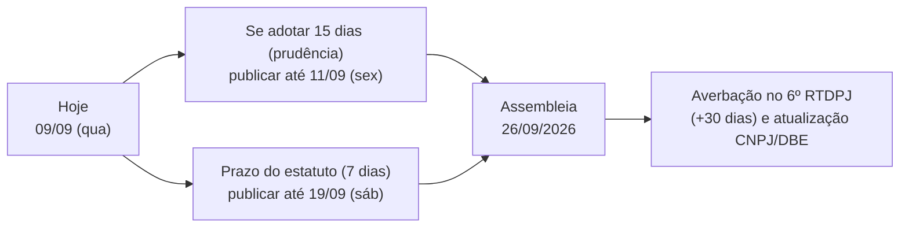

# ⚖️ Parecer — Convocação da Assembleia Geral de 26/09/2026

> **Data de referência:** 09/09/2026 · **Assembleia prevista:** 26/09/2026
> **Fonte primária:** Estatuto Social vigente (consolidado com a alteração do art. 15, §1º aprovada na AGO de 04/10/2024).

---

## 1. Conclusão principal (resumo executivo)

1. **O prazo de convocação do estatuto vigente é de 7 (sete) dias, não 15.** O art. 14, §2º exige edital **afixado na sede da Associação e no sítio da Associação (site)**, com **antecedência mínima de sete dias**, contendo **ordem do dia, data e hora**.
2. **A regra de 15 dias existe apenas em minuta proposta** (`ESTATUTO SOCIAL projeto ame sugestões Armando e Vanessa (1).docx`), que **não está em vigor** — não pode ser tratada como obrigação estatutária até que uma alteração seja aprovada e averbada.
3. **Data-limite estatutária: 19/09/2026** (7 dias antes). **Mas recomendo publicar até 11/09/2026** — publicar mais cedo nunca viola o estatuto (que fixa mínimo) e cria margem de segurança + prova robusta.
4. **Risco maior não é o prazo — é o quórum.** Os itens do art. 13 (eleger/destituir conselhos, alterar estatuto, apreciar o relatório anual, aprovar orçamento) exigem **50% + 1 dos Associados Família presentes**, com **presença mínima de 30% dos Associados Família**. Sem um **cadastro formal de associados** não é possível apurar esse quórum — e esse cadastro **não existe hoje** no sistema (só há `usuarios`/`candidatos`: 107 e 112 registros, sem categorização estatutária).
5. **Lacuna documental crítica:** não há **edital de convocação da AGO de 04/10/2024** no acervo — e ele é anexo exigido no requerimento de averbação ao 6º RTDPJ.

---

## 2. Base documental analisada (acervo `F:\OneDrive\Projeto A.M.E\01_Institucional_e_Legal`)

| Documento | Situação |
|---|---|
| `ATA E ESTATUTO ATUAL\PROJETO AME - ESTATUTO - 20240626_181102.pdf` | **Estatuto vigente** (6 págs., digitalizado em 26/06/2026; sem camada de texto — lido por OCR) |
| `ATA E ESTATUTO ATUAL\ATA DA ASSEMBLEIA GERAL ORDINÁRIA DA ABIAT - 04-10-24-ASSINADA.pdf` (+ versão pública/.docx) | AGO 04/10/2024: prestação de contas out/2022–set/2024, alteração do art. 15 §1º, eleição do mandato 2024–2026 |
| `ATA E ESTATUTO ATUAL\REQUERIMENTO DE AVERBACAO - 6 RTDPJ - MANDATO 2024-2026.docx/.md` | Requerimento de averbação — registro de origem nº **173.633** (averbação 181.731 e posteriores); **data em branco (2026)** = em aberto |
| `ATA E ESTATUTO ATUAL\Edital de CONVOCAÇÃO de Assembleia Geral Ordinária.docx/.pdf` | **Edital de 2022** (assinado 15/07/2022 para AGO de 30/07/2022) — único edital existente no acervo |
| `ATA E ESTATUTO ATUAL\30-07-2022 — ATA ...` / `FINAL - Ata e Estatuto A.M.E-2022 ...` | AGO 30/07/2022 + lista de presença + link de gravação |
| `Assembleias\…` (2018, 2019, 2020) | Histórico de assembleias; atas averbadas de 2020 (banco Itaú) |
| `SITUAÇÃO CADASTRAL - AME - 2024-03-06.pdf`, `RECEITA FEDERAL DBE.pdf` | Regularidade cadastral/fiscal (últimos extratos arquivados: 2024) |
| `ESTATUTO SOCIAL projeto ame sugestões Armando e Vanessa (1).docx` | **Minuta proposta** — origem do prazo de 15 dias e da previsão de convocação por e-mail/AR |
| `Ata de Constituição e Estatuto Proposto - AME.docx` | Proposta com “convocação na sede … antecedência mínima de sete dias” |

---

## 3. Regras estatutárias aplicáveis (transcrição literal)

**Art. 12** — “A assembleia geral, órgão soberano da Associação, é constituída por todos os associados em pleno gozo de seus direitos estatutários.”

**Art. 13** — Compete à assembleia geral: (i) observar e fazer cumprir o Estatuto; (ii) **votar alterações** propostas ao Estatuto; (iii) **eleger** membros do Conselho de Administração e Conselho Fiscal; (iv) **destituir** esses membros; (v) **apreciar o relatório anual**; (vi) deliberar sobre dissolução; (vii) **aprovar o orçamento do ano subsequente**.

> **Art. 13, §1º** — “O quórum mínimo necessário para a dissolução da associação deverá ser por decisão de **50% mais um do total dos Associados Família** … Os demais itens deste artigo deverão, por decisão, ser de **50% mais um dos Associados Família presentes** em assembleia, sendo necessário um **quórum mínimo de 30% de presença de Associados Família**.”

**Art. 14** — A assembleia é **presidida pelo Presidente do Conselho Consultivo** (ou membro do Conselho por ele indicado) e reúne-se **ordinariamente uma vez por ano** e extraordinariamente quando os interesses sociais exigirem.
- **§1º** — Cabe ao presidente da assembleia o **voto de desempate**.
- **§2º** — “Assembleias gerais serão convocadas pelo **Presidente** e, na sua falta, por **qualquer outro Diretor**, mediante a **afixação de edital de convocação na sede da Associação, sítio da Associação**, com **antecedência mínima de sete dias**, no qual constará a **ordem do dia, data e hora** de realização da assembleia.”
- **§3º** — Instalação com **maioria absoluta dos associados** em **primeira convocação** e com **qualquer número** na convocação seguinte; deliberações por **maioria simples** dos associados com direito a voto presentes, **exceto** destituição e alteração de Estatuto, que seguem o art. 13, §1º.

**Art. 29 / Art. 30** — Alienação de bens exige **maioria absoluta** dos presentes em AGE convocada especificamente; dissolução exige **50% + 1 do total dos Associados Família** e maioria absoluta na 1ª convocação.

---

## 4. Calendário de convocação (dias úteis/corridos)

| Marco | Data-limite | Observação |
|---|---|---|
| Fechar a **ordem do dia** | **09–10/09** | Se houver alteração estatutária/eleição, precisa constar expressamente do edital |
| Compilar **registro de Associados Família** (quórum) | **10/09** | Item inexistente hoje — pré-requisito para o edital e para a ata |
| **Publicar o edital** (site + afixação na sede) | **11/09** (recomendado) · **19/09** (mínimo legal) | Guardar URL, print datado e foto da afixação na sede |
| Envio complementar a todos os associados (e-mail/WhatsApp) | junto | Prova adicional de convocação |
| Prestação de contas/relatório do período out/2024–set/2026 | até **24/09** | Ver lacuna do exercício 2025 (item 6.3) |
| **Assembleia** | **26/09/2026** | Sugerir 1ª e 2ª convocação no mesmo edital (histórico: 2024 só instalou em 2ª chamada) |
| Averbação da ata + estatuto consolidado | até **30 dias** após | Ata com **visto de advogado** (exigência do RTDPJ) |

---

## 5. Modelo de quórum a observar no dia

| Matéria | Quórum de instalação | Quórum de deliberação |
|---|---|---|
| Prestação de contas, assuntos gerais | Maioria absoluta dos associados (1ª) · qualquer número (2ª) | Maioria simples dos presentes |
| **Relatório anual, orçamento, eleger/destituir conselhos, alterar Estatuto** | Mesma instalação **+ presença mínima de 30% dos Associados Família** | **50% + 1 dos Associados Família presentes** |
| Dissolução | Maioria absoluta na 1ª convocação | **50% + 1 do total** dos Associados Família |
| Alienação de bens | AGE específica | Maioria absoluta dos presentes |

---

## 6. Lacunas e riscos identificados

| # | Achado | Severidade | Ação |
|---|---|---|---|
| 6.1 | **Não há registro/cadastro de associados** (categorias “Associados Família”, “honorário”) no sistema — impossível apurar quórum com segurança jurídica | **Alta** | Criar o **Livro/Registro de Associados** (planilha + módulo no sistema) com data de admissão, categoria e status |
| 6.2 | **Edital da AGO de 04/10/2024 ausente** do acervo, embora listado como anexo do requerimento de averbação | **Alta** | Localizar/reconstituir e instruir o processo de averbação |
| 6.3 | **AGO de 2025 não localizada** — o art. 14 exige assembleia ordinária **anual**; o último relatório aprovado cobre até set/2024 | **Alta** | Incluir na pauta de 26/09 a prestação de contas de out/2024 a set/2026 (absorvendo o exercício 2025) |
| 6.4 | **Averbação do mandato 2024–2026 em aberto** (requerimento sem data/protocolo) | **Alta** | Confirmar protocolo no 6º RTDPJ e concluir antes/junto da nova averbação |
| 6.5 | **Divergência estatuto × prática:** o art. 14 atribui a presidência da assembleia ao **Presidente do Conselho Consultivo**, mas as atas de 2022 e 2024 registram o **Presidente da Diretoria** presidindo | **Média** | Verificar a existência do Conselho Consultivo; se não houver, regularizar por alteração estatutária (com ordem do dia expressa) ou registrar justificativa em ata |
| 6.6 | **Inconsistência de nomenclatura:** art. 13 fala em “Conselho de Administração”; art. 15 trata da “Diretoria” | **Média** | Consolidar a redação do estatuto (texto único) e averbar |
| 6.7 | **Mito interno dos “15 dias”** (origem: minuta proposta) | **Baixa** | Alinhar a diretoria: prazo vigente = 7 dias; adotar 15 por prudência é facultativo |
| 6.8 | Edital vigente de 2022 cita local físico e “primeira convocação” apenas | **Média** | Atualizar o modelo: local + **formato híbrido** (presencial e online), 1ª e 2ª convocação com horários, link de acesso |

---

## 7. Checklist de execução imediata

- [ ] Deliberar internamente a **natureza da assembleia** (AGO anual? inclui **eleição 2026–2028**? inclui **alteração estatutária**?).
- [ ] Fechar a **ordem do dia** e, se houver mudança de estatuto, escrever **quais artigos** serão alterados (exigência de convocação específica).
- [ ] Compilar a **lista de Associados Família** aptos a votar (com CPF e data de admissão) → base do quórum.
- [ ] Redigir o **edital** a partir do modelo de 2022, com: ordem do dia, data, hora, **1ª e 2ª convocação**, local presencial + link online, assinatura do Presidente.
- [ ] **Afixar na sede** (com foto datada) e **publicar no sítio** (página pública de Transparência do novo site) — art. 14, §2º.
- [ ] Enviar por e-mail/WhatsApp a todos os associados e arquivar comprovantes.
- [ ] Preparar **prestação de contas out/2024–set/2026** (balanço, razão, conciliações) + relatório anual de atividades.
- [ ] Preparar **ata** já com espaços de quórum, deliberações e anexos; prever **visto de advogado**.
- [ ] Programar a **averbação no 6º RTDPJ** no dia seguinte à assembleia.
- [ ] Publicar no site, em Transparência: atas anteriores (2022/2024), estatuto consolidado, balanços e o próprio edital.

---

## 8. Oportunidades estratégicas para a assembleia de 26/09

1. **Transparência ativa como entrega de gestão:** página institucional com estatuto, atas, balanços, editais e relatórios — atende simultaneamente ao art. 14, §2º (“sítio da Associação”) e ao discurso de modernização.
2. **LGPD e Portal do Responsável:** levar à deliberação as políticas de privacidade, uso de imagem e o novo portal (responsável ↔ atendente, vínculos M:N) — dá respaldo institucional ao que está sendo construído no sistema.
3. **Modernização estatutária (se desejada):** prever convocação por **meios eletrônicos**, assembleias **híbridas/voto eletrônico**, adesão à LGPD, prazos (ex.: 15 dias) e consolidação das nomenclaturas (itens 6.5 e 6.6). **Tudo isso precisa estar expresso na ordem do dia** e é aprovado com o quórum qualificado do art. 13, §1º.
4. **Sucessão:** se houver eleição para 2026–2028, preparar a composição (lembrando o art. 15, §1º: até 5 membros, mínimo de 4 Associados Família, até 1 honorário — vedado a este presidir) e já prever a averbação.

---

## 9. Perguntas para decisão

1. A assembleia de 26/09 é **AGO anual** apenas, ou inclui **eleição da diretoria 2026–2028**?
2. Há **alteração estatutária** na pauta? Se sim, quais artigos (para constarem do edital)?
3. Existe formalmente o **Conselho Consultivo** (e quem é seu presidente)? Isso define quem preside a mesa (art. 14).
4. Quem é o **universo de Associados Família** aptos a votar hoje (lista nominal)?
5. A averbação do mandato 2024–2026 foi **protocolada**? Qual o número/status?
6. Autoriza adotar o **prazo de 15 dias** como padrão de convocação (embora o estatuto exija 7), por prudência e alinhamento à minuta futura?

---

## 🔗 Conexões & Ecossistema
- **Plano de análise funcional:** [[PLANO_ANALISE_COMPLIANCE_ASSEMBLEIA_26SET]]
- **Contexto do projeto:** [[GEMINI]] · [[HISTORY]] · [[REGRAS_DE_NEGOCIO]]
- **Infra do site (sítio da Associação):** [[INFRA]] (VPS1 — `projetoame.org`)
- **Cópia do relatório geral:** `F:\01_Projetos\apoio\2026-09-09 — Parecer Convocação Assembleia 26-09-2026.md`
