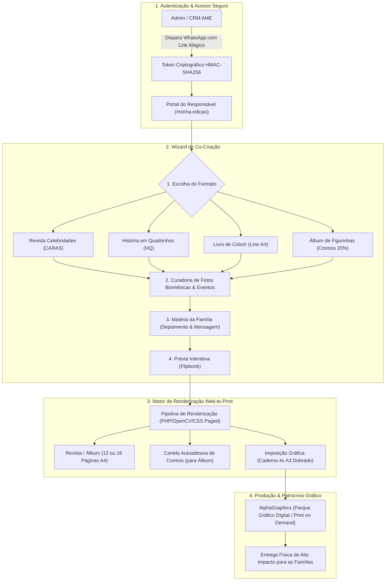

# Plano de Arquitetura & Implementação: AME Magazine & Web-to-Print Studio

Este documento estabelece o projeto técnico, a esteira de co-criação para os responsáveis e a proposta de parceria institucional com a **AlphaGraphics** para viabilizar a impressão sob demanda das publicações personalizadas dos atendentes do **Projeto AME**.

---

## 🗺️ Visão Geral & Diagrama de Arquitetura

---

## 📋 Detalhamento das 5 Etapas do Projeto

### Etapa 1: Infraestrutura de Dados & Link Mágico Seguro
* **Banco de Dados:** Criação da tabela `publicacoes_personalizadas` vinculada a `candidatos` e `fotos_reconhecidas`.
* **Link Mágico HMAC:** Geração de URLs seguras `https://projetoame.org/minha-edicao?id={id}&token={hash}&expires={timestamp}` sem exigir senha do responsável.
* **Segurança:** Validação no back-end garantindo que o token só libere visualização e edição das fotos do candidato específico.

### Etapa 2: Interface do Assistente (Wizard do Responsável)
* **Passo 1 (Estilo):** Cards visuais apresentando os 4 formatos disponíveis.
* **Passo 2 (Fotos & Feiras):** Grid interativo com as fotos reconhecidas por IA nos eventos da AME (ExpoPrint, SENAI, SBT, etc.), permitindo marcar as favoritas.
* **Passo 3 (Depoimento da Família):** Formulário guiado para redação da "Matéria da Família" com auxílio opcional de IA para título e diagramação.
* **Passo 4 (Aprovação):** Visualizador de páginas com botão de confirmação e solicitação de impressão.

### Etapa 3: Engenharia dos 4 Formatos Gráficos

| Formato | Estrutura de Páginas | Especificidade Técnica |
| :--- | :--- | :--- |
| **1. Revista Celebridades** | 12 ou 16 págs A4 | Layout estilo *CARAS/Quem*, capa de gala, manchetes em caixa alta, citações em destaque e matérias institucionais da AME. |
| **2. HQ AME** | 12 ou 16 págs A4 | Grade de quadrinhos com fotos tratadas com efeito Comic/Posterize, balões de fala e narrativa heroica da atuação do atendente. |
| **3. Livro para Colorir** | 12 ou 16 págs A4 | Conversão automática das fotos em **Line Art (P&B)** via filtro OpenCV/GD, intercaladas com labirintos e caça-palavras da inclusão. |
| **4. Álbum de Figurinhas** | 12 págs A4 (4 cromos/pág) + Cartela Adesiva | Páginas com molduras numeradas contendo a **marca d'água a 20% de opacidade** da foto a ser colada + matérias "calhau" (institucionais) para preenchimento de espaço. |

### Etapa 4: Motor de Renderização & Imposição Gráfica
* **Resolução:** 300 DPI para impressão laser colorida de alta fidelidade.
* **Imposição:** Geração do PDF em páginas simples A4 e montagem opcional em pares de páginas A3 para impressão direta frente e verso em 4 folhas A3 (dobra ao meio e grampo canoa).
* **Cartela de Cromos:** Geração do PDF de etiquetas adesivas A4 com linhas de corte e numeração correspondente.

### Etapa 5: Proposta Institucional para a AlphaGraphics
* **Objetivo:** Estabelecer uma parceria estratégica de responsabilidade social (ESG) com a AlphaGraphics.
* **Contrapartida para a AlphaGraphics:**
  * Inclusão da chancela *"Apoio Gráfico Oficial: AlphaGraphics"* na contracapa de todas as edições impressas.
  * Matéria institucional de 1 página sobre a tecnologia gráfica e inclusão promovida pela AlphaGraphics dentro das revistas.
  * Divulgação em posts do blog da AME, redes sociais e eventos corporativos atendidos pelos DJs e monitores da AME.
* **Modelo Operacional:** Impressão sob demanda (*Print on Demand*) enviada via API/Painel diretamente para a unidade AlphaGraphics parceira.

---

## 🔗 Conexões & Ecossistema
- **Projetos Relacionados:** [[PRINTADVISOR]], [[AUTOMACAO]], [[REGRAS_DE_NEGOCIO]], [[GEMINI]]
- **Infraestrutura:** VPS1 (Produção PHP/MariaDB), VPS3 (Motor de Biometria e Processamento OpenCV).
