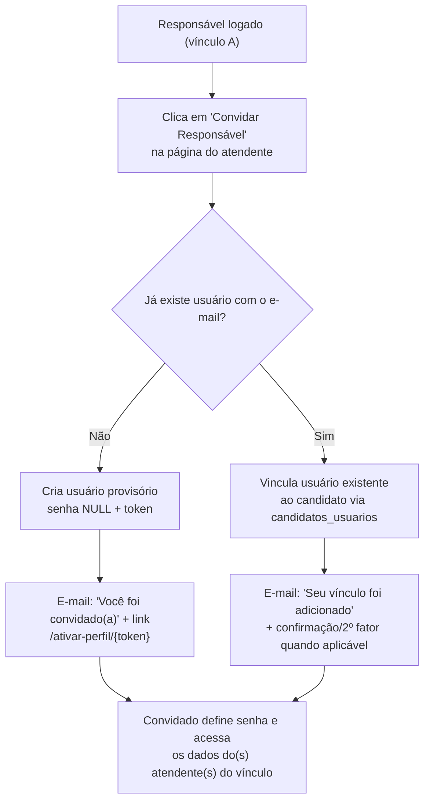
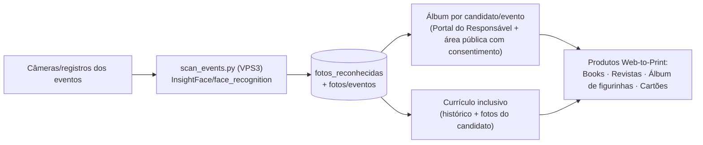
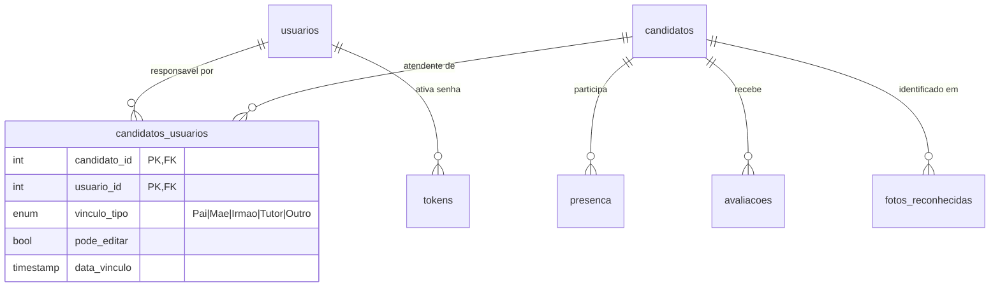

# 📋 Plano de Análise Funcional & Compliance — Assembleia 26/09/2026

> **Objetivo:** Realizar uma análise completa das funcionalidades do Projeto AME para alinhar o
> sistema (site + CRM + portal) às **melhores práticas de engenharia**, à **legislação brasileira
> aplicável a entidades beneficentes/OSC** e aos pilares de **transparência, segurança e
> acessibilidade**, entregando até a **Assembleia de 26/09/2026** um site moderno, transparente e acessível.

---

## 1. Contexto & Premissas

- **Prazo:** Assembleia em **26/09/2026** (~17 dias da data deste documento).
- **Público interno:** Diretoria (mandato 2024-2026), responsáveis (pais/tutores), atendentes (A.M.E.), voluntários, parceiros e imprensa/instituições.
- **Ambiente:** Produção VPS1 (`projetoame.org`, MariaDB schema `projetoame`, PHP 8.x vanilla + Bootstrap 4/MDB), automação VPS2 (LiteLLM/n8n/Evolution), inferência/biometria VPS3 (InsightFace/Ollama).
- **Postura de risco:** **NUNCA excluir dados sem autorização**; toda mudança de banco em produção via scripts revisados + backup; deploy por scp + `chown projetoame:projetoame` (public_html **não** é clone git).
- **Já existente no código (levantamento 09/09/2026):**
  - Pivot **`candidatos_usuarios`** (`candidato_id`, `usuario_id`, `vinculo_tipo` enum `Pai|Mãe|Irmão|Tutor|Outro`, `pode_editar`, `data_vinculo`) → base pronta para o modelo **M:N** responsável↔atendente.
  - Tabela **`usuarios`** com `senha` (hash MD5 legado — **migrar para bcrypt**), e-mail/telefone/nome; rotas de ativação por token (`/ativar-perfil/{token}`, `api_send_activation_token`, `atualizar_email`, tabela `tokens`).
  - `/meuperfil` já filtra candidatos via JOIN em `candidatos_usuarios` e possui início do "convidar responsável" (`/api/invite_responsavel.php`).
  - Currículo inclusivo `/curriculo/{id}` + PDF (FPDF) com histórico de atuação; ficha de avaliação por evento; `presenca`; `avaliacoes`.
  - Foto-análise: backend Python (VPS3) `enrollment.py`/`scan_events.py`, tabelas `fotos_reconhecidas`/`fotos`, migração `migrar_foto_analise.sql`, galeria `eventosgaleria`.
  - Acessibilidade: VLibras + alto contraste + fonte grande no cabeçalho global.

---

## 2. Pilar A — Transparência Institucional (Site Público)

Entregar na assembleia uma área pública clara, com navegação institucional moderna:

- [ ] **Página "A Associação":** missão, visão, valores, histórico, estrutura de governança (diretoria e conselhos), CNAE/registros, certificações (CEBAS, Utilidade Pública, CMAS quando aplicável).
- [ ] **Estatuto & Atas:** publicar estatuto vigente (compilado e com atas de alteração), atas de assembleias (inclusive **AGO/AGE 2024**, resgatadas) em PDF — transparência e memória institucional.
- [ ] **Transparência financeira:** balanços/razão por exercício, prestações de contas, renúncias, doações e políticas de uso (Painel já possui `extrato`/`prestacaocontas` — ampliar para divulgação pública não sensível).
- [ ] **Editais e comunicações oficiais:** avisos de convocação (com prazos do Código Civil), calendário de eventos/assembleias, comunicados à comunidade.
- [ ] **Canais de contato/ouvidoria** e **política de privacidade (LGPD)** acessível no rodapé de todas as páginas.
- [ ] Revisão de **conteúdo acessível** (linguagem simples, alt text, contraste AA, navegação por teclado) — ver Pilar E.

---

## 3. Pilar B — Portal do Responsável: Transparência & Segurança

Área logada onde o responsável vê **informações institucionais + dados do(s) filho(s)/atendente(s)** de forma segura e auditável.

### 3.1 Visões previstas por vínculo (1 usuário → N atendentes)
- Dados cadastrais, documentação (autorizações, atestados) e status (ativo/treinando).
- **Escala/disponibilidade** por evento (declarada, confirmada, substituições) e **presença** (check-in).
- **Avaliações/fichas** liberadas após o evento e **histórico de atuação** (currículo).
- **Extrato financeiro** quando houver valores (ajuda de custo, mensalidades) — somente do próprio vínculo.
- **Fotos reconhecidas** e álbuns por evento (Pilar D) com consentimento de uso de imagem vigente.
- Comunicados direcionados (grupo/evento) e **notificações** (WhatsApp via Evolution GO `NETGO1200` / e-mail).

### 3.2 Segurança obrigatória (ver Pilar E)
- Autenticação forte; sessões com expiração; **autorização por vínculo ativo** em toda consulta (nunca confiar em `?id=` sem checar `candidatos_usuarios`).
- **Logs de auditoria** de acessos e alterações (quem viu/editou o quê, quando, IP).
- Dados sensíveis de terceiros jamais exibidos a um vínculo que não o autorizado.
- Consentimento de uso de imagem (já existe `usodeimagem`/`autorizacoes`) com versão e data.

---

## 4. Pilar C — Primeiro Acesso sem Senha (senha NULL) + Convite de Responsáveis

### 4.1 Fluxo-alvo: Primeiro acesso (usuário novo, `senha = NULL`)
```mermaid
flowchart LR
    A["Responsável cadastrado<br/>(sem senha)"] --> B["Tenta entrar em /login"]
    B --> C{"`usuarios.senha` é NULL?"}
    C -->|"Sim"| D["Site exibe 'Criar senha'<br/>e envia e-mail"]
    D --> E["E-mail com link único<br/>/ativar-perfil/{token}"]
    E --> F["Token válido e não expirado?"]
    F -->|"Sim"| G["Página de criação de senha<br/>(bcrypt, política de força)"]
    G --> H["Login liberado<br/>+ registro de auditoria"]
    F -->|"Não / expirado"| I["Gerar novo token e reenviar"]
```
**Regras de negócio:**
- Cadastro de responsável sempre nasce com `senha = NULL` e `email` confirmado obrigatoriamente (ou validado no primeiro acesso).
- Token: aleatório (≥ 32 bytes), **hash no banco**, expiração (ex.: 24–72h), uso único, reenvio limitado (anti-spam).
- Link abre página **fora do login** para criação da senha; após criar, usuário autentica com e-mail + senha.
- Sem senha cadastrada o usuário **não autentica** por nenhum outro meio (sem "senha padrão").

### 4.2 Fluxo-alvo: Convidar novo responsável (inclusive para outro atendente)

**Regras de negócio:**
- Cada **candidato pode ter N responsáveis** e cada **usuário pode ter acesso a N candidatos** (M:N já modelado em `candidatos_usuarios`).
- O convite registra **quem convidou, quando e para qual papel** (`vinculo_tipo`); convites ficam **pendentes de aceite** e visíveis à diretoria (aprovação/revoogação).
- `pode_editar` por vínculo (responsável pleno vs. somente leitura) — decisão de negócio a validar (item 9).
- Prevenção de acesso indevido: novo vínculo para candidato de terceiros **não pode ser criado** sem validação institucional (ex.: o responsável atual convida e a diretoria homologa) — validar fluxo (item 9).

### 4.3 O que já existe vs. a construir
| Item | Situação (09/09/2026) |
|---|---|
| Rotas `/ativar-perfil/{token}`, `api_send_activation_token`, `atualizar_email`, tabela `tokens` | Parcialmente implementado — auditar consistência, expiração e hash |
| `candidatos_usuarios` (M:N, `vinculo_tipo`, `pode_editar`) | Tabela OK; validar índices/FKs e uso em TODAS as consultas de autorização |
| `/meuperfil` seleciona candidatos por vínculo e início do convite | Presente; falta tela "Convidar Responsável" finalizada + aceite |
| `usuarios.senha` aceitar NULL | Validar `ALTER TABLE` em produção (coluna hoje `NOT NULL` no dump legado) |
| Migração hashes MD5 → bcrypt | **A fazer** (login atual valida MD5; migrar em lote com rehash transparente) |

---

## 5. Pilar D — Álbuns & Currículos com Fotos Identificadas por Atendente

Pipeline de valor: **foto → reconhecimento facial → associação ao candidato → álbum/currículo → produtos**.


- **Pré-requisitos de produto:** consentimento de uso de imagem vigente e **opt-in** por responsável (imagem de menores → autorização obrigatória), marca d'água/metadados (evento, data, fotógrafo), controle de exclusão/descarte.
- **Curadoria:** o responsável vê as fotos do SEU candidato; pode marcar "favoritas", baixar e solicitar impressão (AlphaGraphics/PrintAdvisor) — alinhar com `PLANO_AME_MAGAZINE_WEB_TO_PRINT`.
- **Governança de dados:** fotos reconhecidas = dados pessoais/biométricos (LGPD) → política de retenção, acesso restrito e trilha de auditoria.

---

## 6. Pilar E — Legislação & Melhores Práticas (Checklist de Conformidade)

### 6.1 LGPD (Lei 13.709/2018) — prioridade máxima por envolver dados de menores
- [ ] **Base legal** para cada finalidade (consentimento do responsável para dados do atendente; legítimo interesse/obrigação legal para administrativo/fiscal).
- [ ] **Consentimento explícito e destacado** no cadastro (não em "caixa única"); registro de data/versão do termo.
- [ ] **Direitos dos titulares:** acesso, correção, portabilidade (quando aplicável), exclusão/anonimização e informação — página própria + canal.
- [ ] **Minimização e retenção:** coletar só o necessário; prazo de guarda documentado; descarte seguro.
- [ ] **Segurança:** criptografia em trânsito (TLS) e em repouso para campos sensíveis; bcrypt/argon2; tokens com expiração; logs de acesso.
- [ ] **Encarregado (DPO)** nomeado e **comunicação de incidentes** (prazo 72h ANPD quando aplicável).
- [ ] Política de privacidade + avisos por tela (LGPD "informação clara"); atualizar `/privacidade`.

### 6.2 Acessibilidade & Inclusão (LBI 13.146/2015 + WCAG 2.1 AA)
- [ ] Manter VLibras, contraste AA, fonte ajustável (já existentes) e estender a **todas** as páginas novas.
- [ ] Auditoria básica: navegação por teclado, foco visível, labels/aria, alt text, HTML semântico, `lang=pt-BR`.
- [ ] Linguagem simples nos textos públicos/institucionais; formulários com erro claro e recuperável.

### 6.3 Transparência & Legislação de OSC/Entidades Beneficentes
- [ ] **Lei 12.101/2009 (CEBAS/isentões):** manter requisitos de transparência (balanços, relatório anual, contrapartidas) acessíveis.
- [ ] **MROSC — Lei 13.019/2014:** se houver parcerias/convênios (municipal/estadual), manter chamamentos, planos de trabalho e prestações de contas publicáveis.
- [ ] **Lei do Voluntariado 9.608/1998:** termo de adesão do voluntário registrado (módulo `/inscrever-voluntario` previsto).
- [ ] **Governança (Código Civil arts. 53-69):** atas assinadas, convocações com antecedência, quórum registrado, diretoria e conselhos formalizados.
- [ ] **Boas práticas IBGC/OSC:** código de conduta, conflito de interesses, política de doações e de uso de imagem; **transparência ativa** (publicar no site atas, balanços e relatórios).

### 6.4 Segurança de Aplicação (OWASP Top 10)
- [ ] Rever SQL dinâmico (migrar para prepared statements/PDO onde houver concatenação).
- [ ] Sanitização/escape de saída (XSS); CSRF em formulários de sessão; headers de segurança (CSP, X-Frame-Options, HSTS).
- [ ] Controle de acesso vertical/horizontal por vínculo; rate limiting em login/convite/reenvio.
- [ ] Backups diários (VPS1) com restauração testada; segredos fora do código (`.env`, `SECRETS.md`).

---

## 7. Roadmap até a Assembleia (26/09/2026)

| Fase | Janela | Entregáveis |
|---|---|---|
| **0 — Inventário & auditoria técnica** | 09–12/09 | Mapa de rotas/tabelas; lista de bugs de UX/CSS (ex.: `md-form` sem JS); dívidas de segurança |
| **1 — Compliance documental** | 12–16/09 | Publicar estatuto/atas/balanços; política de privacidade; termos de consentimento e uso de imagem |
| **2 — Portal do Responsável (núcleo)** | 15–20/09 | Primeiro acesso senha NULL + token; M:N consolidado; autorização por vínculo em todas as telas; auditoria |
| **3 — Convites & permissões** | 18–22/09 | Tela convidar responsável, aceite, aprovação pela diretoria, revogação |
| **4 — Fotos → Currículo/Álbum (piloto)** | 20–24/09 | Piloto com 1 evento recente: fotos reconhecidas → álbum do responsável + currículo com fotos |
| **5 — Polimento & testes** | 24–25/09 | Testes de acessibilidade/LGPD/segurança, revisão mobile, deploy VPS1 |
| **6 — Assembleia 26/09** | 26/09 | Demonstração ao vivo; coleta de feedback; ata de decisões |

> Após a assembleia: evoluir produtos Web-to-Print (books/revistas/figurinhas), integração iController e comunicações automatizadas (ageNET/Evolution).

---

## 8. Arquitetura-alvo de Vínculos (resumo técnico)



---

## 9. Perguntas em Aberto (decisões para Paulo/diretoria)

1. **Convite de responsável para candidato de outro responsável:** aprovação automática do responsável atual + homologação da diretoria, ou somente a diretoria convida? (segurança vs. agilidade)
2. **Perfis de permissão:** manter apenas `pode_editar` (sim/não) ou evoluir para papéis (leitura / edição cadastral / financeiro)? Quem pode editar o quê?
3. **Dados financeiros do atendente no portal:** o responsável deve ver valores (ajuda de custo, repasses) ou somente a diretoria?
4. **Validade/expiração do token** do primeiro acesso e **reenvio automático** (prazos, limite diário).
5. **Fotos:** opt-in por responsável já no cadastro ou por evento? Necessidade de aprovação da foto antes de exibir?
6. **Produtos Web-to-Print:** assinatura/compra pela associação ou venda direta ao responsável (precificação, repasse institucional)?
7. **Escopo "análise completa de funcionalidades":** prefere um **relatório de auditoria funcional** (tela a tela) antes da assembleia, ou priorizar apenas os fluxos desta pauta?
8. **Prazo de guarda/dados**: política de retenção para cadastros, fotos e avaliações (proposta de prazos para validar em assembleia).

---

## 🔗 Conexões & Ecossistema
- **Contexto:** [[GEMINI]] · [[HISTORY]] · [[REGRAS_DE_NEGOCIO]]
- **Produtos:** [[PLANO_AME_MAGAZINE_WEB_TO_PRINT]] · [[PRINTADVISOR]]
- **Infra:** [[INFRA]] (VPS1 produção · VPS2 LiteLLM/n8n/Evolution · VPS3 biometria)
- **Backup deste relatório:** `F:\01_Projetos\apoio\2026-09-09 — Plano Análise Compliance Projeto AME.md`
