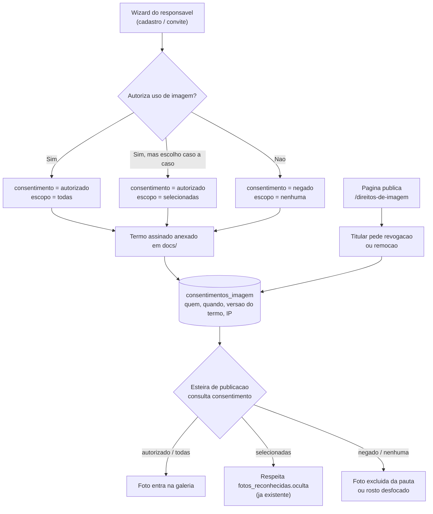

# Plano — Direitos de Imagem dos Atendentes Muito Especiais

> **Data:** 18/09/2026 · **Pergunta de origem:** criar página de direitos de imagem, incluir a questão no wizard do responsável, permitir imagem não publicável (individual ou todas?) e possibilidade de desfocar o rosto de quem não autorizou.

## 1. O que já existe (levantado em 18/09/2026)

| Ativo | Situação |
|---|---|
| Termo de autorização assinado | **41 PDFs** em produção: `/home/projetoame/public_html/docs/direito-de-imagem-de-<nome>.pdf` |
| Índice legado | `docs/autorizacoes.csv` — mapeia nome → documento (modelo antigo, anterior aos subdiretórios por candidato) |
| Registro em banco | Tabela `documentos` — 156 linhas para **83 candidatos**; `descritivo` inclui *"Autorização de uso de imagem"* |
| Cópia local organizada | `docs/{candidato_id}/direito_de_imagem_de_<nome>.pdf` — 33 arquivos em 73 pastas (formato novo, ainda não refletido em produção) |
| Ocultação de foto | **Já implementada**: `fotos_reconhecidas.oculta` + rota `pages/api_ocultar_foto.php`, com o candidato vendo as próprias fotos em `pages/meuperfil.php` |
| Campos de representação legal | `candidatos.responsavel` e `candidatos.curatela` já existem |
| Base de candidatos | 112 candidatos, **37 ativos** |

**Conclusão:** o termo já existe e já foi assinado por parte dos atendentes — mas está **desconectado da esteira de publicação**. Hoje nada impede que uma foto de alguém sem autorização seja publicada, porque o pipeline de artigos não consulta consentimento nenhum.

## 2. Resposta direta às perguntas

### 2.1 "Individual ou todas?" — os dois, e um deles já funciona

| Nível | Como funciona | Situação |
|---|---|---|
| **Global** ("não quero aparecer em nada") | Um campo de consentimento no cadastro do candidato | ⏳ **a criar** |
| **Por foto** ("não gostei desta foto") | `fotos_reconhecidas.oculta = 1` — o próprio candidato oculta no `/meuperfil` | ✅ **já existe** |

Não é preciso escolher: o wizard resolve o caso geral, e o `oculta` já cobre o caso granular. O que falta é o **global** e, principalmente, **fazer a esteira respeitar os dois**.

### 2.2 "Desfocar o rosto de quem não autorizou?" — sim, é viável

A VPS3 já tem `face_recognition` + `dlib` instalados, e o `scan_events.py` já usa `face_recognition.face_locations()`, que devolve exatamente a **caixa do rosto**. Desfocar é aplicar `PIL.ImageFilter.GaussianBlur` (ou pixelização) nessa caixa:

```
encoding do atendente sem autorização  →  localizar o rosto na foto  →  mascarar a caixa  →  publicar
```

**Duas ressalvas honestas:**

1. Depende do enrollment biométrico estar completo — hoje apenas **39 dos 112 candidatos** têm vetor facial. Sem o vetor, o sistema não sabe *qual* rosto desfocar.
2. Desfoque é **mitigação, não anonimização**. Em foto de evento, a pessoa continua identificável pelo contexto (cracha, uniforme, quem está ao lado). Portanto o desfoque não substitui o consentimento — ele serve para o caso de imagem já publicada ou de terceiro na foto.

## 3. Desenho proposto



### 3.1 Dados — tabela nova, com trilha de auditoria

O consentimento precisa ser **demonstrável** (LGPD art. 8º §1º). Um campo booleano em `candidatos` não registra quem autorizou, quando, nem qual versão do termo. Proposta:

```sql
CREATE TABLE consentimentos_imagem (
  id INT AUTO_INCREMENT PRIMARY KEY,
  candidato_id INT NOT NULL,
  status ENUM('pendente','autorizado','negado','revogado') NOT NULL DEFAULT 'pendente',
  escopo ENUM('todas','selecionadas','nenhuma') NOT NULL DEFAULT 'selecionadas',
  termo_versao VARCHAR(16) NOT NULL,
  documento_url VARCHAR(255) NULL,
  assinado_por ENUM('titular','responsavel_legal') NOT NULL DEFAULT 'titular',
  nome_assinante VARCHAR(120) NULL,
  origem ENUM('wizard','presencial','email') NOT NULL DEFAULT 'wizard',
  ip_registro VARCHAR(45) NULL,
  criado_em TIMESTAMP DEFAULT CURRENT_TIMESTAMP,
  revogado_em DATETIME NULL,
  INDEX (candidato_id, status)
);
```

Mais um campo derivado em `candidatos` (`consentimento_imagem_status`) para consulta rápida na esteira, mantido por trigger ou pela própria rota de gravação.

**Por que `termo_versao` importa:** se o texto do termo mudar, consentimentos da versão antiga precisam ser renovados. Sem esse campo, não há como saber quem autorizou sob qual redação.

### 3.2 Wizard do responsável

No fluxo de cadastro/convite (`convites_responsaveis`, `cadastro.php`, `ativarperfil.php`), um passo com:

1. Texto curto em linguagem simples + link para o termo completo e para `/direitos-de-imagem`.
2. Três opções: **Autorizo para todas as imagens** · **Autorizo, mas quero revisar caso a caso** · **Não autorizo**.
3. Anexo do termo assinado (reaproveitando `api_upload_documento.php`).
4. Se houver `curatela = 1` ou o titular for menor, o passo exige identificação do responsável legal (`assinado_por = 'responsavel_legal'`).
5. Registro em `consentimentos_imagem` com versão do termo e IP.

### 3.3 Página pública `/direitos-de-imagem`

Conteúdo mínimo: o que é coletado (imagem, e biometria quando há reconhecimento facial), finalidade, base legal, como autorizar/revogar, como pedir remoção, prazo de atendimento, canal de contato, e o termo em PDF. É também a página que dá transparência ao uso de reconhecimento facial — hoje ele existe sem nenhuma informação pública, o que é o ponto mais frágil do conjunto.

### 3.4 Enforçamento na esteira (a parte que resolve de fato)

Sem isto, tudo acima é documentação. Três pontos de controle:

1. **`api_ame_pautas.php`** — ao montar `midia_acervo` e a lista de fotos, consultar `consentimentos_imagem` e:
   - `autorizado/todas` → foto liberada;
   - `selecionadas` → respeitar `oculta = 0`;
   - `negado/nenhuma` → foto **não** entra na pauta (e o atendente não é contado em `atendentes_presentes`).
2. **`scan_events.py` (VPS3)** — marcar ou pular rostos sem consentimento no momento da varredura, para que o dado nunca chegue ao banco de publicação.
3. **Revisor do Content Factory** — hoje a trava de ancoragem verifica o fato; falta uma verificação de que não há nome nem foto de quem não autorizou. Pode ser uma checagem programática simples, no mesmo padrão.

## 4. Ordem de execução sugerida

| # | Entrega | Depende de |
|---|---|---|
| 1 | Aprovar o texto do termo e sua **versão** | Você + jurídico |
| 2 | Tabela `consentimentos_imagem` + migração dos 41 termos já assinados para ela | 1 |
| 3 | Página `/direitos-de-imagem` | 1 |
| 4 | Passo de consentimento no wizard do responsável | 2, 3 |
| 5 | Enforçamento no endpoint de pautas + contagem de atendentes | 2 |
| 6 | Marcação em `scan_events.py` | 2 |
| 7 | Desfoque automático para `negado` (exige enrollment completo) | 6 + F1 do plano da esteira |

**Recomendação de sequência:** comece por **1 → 2 → 5**. A página e o wizard são a face visível, mas é o enforcamento no endpoint que efetivamente impede a publicação indevida — e ele depende apenas da tabela e da migração dos 41 termos já existentes.

## 5. 🔗 Conexões & Ecossistema

- [[PROJETO_AME]] · [[GEMINI]] · [[HISTORY]] · [[REGRAS_DE_NEGOCIO]] · `PLANO_ESTEIRA_COBERTURA_BLOG_AME.md`
- Infra: `#infra/vps1` (`documentos`, `docs/`, endpoint de pautas), `#infra/vps3` (`scan_events.py`, `face_recognition`)
- Módulos: `#modulo/portal-responsavel`, `#modulo/biometria`, `#modulo/crm`, `#modulo/content-factory`
