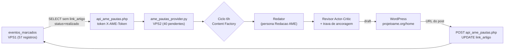

# Plano — Esteira de Cobertura do Blog do Projeto AME

> **Data:** 18/09/2026 · **Objetivo:** zerar as 38 atividades sem artigo e impedir que a lacuna volte a crescer, reaproveitando a Content Factory (Esteira 7), os agentes noturnos NASANET e o pipeline de biometria da VPS3.
> **Resposta curta: sim, é possível** — e a maior parte da infraestrutura já existe. O que falta é uma **fonte de pauta baseada em atividades** (hoje o tenant usa RSS genérico) e o **write-back** do link no CRM.

## 1. Diagnóstico: por que os artigos recentes ficaram genéricos

> **Correção do diagnóstico inicial.** A primeira hipótese era "o tenant cai no RSS de tecnologia do G1". A investigação do motor mostrou algo mais preciso — e pior.

Os dois últimos posts do blog têm origem rastreável:

| Componente | Situação encontrada | Consequência |
|---|---|---|
| `TENANT_CURATED_PAUTAS["projetoame"]` | Contém **exatamente 2 pautas genéricas**: *"Inclusão Produtiva Através do Trabalho…"* e *"Acolhimento e Equidade Corporativa…"* | Foram **exatamente** os dois artigos de 12 e 15/09/2026 |
| Pool curado esgotado | `get_already_covered_topics()` já marca as duas como cobertas | O **próximo** artigo cairia no `RSS_FEED_URL` — `g1.globo.com/rss/g1/tecnologia/`, hardcoded |
| Bloco `projetoame` em `wp_content_factory_tenants.json` | Tinha `theme` e `author`, mas **não tinha** `strict_scope`, `editorial_anchor` nem `primary_cta_url` | O redator escrevia sobre o tema em abstrato, sem ancorar em fato real |
| `eventos_marcados.link_artigo` | Preenchido em 12 de 57 registros, com vínculos errados | O motor **não sabia** quais atividades já tinham artigo |

Ou seja: o agente escreveu sobre *inclusão* porque foi isso que o pool de pautas pediu. Nunca foi pedido a ele que escrevesse sobre *a atividade de 30/05 no SENAI Osasco* — e, esgotado o pool, a fonte degradaria para notícia de tecnologia.

### 1.1 Achado adicional durante o dry-run: o refinamento derrubava a ancoragem

Ao rodar o pipeline com a pauta por atividade, o **ciclo 1 saiu perfeito** ("CONARH 2026: Projeto AME leva atendimento inclusivo ao São Paulo Expo", 89 pts) e o **ciclo 2 regrediu** para "Inclusão Produtiva: Quando o Trabalho Deixa de Ser Favor e Vira Estratégia" (82 pts).

Causa: o revisor avalia voz, clichê, SEO, afiliado e fluidez — dimensões em que um ensaio genérico pontua bem — e o prompt de refinamento (ciclo ≥ 2) não repetia a atividade. Sem reancoragem, "aprofunde o texto" significa abandonar o fato.

**Correção aplicada:** a âncora factual passou para o *system prompt* (vale em todos os ciclos), o ciclo ≥ 2 recebe lembrete de ancoragem, e o revisor ganhou uma **trava programática** — se o texto não citar a atividade, a nota é limitada a 60 e o artigo é reprovado, independentemente de o LLM obedecer ao prompt.

## 2. Correção 1 — Fonte de pauta por atividade (IMPLEMENTADO em 18/09/2026)

> **Status:** entregue e em produção. Endpoint na VPS1 (`include/api_ame_pautas.php`), provedor `ame_pautas_provider.py` e patches no motor, ambos implantados na VPS2 em `/root/nasanet/content_factory/`.

Modo **event-driven** de pauta, análogo ao que já existe para PAPONET, mas alimentado pelo banco de atividades:

**Contrato da pauta por atividade** (o que o motor passa ao redator em vez do RSS):

| Campo | Origem | Uso no prompt |
|---|---|---|
| `nome`, `slug` | `eventos_marcados` | Título e URL |
| `inicio` / `final` | `eventos_marcados` | Data explícita no título e no corpo |
| `local`, `endereco` | `eventos_marcados` | Contexto geográfico e credibilidade |
| `tipo_evento` | `eventos_marcados` | Enquadramento (atendimento / curso / reunião) |
| Empresa contratante | `horarios.empresa_id` → `empresas` | Case de cliente nomeado |
| Atendentes presentes | `fotos_reconhecidas` (distinct, `oculta = 0`) | Número real de escalados |
| Fotos | `fotos_reconhecidas.foto_path` | Galeria real, sem banco de imagem genérico |

### 2.1 Endpoint `GET/POST https://projetoame.org/include/api_ame_pautas.php`

- `GET ?limit=N` — atividades realizadas **sem** artigo (`link_artigo` vazio), ordenadas da mais recente.
- `GET ?id=N` — uma atividade específica, com fotos e empresas contratantes.
- `GET ?modo=completo` — inclui primeiro nome dos atendentes (padrão é `contagem`, sem dado pessoal).
- `POST {"id": N, "url": "..."}` — **write-back** do `link_artigo`; aceita apenas URLs do blog do AME.
- **Autenticação fail-closed:** header `X-AME-Token`, segredo em `/home/projetoame/ame_pautas.token`, **fora do web root**. Sem o arquivo, o endpoint responde 503 e não entrega nada.

### 2.2 Isolamento e reversibilidade

- O desvio só ocorre se o tenant tiver `"pauta_source": "activities"` — os outros **14 canais não mudam de comportamento** (verificado).
- O motor cai para a fonte antiga automaticamente se o endpoint estiver fora do ar.
- Backup do motor e do arquivo de tenants em `/root/backups/` na VPS2 antes do deploy.

## 3. Correção 2 — Escopo e ancoragem do tenant `projetoame`

Adicionar ao bloco `projetoame` em `wp_content_factory_tenants.json`:

- `"pauta_source": "activities"` — desliga o RSS G1 para este tenant;
- `"strict_scope": true` — proíbe pauta genérica (mesmo padrão já usado no tenant `marilia`);
- `"editorial_anchor"` — a missão real: inclusão produtiva pelo trabalho, protagonismo PCD, Atendentes Muito Especiais;
- `"primary_cta_url"` + `"primary_cta_text"` — CTA institucional para `contacte.me/projetoame` (hoje só há o box de afiliado Amazon);
- `"forbidden_topics"` — pauta de tecnologia/IA que não dialogue com a associação.

Com isso o próprio Content Factory deixa de publicar artigo editorial solto no blog do AME. Se a intenção for **manter** o conteúdo editorial temático, o caminho é um tenant separado (ou um segundo blog) — misturar os dois propósitos no mesmo domínio é o que produziu a distorção atual.

## 4. Correção 3 — Pipeline de fotos (EXIF + reconhecimento facial)

A infraestrutura **já existe e já rodou**: `fotos_reconhecidas` tem 365 matches de 35 atendentes distintos. Os scripts estão na VPS3:

| Ativo | Caminho | Função |
|---|---|---|
| `enrollment.py` | `/root/enrollment.py` | Gera o vetor `face_encoding` a partir da foto de perfil do candidato |
| `scan_events.py` | `/root/scan_events.py` | `python3 scan_events.py <evento_id> <pasta>` — varre a pasta, acha rostos, cruza com os candidatos e grava em `fotos_reconhecidas` |
| `biometria_venv` | `/root/biometria_venv` | `face_recognition` + `dlib` já instalados |

**Estado atual:** 39 dos 112 candidatos têm vetor biométrico carregado. Ampliar esse enrollment é o primeiro passo de maior retorno.

### O que falta para o acervo do celular

O acervo em `E:\06_Backup_Local\POCO_PADF\` tem **73.069 arquivos / 118,55 GB** (48.682 `.jpg`, 8.278 `.mp4`, 3.734 `.webp`). Nada disso está datado de forma utilizável hoje. Pipeline proposto:

1. **Indexação EXIF** — extrair `DateTimeOriginal` (+ GPS quando houver) de cada `.jpg/.jpeg/.webp` para uma tabela `midia_exif` (path, data/hora, GPS, modelo da câmera, orientação).
2. **Bucketing por dia** — agrupar por data; um dia com dezenas de fotos no mesmo local é um evento.
3. **Cruzamento com a base** — casar o bucket com `eventos_marcados.inicio/final` (tolerância de ±1 dia para montagem/desmontagem).
4. **Roteamento humano no empate** — quando dois eventos ocorrem no mesmo dia (ex.: as 4 atividades de 18/01/2025), o índice deve **pedir confirmação**, nunca adivinhar.
5. **Vídeos** — `.mp4` não tem `DateTimeOriginal` de EXIF; usar `QuickTime CreateDate` ou o nome do arquivo. Separar em trilha própria.
6. **Envio ao reconhecimento** — pastas já classificadas por evento entram no `scan_events.py`, e o resultado vira a galeria do artigo.

> **Impacto colateral positivo:** esse índice EXIF resolve também o acervo do **WordPress** (as fotos que já estão em `home/wp-content/uploads/YYYY/MM/`), porque o reconhecimento atual usou esses arquivos — dá para reconstruir a data real de cada foto publicada.

### ⚠️ LGPD — ponto de atenção obrigatório

Fotos de pessoas com deficiência são **dado pessoal sensível** (LGPD, art. 5º, II), e o reconhecimento facial é tratamento de dado biométrico. Antes de automatizar a publicação:

- **Base legal explícita** — consentimento específico e destacado, ou legítimo interesse formalmente documentado no estatuto/termo de associação.
- **Registro do consentimento por associado** (mesmo que em planilha controlada) cobrindo uso de imagem *e* biometria.
- **Direito de oposição já existe parcialmente** — a rota `api_ocultar_foto.php` permite ao candidato ocultar a foto. Ela precisa ser respeitada pela esteira: **nunca** publicar foto com `oculta = 1`.
- **Verificar menores de idade** entre os candidatos — se houver, exigem consentimento de responsável.
- **Auditoria anual** de quem tem vetor biométrico e para quê.
- **Recomendação forte:** a esteira gera `draft` e **um humano aprova**. Publicação automática de imagem identificável de pessoa com deficiência sem revisão é risco jurídico e reputacional desnecessário.

## 5. Correção 4 — Write-back e medição

1. A esteira publica em `draft` e grava `kpis_content_factory.json` (como já faz).
2. Ao aprovar/publicar, o motor faz `UPDATE eventos_marcados SET link_artigo = '<url>' WHERE id = <id>` na VPS1.
3. Um contador de cobertura em `eventos_marcados` substitui a auditoria manual: `57 - COUNT(link_artigo <> '')` = lacuna atual.
4. **Backfill imediato:** corrigir os 12 `link_artigo` atuais — o post do Curso de DJ está replicado em 4 atividades (`14`, `15`, `16`, `20`), sendo que só `20` corresponde ao lançamento; e faltam `24` (SENAI Moóca) e `44` (Museu da Língua Portuguesa), que têm artigo e estão sem link.
5. **Sentido inverso:** ao cadastrar atividade retroativa, preencher o link e cadastrar a atividade que o blog cobriu e o CRM ignorou (ALESP 20/03/2026, Maio Amarelo etc.).

## 6. Roadmap proposto

| Fase | Entrega | Status |
|---|---|---|
| **F0** | Consolidar a base (73 → 57) e corrigir os 15 `link_artigo` | ✅ **feito** 18/09/2026 |
| **F1** | Ampliar enrollment biométrico (39 de 112 candidatos) | ⏳ pendente |
| **F2** | Indexador EXIF do acervo `POCO_PADF` | ✅ **feito** 18/09/2026 — `tools/indexar_midia_exif.py`, 57.921 arquivos, 944 com EXIF real |
| **F3** | Cruzamento EXIF × `eventos_marcados` + fila de revisão humana | ✅ **feito** 18/09/2026 — `tools/cruzar_midia_atividades.py`, 21 atividades com fotos, 13 ambíguas isoladas |
| **F4** | Pauta por atividade no Content Factory + `strict_scope` no tenant | ✅ **feito** 18/09/2026 — endpoint, provedor, patches no motor e trava de ancoragem |
| **F5** | Write-back do `link_artigo` + contador de cobertura | ✅ **feito** 18/09/2026 — `POST` no endpoint, verificado idempotente |
| **F6** | Rodar as 5 ondas editoriais (38 atividades) em cadência noturna | ⏳ pronto para rodar — ver nota de cadência abaixo |
| **F7** | Termo de consentimento de imagem/biometria assinado pelos associados | ⏳ jurídico |

### Nota de cadência (F6)

Na cadência atual do cron (`0 0,6,9,12,15,18,21` = 7 slots/dia) com `--round-robin` entre **15 tenants**, o AME recebe ~1 slot a cada 2 dias. Cobrir as 42 pendências levaria **~80 dias**. Alternativas: (a) rodar `--slug projetoame` em um slot dedicado; (b) reduzir o rodízio do AME para prioridade; (c) aceitar a cadência lenta como "publicação contínua".

### Resultado parcial do pipeline de mídia (F2/F3) — ver relatório dedicado

`RELATORIO_MIDIA_EXIF_ATIVIDADES_18SET2026.md`. Resumo: das 42 lacunas, **19 já têm fotos candidatas**; 8 sem ambiguidade e 13 exigindo decisão humana. O reconhecimento facial ainda **não** rodou nas atividades pendentes (as 365 linhas de `fotos_reconhecidas` cobrem só eventos antigos), então a pauta chega ao redator com `atendentes_presentes: 0` para as lacunas de 2025-2026 — próximo passo é rodar `scan_events.py` por atividade.

## 7. Riscos

| Risco | Mitigação |
|---|---|
| Falso positivo do reconhecimento facial gerar artigo com foto de pessoa errada | Tolerância atual é 0,55 (rigorosa); manter revisão humana obrigatória no `draft` |
| Bloqueio do WordPress por volume de uploads | Reaproveitar mídia já existente em vez de subir o acervo inteiro |
| Custo de tokens por volume de artigos | Rodar no slot noturno via LiteLLM (`hermes-local`) e limitar a 1-2 artigos por slot |
| Divergência local x produção | Sempre ler `eventos_marcados` da VPS1 — a cópia do XAMPP está defasada |
| Exposição indevida de imagem | Respeitar `fotos_reconhecidas.oculta` e o consentimento (seção 4) |

## 8. 🔗 Conexões & Ecossistema

- [[PROJETO_AME]] · [[GEMINI]] · [[HISTORY]] · [[REGRAS_DE_NEGOCIO]] · `RELATORIO_COBERTURA_BLOG_ATIVIDADES_18SET2026.md`
- Infra: `#infra/vps1` (site + WP + MySQL), `#infra/vps2` (Content Factory / n8n / LiteLLM), `#infra/vps3` (face_recognition)
- Módulos: `#modulo/content-factory` (`content_factory_critic_engine.py`, `wp_content_factory_tenants.json`), `#modulo/biometria` (`scan_events.py`, `enrollment.py`, `fotos_reconhecidas`), `#modulo/crm` (`eventos_marcados`, `link_artigo`)
- Projetos: [[NASANET]] (orquestração e agentes noturnos), [[AUTOMACAO-ECOSSISTEMA]] (janelas de operação), [[contacteme]] (CTA institucional)
