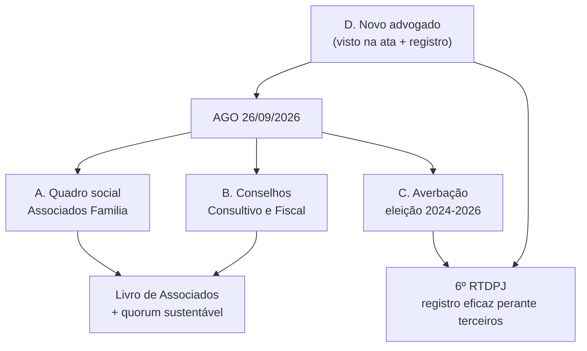

# 🏛️ Plano de Formalização do Quadro Social, Conselhos e Registro Legal

> **Contexto:** A AGO de **26/09/2026** é a janela para resolver quatro pendências estruturais
> identificadas na análise do acervo legal. Duas delas (quadro social e conselhos) são **matéria de
> assembleia** e precisam constar expressamente do edital; uma é **registral** (averbação 2024-2026) e
> uma é **contratação** (novo advogado, em substituição à Dra. Marta, aposentada).

---

## 1. Frentes de trabalho

---

## 2. Frente A — Formalização do Quadro Social (Associados Família)

### 2.1 Situação atual (o problema)
- **Estatuto vigente — art. 6º (transcrição confirmada):** “A associação é constituída por um número ilimitado de associados, distribuídos nas seguintes categorias:
  **I – Associados Família:** pais ou representante direto de pessoas com deficiência intelectual, preferencialmente síndrome de Down;
  **II – Associados Honorários:** todas as pessoas físicas ou jurídicas que desejam contribuir com participação voluntária no desenvolvimento das atividades da Associação;
  **III – Associados Mantenedores:** pessoas físicas ou jurídicas que desejam contribuir financeiramente com a manutenção e custeio das atividades da Associação.
  **§1º – O ingresso no quadro social da Associação será regulado pelo Regimento Interno.**”
- **Estatuto de constituição (2017/2018):** previa **apenas duas categorias — fundador e honorário** — nominando **5 Associados Fundadores**: *Paulo Addair Daniel Filho, Jorge Antonio Villalobos Briones, Regina Aparecida Justo Daniel, Maria de Lourdes Campos Bistafa e Alessandro Martins de Oliveira*, com a regra de que “todos os demais serão associados honorários”.
- **O problema:** (i) a categoria “fundador” **desapareceu** do estatuto vigente, e nunca houve **deliberação formal de enquadramento/admissão** dos associados nas três categorias atuais; (ii) **não existe Regimento Interno** aprovado que regule o ingresso (art. 6º, §1º); (iii) **não existe registro/livro de associados**. Na prática, o quadro social formal permanece o da fundação, enquanto o sistema tem **107 usuários** e **112 candidatos**.

### 2.2 Caminho jurídico correto (revisado após leitura do art. 6º)
1. **Elaborar e aprovar o Regimento Interno** (ou, no mínimo, um capítulo específico sobre o quadro social), disciplinando **requisitos e procedimento de ingresso** de cada categoria, direitos e deveres, contribuições (se houver) e hipóteses de suspensão/exclusão. O art. 3º, §5º do estatuto de constituição previa expressamente o Regimento aprovado em Assembleia Geral.
2. **Enquadrar os fundadores e o quadro atual** nas três categorias vigentes (a maioria dos fundadores é “Associado Família”, por serem pais/representantes diretos de atendentes; os demais, “Honorário” ou “Mantenedor”).
3. **Admitir formalmente** os responsáveis/atendentes e apoiadores conforme o Regimento, com **termo de associação** individual e **registro no Livro de Associados**.
4. **Incluir na ordem do dia da AGO de 26/09**: (a) aprovação do Regimento Interno (regras de ingresso); (b) **referendo/registro das admissões** e instituição do Livro de Associados; (c) definição das contribuições, se aplicável.

### 2.3 Ações
1. **Redigir a minuta do Regimento Interno** (capítulo do quadro social) — regras de ingresso por categoria, direitos (inclusive **direito a voto**, se aplicável a Honorário/Mantenedor), deveres, contribuições, suspensão e exclusão — **até 15/09** (base para deliberação na AGO).
2. **Montar a lista de candidatos a Associado Família** (pais/responsáveis de atendentes), com qualificação completa: nome, CPF, RG, endereço, e-mail, telefone, **atendente(s) vinculado(s)** e data de vínculo (fonte: base `candidatos`/`candidatos_usuarios`).
3. **Enquadrar os 5 fundadores** nas categorias vigentes (Família/Honorário/Mantenedor), com registro próprio de “fundador” como **informação histórica** no Livro de Associados.
4. **Reunião da Diretoria** (com ata) aprovando as admissões conforme o Regimento — até **15/09**.
5. **Incluir na ordem do dia da AGO**: (a) **aprovação do Regimento Interno**; (b) **referendo/registro das admissões** e instituição do **Livro de Associados**.
6. **Criar o Livro/Registro de Associados** — livro físico (ou ata específica) + **módulo no sistema** (`associados`): nº de registro, data de admissão, categoria, vínculo com atendente, status (ativo/suspenso/desligado), termo assinado, histórico de deliberações.
7. **Termo de Associação** individual (aceite do estatuto, direitos e deveres, contribuição se houver), com assinatura física ou eletrônica.

### 2.4 Cuidados técnicos (quórum)
- **Efeito colateral:** ampliar o quadro aumenta a base do “maioria absoluta” exigida na **1ª convocação** (art. 14, §3º). Recomendo instalar em **2ª convocação** (qualquer número) e mobilizar presença.
- **Ordem dos trabalhos:** por serem matérias do art. 13 (que exigem **50%+1 dos Associados Família presentes** e presença mínima de **30%**), aprovar o Regimento e o referendo das admissões **com a base de associados atual** e consignar esse critério expressamente na ata, para evitar circularidade entre “quem vota” e “quem está sendo admitido”.
- **Direito a voto por categoria:** o art. 6º não explicita se Honorários/Mantenedores votam (o art. 13, §1º exige quórum só de **Associados Família** nos itens sensíveis). Definir isso **no Regimento Interno** — é a peça que dá segurança jurídica ao quadro social.

---

## 3. Frente B — Conselhos: Consultivo e Fiscal

### 3.1 Conselho Fiscal — vago desde out/2024 (base estatutária confirmada)
- **Art. 24 (transcrição):** “O Conselho Fiscal será composto por **três membros efetivos e 1 suplente**, associados ou não, **eleitos pela Assembleia Geral**, sendo seu **mandato coincidente com o da Diretoria**.”
- **Art. 25:** atribuições — opinar sobre balanços e relatórios financeiros/contábeis; **examinar as contas da Diretoria no final de cada exercício** submetendo-as à aprovação da Assembleia; requisitar documentação; acompanhar auditores externos; e **convocar extraordinariamente a Assembleia Geral**.
- **Situação:** o Conselho Fiscal foi reeleito em 2022 (mandato coincidente com a Diretoria 2022–2024), mas a **AGO de 04/10/2024 — que elegeu a Diretoria 2024–2026 — não elegeu o Conselho Fiscal**. Como o mandato é **coincidente com o da Diretoria**, o órgão está **vago desde out/2024**.
- **Ação:** incluir na ordem do dia a **eleição de 3 efetivos + 1 suplente** (art. 24) e prever que o novo Conselho emita o **parecer sobre as contas** (art. 25, ii) antes da deliberação das contas na AGO.

### 3.2 Conselho Consultivo — previsto no estatuto; falta formalizar (base confirmada)
- **Art. 14, caput (confirmado):** “A assembleia geral será **presidida pelo Presidente do Conselho Consultivo** ou por outro membro do Conselho por ele indicado…”
- **Art. 26 (transcrição):** “O Conselho Consultivo será composto por **entidades ou pessoas dos diversos setores econômicos**, associados ou não, **referendados pela Assembleia Geral** da Associação, sendo seu **mandato coincidente com o da Diretoria**. **§1º** O Conselho Consultivo é **órgão não deliberativo**, portanto **não tem direito a voto**. **§2º** Integram **automaticamente** o Conselho Consultivo os **Ex-Presidentes** da Associação.”
- **Portanto:** **não é necessária alteração estatutária para criar o órgão** — ele já existe na norma. O que falta é **constituí-lo e referendá-lo em Assembleia Geral** (art. 26), com ata e termo de aceite, definindo a lista de entidades/pessoas.
- **Atenção à mesa da assembleia:** como o art. 14 atribui a presidência da mesa ao **Presidente do Conselho Consultivo**, e o órgão não está constituído, a AGO de 26/09 deve resolver isso na abertura: o Presidente da Diretoria conduz o item de **constituição/referendo do Conselho Consultivo** e, na sequência, **passa a mesa** ao seu presidente (registrando tudo em ata). Validar essa sequência com o advogado para não haver questionamento.
- **Sugestão de composição:** entidades e pessoas de setores econômicos ligados à causa (ex.: **UBRAFE**, **WTC/Sheraton**, **SENAI/Faculdade Theobaldo de Nigris**, **ABEOC**, apoiadores institucionais) e **ex-presidentes** por integração automática (§2º).

---

## 4. Frente C — Regularização do Registro (averbação 2024–2026)

### 4.1 Situação
- A **eleição e posse da diretoria 2024–2026** e a **alteração do art. 15, §1º** (aprovadas na AGO de 04/10/2024) **não foram averbadas** no **6º RTDPJ** — o requerimento de averbação existe no acervo, mas **sem data/protocolo**, indicando processo em aberto.
- **Falta o edital de convocação da AGO de 2024** no acervo — e ele é **anexo exigido** no requerimento (junto com a ata com visto de advogado, lista de presença e o estatuto consolidado).

### 4.2 Riscos
- **Ineficácia perante terceiros**: bancos (há precedente no próprio acervo: a ATA de 2020 foi averbada por exigência do Banco Itaú), parceiros, convênios públicos (SMPED/Prefeitura) e a Receita Federal (DBE) podem exigir prova da composição vigente da diretoria.
- Insegurança jurídica para os atos praticados pela diretoria atual e para a própria AGO de 26/09.

### 4.3 Caminhos (decidir com o novo advogado)
- **Via 1 (preferencial):** localizar o **edital de 2024** (busca em e-mails antigos, listas de transmissão/WhatsApp, pastas de eventos de 2024) + lista de presença → instruir e **protocolar a averbação** imediatamente, com visto de advogado.
- **Via 2 (se o edital não existir):** incluir na ordem do dia da AGO de 26/09 a **ratificação expressa dos atos da AGO de 04/10/2024** (prestação de contas, alteração do art. 15, §1º e eleição/posse 2024–2026) e **averbar a ata de 2026** que consolida essas deliberações — a ata nova nasce com edital regular (o de 26/09) e visto de advogado.
- **Via 3:** nova **eleição e posse** em 26/09, gerando ata registrável já com o mandato 2026–2028.
- Em qualquer via: **anexar o estatuto consolidado** e, se houver, o **texto consolidado** com as alterações aprovadas.

---

## 5. Frente D — Novo Advogado (substituição da Dra. Marta)

### 5.1 Por que é urgente
A ata da AGO de 26/09 só é **averbável** com **visto de advogado** (exigência do RTDPJ, conforme o próprio requerimento de averbação). Logo, a contratação precisa ocorrer **antes de 26/09** — idealmente **nesta semana**.

### 5.2 Perfil desejado
- Inscrição na **OAB/SP**, com prática em **Registro de Títulos e Documentos e Civil de PJ (RTDPJ)**.
- Experiência em **terceiro setor/OSC**: Código Civil arts. 53–69, **Lei 13.019/2014 (MROSC)**, **Lei 12.101/2009 (CEBAS)**, imunidades/isenções, prestação de contas.
- **LGPD** e proteção de dados de crianças/adolescentes (relevante para o Portal do Responsável).

### 5.3 Escopo mínimo (termo de referência)
1. Parecer sobre **regularização do quadro social** e validação dos **quóruns** aplicáveis.
2. **Revisão e consolidação do estatuto** (texto único), incluindo as alterações já aprovadas e as novas propostas.
3. **Minuta do edital** de convocação da AGO de 26/09 e conferência dos prazos (art. 14, §2º).
4. **Conferência/elaboração das atas** (AGO 2026 e, se necessário, ratificação de 2024) com **visto**.
5. **Instrução e protocolo das averbações** no 6º RTDPJ (2024–2026 e 2026–2028) e **atualização cadastral** (CNPJ/DBE).
6. Orientação sobre **Conselho Consultivo** e **Conselho Fiscal** (composição, mandato, competências, impedimentos).
7. Apoio na **formalização dos associados** (termo de associação, livro de associados, critérios de exclusão).
8. *(Fase 2)* Adequação **LGPD**: política de privacidade, termos de uso de imagem, encarregado (DPO), retenção de dados.

### 5.4 Ações paralelas
- Solicitar à **Dra. Marta / seu escritório (ou sucessor)** a **entrega do acervo**: procuração, vistos e minutas anteriores, protocolos do RTDPJ, cópias averbadas (registro nº **173.633**, averbação 181.731 e posteriores).
- Cotar **2 a 3 escritórios** e comparar escopo/preço/prazo; confirmar com o RTDPJ o formato exigido do **visto** e os documentos do pacote.

---

## 6. Proposta de Ordem do Dia para o edital de 26/09/2026

> ⚠️ **Toda matéria que exija alteração estatutária ou eleição precisa constar expressamente** do edital (convocação específica) e observar o quórum do art. 13, §1º.

1. Verificação de quórum e instalação (1ª e 2ª convocação).
2. Leitura e aprovação da ata da AGO anterior (**04/10/2024**) — e, se necessário, **ratificação de seus atos** (Frente C).
3. **Prestação de contas e relatório de atividades** do período **out/2024 a set/2026** (absorvendo o exercício **2025**, que não foi apreciado).
4. Apreciação e aprovação do **orçamento/programação de atividades** do exercício seguinte.
5. **Aprovação do Regimento Interno** (regras de ingresso no quadro social — art. 6º, §1º) e **referendo/enquadramento dos associados** (Família, Honorários e Mantenedores), com instituição do **Livro de Associados**.
6. **Eleição/formalização do Conselho Fiscal** e do **Conselho Consultivo**.
7. **Eleição da Diretoria 2026–2028** e posse (se aplicável ao mandato).
8. **Alterações estatutárias** — relacionar **artigo por artigo** (ex.: quadro social e categorias; conselhos; convocação por meios eletrônicos e assembleia híbrida; prazos; consolidação de nomenclaturas; LGPD).
9. Aprovação das **políticas de transparência, privacidade (LGPD) e uso de imagem**; apresentação do **novo site e do Portal do Responsável**.
10. Assuntos gerais.

---

## 7. Cronograma consolidado

| Data | Ação | Frente |
|---|---|---|
| **10–12/09** | Fechar ordem do dia; compilar lista de **Associados Família**; **minuta do Regimento Interno**; iniciar cotação de advogados | A · B · D |
| **11/09** | **Publicar o edital** (sítio + afixação na sede) — margem de segurança | C (base) |
| **15/09** | Ata da **Diretoria** aprovando admissões; contratação do advogado | A · D |
| **15–19/09** | Advogado revisa edital/estatuto; busca do edital de 2024 (Via 1) | C · D |
| **Até 24/09** | Prestação de contas out/2024–set/2026; minutas de ata com visto | C · D |
| **26/09** | **AGO** — referendo de associados, eleição de conselhos, contas, alterações | A · B · C |
| **27–30/09** | Lavratura/assinaturas; **averbação no 6º RTDPJ**; atualização CNPJ/DBE | C · D |
| **Out/2026** | Implantação do módulo **Livro de Associados** no sistema e publicação em Transparência | A |

---

## 8. Pendências de verificação (com o advogado / conferência documental)

1. ~~Redação exata do art. 14, caput~~ **CONFIRMADO** em render de 300 dpi: presidência da assembleia pelo **Presidente do Conselho Consultivo**.
2. ~~Capítulo de Associados~~ **PARCIALMENTE CONFIRMADO** (art. 6º: categorias Família/Honorários/Mantenedores; §1º remete ao **Regimento Interno**). **Pendente:** art. 7º e seguintes — **direitos**, **direito a voto** por categoria, deveres, suspensão/exclusão (OCR da metade inferior da página 2 em andamento).
3. ~~Previsão de Conselho Fiscal~~ **CONFIRMADO**: arts. 24 (3 efetivos + 1 suplente, mandato coincidente com a Diretoria) e 25 (atribuições, inclusive **convocar AGE** e **parecer sobre as contas**).
4. **Localização do edital da AGO de 04/10/2024** e da lista de presença correspondente (busca em e-mails/pastas antigas).
5. **Status real da averbação** do mandato 2024–2026 no 6º RTDPJ (protocolo e exigências pendentes).
6. **Livro de associados** da fundação: existe livro físico/registro com as assinaturas dos fundadores? (base para o novo registro)
7. **Ex-presidentes** da Associação (art. 26, §2º) — quem são, para integração automática ao Conselho Consultivo..

---

## 🔗 Conexões & Ecossistema
- **Parecer de convocação:** [[PARECER_CONVOCACAO_ASSEMBLEIA_26SET]]
- **Plano de análise funcional & compliance:** [[PLANO_ANALISE_COMPLIANCE_ASSEMBLEIA_26SET]]
- **Contexto:** [[GEMINI]] · [[HISTORY]] · [[REGRAS_DE_NEGOCIO]]
- **Sistema (futuro módulo de associados):** [[INFRA]] (VPS1 · MariaDB `projetoame`)
