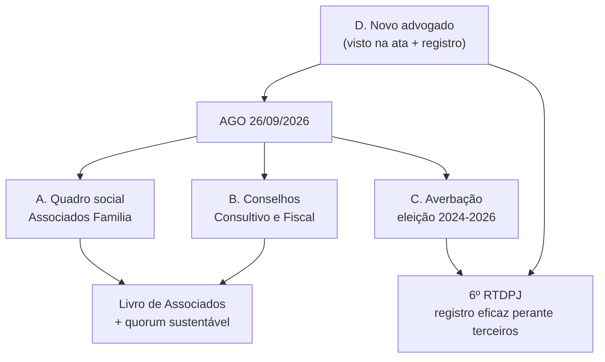

# 🏛️ Plano de Formalização do Quadro Social, Conselhos e Registro Legal

> **Contexto:** A AGO de **26/09/2026** é a janela para resolver quatro pendências estruturais
> identificadas na análise do acervo legal. Duas delas (quadro social e conselhos) são **matéria de
> assembleia** e precisam constar expressamente do edital; uma é **registral** (averbação 2024-2026) e
> uma é **contratação** (novo advogado, em substituição à Dra. Marta, aposentada).

---

## 1. Frentes de trabalho

---

## 2. Frente A — Formalização do Quadro Social (Associados Família)

### 2.1 Situação atual (o problema)
- O estatuto de constituição criou **duas categorias**: **fundador** e **honorário** — com **5 Associados Fundadores** nominados no §1º do art. 6º: *Paulo Addair Daniel Filho, Jorge Antonio Villalobos Briones, Regina Aparecida Justo Daniel, Maria de Lourdes Campos Bistafa e Alessandro Martins de Oliveira* — e a regra de que “**todos os demais serão associados honorários**”.
- O estatuto vigente (consolidado 2022 + alteração de 2024) passou a usar as categorias **Associado Família** e **Associado Honorário** (art. 13, §1º e art. 15, §1º).
- **Nunca houve deliberação formal de ampliação do quadro social.** Na prática, o quadro de associados com plenos direitos permanece o da fundação.
- Consequência dupla: (i) **base de quórum irreal** e juridicamente frágil; (ii) o site/sistema tem hoje **107 usuários** e **112 candidatos**, mas **nenhum registro de associado** categorizado.

### 2.2 Caminho estatutário previsto
O próprio estatuto define o rito: **indicação por um Associado Fundador → proposta à Diretoria → aprovação/referendo em Assembleia Geral** (art. 6º, §2º combinado com art. 13, item “referendar a admissão de associados feita pela Diretoria”).

### 2.3 Ações
1. **Montar a lista de candidatos a Associado Família** (pais/responsáveis de atendentes), com qualificação completa: nome, CPF, RG, endereço, e-mail, telefone, **atendente(s) vinculado(s)** e data de vínculo (fonte: base `candidatos`/`candidatos_usuarios`).
2. **Reunião da Diretoria** (com ata) aprovando a proposta de admissão — até **15/09**.
3. **Incluir na ordem do dia da AGO** o item “**Referendo da admissão dos novos Associados Família** e instituição do Livro de Associados”.
4. **Criar o Livro/Registro de Associados** — livro físico (ou ata específica) + **módulo no sistema** (`associados`): nº de registro, data de admissão, categoria, vínculo com atendente, status (ativo/suspenso/desligado), termo assinado, histórico de deliberações.
5. **Termo de Associação** individual (aceite do estatuto, direitos e deveres, contribuição se houver), com assinatura física ou eletrônica.
6. **Deliberar critérios** de admissão, suspensão e exclusão, e eventual **contribuição social** (valor, periodicidade, isenções).

### 2.4 Cuidados técnicos (quórum)
- **Efeito colateral:** ampliar o quadro aumenta a base do “maioria absoluta” exigida na **1ª convocação** (art. 14, §3º). Recomendo instalar em **2ª convocação** (qualquer número) e mobilizar presença.
- **Ordem dos trabalhos:** votar o referendo das admissões **por último** (ou consignar em ata a base utilizada) para evitar circularidade entre “quem vota” e “quem está sendo admitido”.
- **Se o estatuto vigente não definir com clareza** a categoria, seu rito e seus direitos → incluir **alteração estatutária** de consolidação na ordem do dia.

---

## 3. Frente B — Conselhos: Consultivo e Fiscal

### 3.1 Conselho Fiscal — provável vacância
- **2022:** o Conselho Fiscal foi **reeleito** (ata de 30/07/2022) — titulares Cláudio de Lima Bricks, José Pires Araújo Jr. e Fernando de Oliveira Bueno — mandato **2022–2024**.
- **2024:** a ata de 04/10/2024 **não trata de eleição/renovação do Conselho Fiscal** (apenas Diretoria e a alteração do art. 15, §1º).
- **Portanto:** o Conselho Fiscal está **provavelmente vago desde out/2024**. Como o art. 13, item (iii) atribui à assembleia **eleger** esses membros, **incluir a eleição do Conselho Fiscal na ordem do dia** (respeitando o que o estatuto exigir quanto a titulares/suplentes e impedimentos).

### 3.2 Conselho Consultivo — formalização
- O estatuto vigente, no **art. 14, caput**, refere-se à presidência da assembleia pelo **Presidente do Conselho Consultivo** (leitura obtida por OCR — **confirmar com o advogado**), mas **não há registro de sua composição** em nenhuma ata do acervo, e o estatuto de constituição listava como órgãos apenas *Assembleia Geral, Diretoria e Conselho Fiscal*.
- **Dois cenários:**
  1. **O estatuto o prevê** → basta **eleger/nomear** os membros na AGO, com **ata e termo de aceite**, definindo competências e mandato.
  2. **O estatuto não o institui formalmente** → é necessária **alteração estatutária** criando o órgão (composição, forma de nomeação, mandato, competências e caráter consultivo), **com o artigo expresso na ordem do dia** e quórum qualificado.
- **Sugestão de composição:** fundadores, ex-presidentes e representantes de parceiros institucionais (ex.: UBRAFE/WTC-Sheraton, SENAI/Theobaldo de Nigris), com função **consultiva** (sem poder deliberativo), apoiando governança, captação e articulação institucional.

---

## 4. Frente C — Regularização do Registro (averbação 2024–2026)

### 4.1 Situação
- A **eleição e posse da diretoria 2024–2026** e a **alteração do art. 15, §1º** (aprovadas na AGO de 04/10/2024) **não foram averbadas** no **6º RTDPJ** — o requerimento de averbação existe no acervo, mas **sem data/protocolo**, indicando processo em aberto.
- **Falta o edital de convocação da AGO de 2024** no acervo — e ele é **anexo exigido** no requerimento (junto com a ata com visto de advogado, lista de presença e o estatuto consolidado).

### 4.2 Riscos
- **Ineficácia perante terceiros**: bancos (há precedente no próprio acervo: a ATA de 2020 foi averbada por exigência do Banco Itaú), parceiros, convênios públicos (SMPED/Prefeitura) e a Receita Federal (DBE) podem exigir prova da composição vigente da diretoria.
- Insegurança jurídica para os atos praticados pela diretoria atual e para a própria AGO de 26/09.

### 4.3 Caminhos (decidir com o novo advogado)
- **Via 1 (preferencial):** localizar o **edital de 2024** (busca em e-mails antigos, listas de transmissão/WhatsApp, pastas de eventos de 2024) + lista de presença → instruir e **protocolar a averbação** imediatamente, com visto de advogado.
- **Via 2 (se o edital não existir):** incluir na ordem do dia da AGO de 26/09 a **ratificação expressa dos atos da AGO de 04/10/2024** (prestação de contas, alteração do art. 15, §1º e eleição/posse 2024–2026) e **averbar a ata de 2026** que consolida essas deliberações — a ata nova nasce com edital regular (o de 26/09) e visto de advogado.
- **Via 3:** nova **eleição e posse** em 26/09, gerando ata registrável já com o mandato 2026–2028.
- Em qualquer via: **anexar o estatuto consolidado** e, se houver, o **texto consolidado** com as alterações aprovadas.

---

## 5. Frente D — Novo Advogado (substituição da Dra. Marta)

### 5.1 Por que é urgente
A ata da AGO de 26/09 só é **averbável** com **visto de advogado** (exigência do RTDPJ, conforme o próprio requerimento de averbação). Logo, a contratação precisa ocorrer **antes de 26/09** — idealmente **nesta semana**.

### 5.2 Perfil desejado
- Inscrição na **OAB/SP**, com prática em **Registro de Títulos e Documentos e Civil de PJ (RTDPJ)**.
- Experiência em **terceiro setor/OSC**: Código Civil arts. 53–69, **Lei 13.019/2014 (MROSC)**, **Lei 12.101/2009 (CEBAS)**, imunidades/isenções, prestação de contas.
- **LGPD** e proteção de dados de crianças/adolescentes (relevante para o Portal do Responsável).

### 5.3 Escopo mínimo (termo de referência)
1. Parecer sobre **regularização do quadro social** e validação dos **quóruns** aplicáveis.
2. **Revisão e consolidação do estatuto** (texto único), incluindo as alterações já aprovadas e as novas propostas.
3. **Minuta do edital** de convocação da AGO de 26/09 e conferência dos prazos (art. 14, §2º).
4. **Conferência/elaboração das atas** (AGO 2026 e, se necessário, ratificação de 2024) com **visto**.
5. **Instrução e protocolo das averbações** no 6º RTDPJ (2024–2026 e 2026–2028) e **atualização cadastral** (CNPJ/DBE).
6. Orientação sobre **Conselho Consultivo** e **Conselho Fiscal** (composição, mandato, competências, impedimentos).
7. Apoio na **formalização dos associados** (termo de associação, livro de associados, critérios de exclusão).
8. *(Fase 2)* Adequação **LGPD**: política de privacidade, termos de uso de imagem, encarregado (DPO), retenção de dados.

### 5.4 Ações paralelas
- Solicitar à **Dra. Marta / seu escritório (ou sucessor)** a **entrega do acervo**: procuração, vistos e minutas anteriores, protocolos do RTDPJ, cópias averbadas (registro nº **173.633**, averbação 181.731 e posteriores).
- Cotar **2 a 3 escritórios** e comparar escopo/preço/prazo; confirmar com o RTDPJ o formato exigido do **visto** e os documentos do pacote.

---

## 6. Proposta de Ordem do Dia para o edital de 26/09/2026

> ⚠️ **Toda matéria que exija alteração estatutária ou eleição precisa constar expressamente** do edital (convocação específica) e observar o quórum do art. 13, §1º.

1. Verificação de quórum e instalação (1ª e 2ª convocação).
2. Leitura e aprovação da ata da AGO anterior (**04/10/2024**) — e, se necessário, **ratificação de seus atos** (Frente C).
3. **Prestação de contas e relatório de atividades** do período **out/2024 a set/2026** (absorvendo o exercício **2025**, que não foi apreciado).
4. Apreciação e aprovação do **orçamento/programação de atividades** do exercício seguinte.
5. **Referendo da admissão dos novos Associados Família** e instituição do **Livro de Associados**.
6. **Eleição/formalização do Conselho Fiscal** e do **Conselho Consultivo**.
7. **Eleição da Diretoria 2026–2028** e posse (se aplicável ao mandato).
8. **Alterações estatutárias** — relacionar **artigo por artigo** (ex.: quadro social e categorias; conselhos; convocação por meios eletrônicos e assembleia híbrida; prazos; consolidação de nomenclaturas; LGPD).
9. Aprovação das **políticas de transparência, privacidade (LGPD) e uso de imagem**; apresentação do **novo site e do Portal do Responsável**.
10. Assuntos gerais.

---

## 7. Cronograma consolidado

| Data | Ação | Frente |
|---|---|---|
| **10–12/09** | Fechar ordem do dia; compilar lista de **Associados Família**; iniciar cotação de advogados | A · B · D |
| **11/09** | **Publicar o edital** (sítio + afixação na sede) — margem de segurança | C (base) |
| **15/09** | Ata da **Diretoria** aprovando admissões; contratação do advogado | A · D |
| **15–19/09** | Advogado revisa edital/estatuto; busca do edital de 2024 (Via 1) | C · D |
| **Até 24/09** | Prestação de contas out/2024–set/2026; minutas de ata com visto | C · D |
| **26/09** | **AGO** — referendo de associados, eleição de conselhos, contas, alterações | A · B · C |
| **27–30/09** | Lavratura/assinaturas; **averbação no 6º RTDPJ**; atualização CNPJ/DBE | C · D |
| **Out/2026** | Implantação do módulo **Livro de Associados** no sistema e publicação em Transparência | A |

---

## 8. Pendências de verificação (com o advogado / conferência documental)

1. **Redação exata do art. 14, caput** do estatuto vigente (presidência da assembleia pelo *Conselho Consultivo* — leitura por OCR, a confirmar).
2. **Capítulo de Associados** do estatuto vigente: categorias em vigor, requisitos de admissão, direitos por categoria (voto), contribuições.
3. **Previsão de Conselho Fiscal**: número de titulares/suplentes, mandato e impedimentos.
4. **Localização do edital da AGO de 04/10/2024** e da lista de presença correspondente (busca em e-mails/pastas antigas).
5. **Status real da averbação** do mandato 2024–2026 no 6º RTDPJ (protocolo e exigências pendentes).
6. **Livro de associados** da fundação: existe livro físico/registro com as assinaturas dos fundadores? (base para o novo registro).

---

## 🔗 Conexões & Ecossistema
- **Parecer de convocação:** [[PARECER_CONVOCACAO_ASSEMBLEIA_26SET]]
- **Plano de análise funcional & compliance:** [[PLANO_ANALISE_COMPLIANCE_ASSEMBLEIA_26SET]]
- **Contexto:** [[GEMINI]] · [[HISTORY]] · [[REGRAS_DE_NEGOCIO]]
- **Sistema (futuro módulo de associados):** [[INFRA]] (VPS1 · MariaDB `projetoame`)
