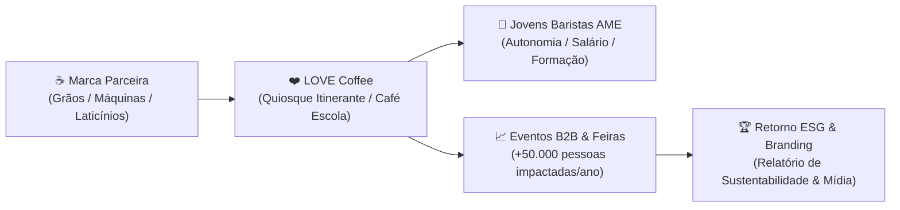

# PROPOSTA COMERCIAL DE PARCERIA & PATROCÍNIO ESG

## PROJETO LOVE COFFEE — O CAFÉ ESCOLA & ITINERANTE DA INCLUSÃO
**Uma iniciativa de impacto social da Associação Projeto A.M.E.**  
*CNPJ/MF nº 32.131.752/0001-88*  
*Portal Oficial:* [lovecoffee.ong.br](https://lovecoffee.ong.br) | [projetoame.org](https://www.projetoame.org)  
*Contato Institucional:* diretoria@projetoame.org | (11) 98000-0000  

---

## 1. APRESENTAÇÃO & CONCEITO

O **LOVE Coffee** nasce com um propósito revolucionário: transformar o amor pelo café em um ecossistema real de capacitação profissional, geração de renda e autonomia para jovens com Síndrome de Down e neurodivergentes.

Diferente de iniciativas assistencialistas, o LOVE Coffee opera no modelo de **Negócio Social de Alto Impacto**:
1. **Café-Escola e Barismo Inclusivo:** Módulos práticos de formação técnica (moagem, extração de espresso, vaporização de leite e atendimento receptivo de excelência).
2. **Food Carts & Quiosques Itinerantes em Eventos Corporativos:** Presença física em congressos, feiras de negócios, eventos corporativos (ex: no WTC Sheraton, Centro de Convenções e feiras industriais) operados diretamente pelos jovens baristas da AME.
3. **Ponto Fixo de Convivência & Cultura:** Criação de pontos de apoio e convivência comunitária onde o café se integra com música (em sinergia com o projeto **AME DJs**).

---

## 2. POR QUE SUA MARCA DEVE SE CONECTAR AO LOVE COFFEE?

Investir no LOVE Coffee não é filantropia — é **ESG de Alta Visibilidade (Social & Governança)** e **Marketing de Causa** com entrega concreta e tangível.

### Principais Benefícios para o Patrocinador:
* **Associação com Causa Nobre e Incontestável:** Sua marca no centro da inclusão produtiva e da transformação social no Brasil.
* **Degustação Qualificada de Produto (Sampling de Alto Nível):** Seu café, bebidas ou equipamentos sendo degustados por executivos, tomadores de decisão e formadores de opinião nos principais centros de convenções de São Paulo.
* **Conteúdo e Mídia Espontânea:** Produção contínua de fotos e vídeos institucionais dos atendentes operando o quiosque e recebendo formação com a marca, gerando acervo rico para o Relatório de Sustentabilidade/ESG da sua empresa.
* **Geração de Emprego Real:** Sua empresa como viabilizadora direta de postos de trabalho e bolsas-auxílio para jovens com deficiência.

---

## 3. MODALIDADES E COTAS DE PATROCÍNIO

Estruturamos modelos flexíveis de parceria, combinando aportes financeiros, equipamentos e fornecimento de insumos:

| Cota de Parceria | Perfil do Parceiro | Principais Contrapartidas | Formato de Aporte |
| :--- | :--- | :--- | :--- |
| **COTA MASTER (Naming Rights)** | Grande Torrefação / Marca Global de Bebidas | "LOVE Coffee por [Sua Marca]"; logotipo máster no quiosque, aventais, xícaras e copos ecológicos; destaque em todas as feiras corporativas e no portal; exclusividade no segmento. | Aporte Financeiro Anual + Fornecimento do Blend Exclusivo |
| **COTA EQUIPAMENTOS & TECNOLOGIA** | Fabricantes de Máquinas de Espresso / Moinhos | "Parceiro Tecnológico Oficial"; maquinário em comodato/doação nos food carts e sala de treinamento; placa de destaque em todos os balcões. | Máquinas Profissionais + Manutenção Preventiva |
| **COTA INSUMOS & BEBIDAS** | Laticínios / Bebidas Vegetais / Xaropes | Fornecimento oficial de leites, opções veganas e complementos de cafeteria; selo de parceiro sustentável nas mídias e no cardápio impresso/digital. | Fornecimento Mensal Recorrente de Insumos |
| **COTA APOIADOR INSTITUCIONAL** | Empresas Corporativas / Fundações ESG | Adote uma Turma de Baristas; custeio de bolsas-formação e transporte para 10 jovens por turma; certificado e troféu "Empresa Inclusiva AME". | Aporte Financeiro por Turma / Projeto |

---

## 4. CONTRAPARTIDAS DETALHADAS DE VISIBILIDADE

1. **Espaço Físico & Eventos:**
   * Aplicação da marca nas testeiras dos quiosques móveis e food carts da AME.
   * Aventais profissionais e uniformes dos baristas com bordado do patrocinador.
   * Embalagens e copos biodegradáveis co-branded (*LOVE Coffee + Marca Parceira*).
2. **Ambiente Digital & Mídia:**
   * Banner principal e página de agradecimento com link ativo no portal `lovecoffee.ong.br` e `projetoame.org`.
   * Publicações mensais dedicadas nas redes sociais da AME celebrando o impacto da parceria.
   * Produção de mini-documentário institucional sobre os baristas formados para veiculação no LinkedIn da empresa patrocinadora.
3. **Ativações Internas (Endomarketing):**
   * Diária do quiosque móvel LOVE Coffee na sede da empresa patrocinadora para servir gratuitamente aos colaboradores em datas comemorativas (Dia do Trabalho, Dia da Diversidade, Confraternização de Fim de Ano).

---

## 5. GOVERNANÇA, TRANSPARÊNCIA & DESTINAÇÃO DOS RECURSOS

A Associação Projeto A.M.E. é uma organização da sociedade civil (OSC) sem fins lucrativos constituída em 2018, inscrita no CNPJ sob o nº **32.131.752/0001-88**.

* **Segregação Contábil Estrita:** Todos os recursos arrecadados via patrocínio do LOVE Coffee são administrados em conta segregada auditável, destinados exclusivamente à:
  * Aquisição e manutenção de infraestrutura do quiosque móvel.
  * Remuneração de monitores técnicos e fonoaudiólogos/terapeutas de apoio.
  * Pagamento de diárias e bolsas-auxílio aos atendentes e baristas com Síndrome de Down.
* **Comprovação Fiscal:** Emissão de recibos institucionais oficiais e relatórios semestrais de prestação de contas com fotos, notas fiscais e métricas de impacto social.

---

## 6. PRÓXIMOS PASSOS PARA FORMALIZAÇÃO

1. **Reunião de Alinhamento & Degustação:** Visita técnica de nossa coordenação para apresentar a equipe, os materiais e definir a cota que melhor atende aos objetivos estratégicos da sua marca.
2. **Minuta de Parceria e Licenciamento Social:** Elaboração do Termo de Cooperação Técnica e Patrocínio com cláusulas claras de proteção de marca e contrapartidas.
3. **Lançamento Oficial:** Coquetel e apresentação do Quiosque LOVE Coffee com a presença da imprensa e formadores de opinião.

---

**ASSOCIAÇÃO PROJETO A.M.E.**  
*Transformando amor em trabalho digno e protagonismo.*  
São Paulo/SP, Outubro de 2026.
