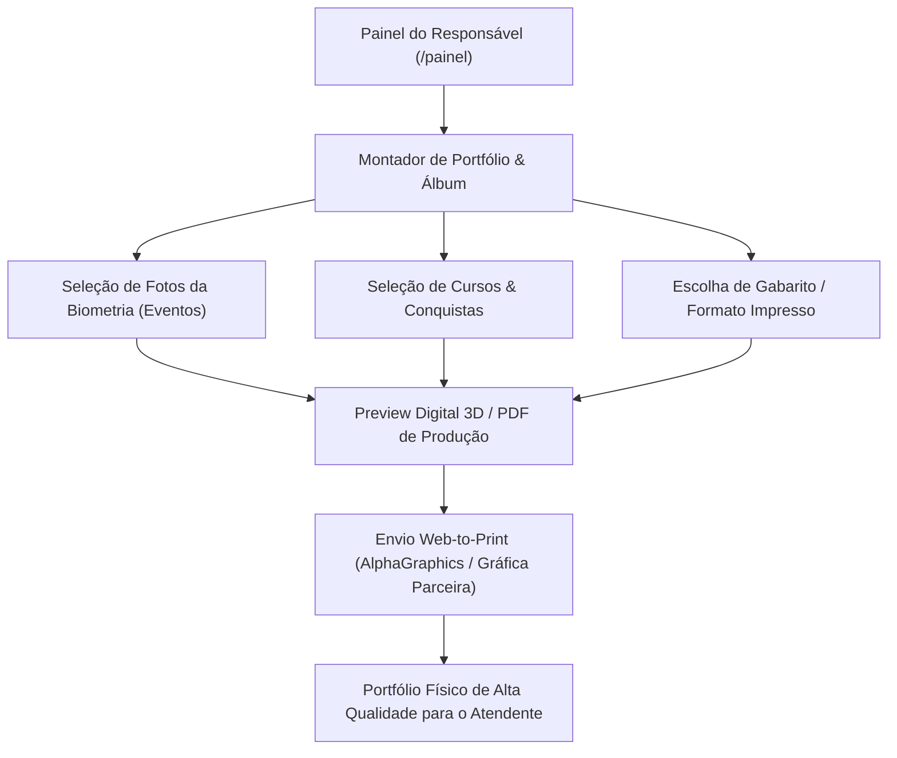

---
tags:
  - "#projeto/ame"
  - "#modulo/crm"
  - "#modulo/biometria"
  - "#modulo/web-to-print"
  - "#infra/vps1"
  - "#infra/vps2"
  - "#infra/vps3"
  - "#tipo/regras-negocio"
relacionados:
  - "[[PRINTADVISOR]]"
  - "[[AUTOMACAO]]"
  - "[[agenet]]"
  - "[[contacteme]]"
---

# Regras de Negócio - Projeto AME (Inclusão Social)

Este documento centraliza as diretrizes de integração de escalas, reconhecimento facial, geração de currículo profissional e o painel de impacto social do **Projeto AME** (Associação Mulheres Empreendedoras).

---

## 1. CRM e Sistema de Escala (adminescala)
- **Relação de Leads e CRM**: Os voluntários e atendentes são cadastrados como contatos unificados integrados ao funil do ageNET.
- **Importação de Escalas**: O sistema lê arquivos de escalas (ex: `AME_ESCALA_MARÇO_2026.xlsx`) contendo disponibilidade e turnos de voluntários escalados em feiras (como a EXPOPRINT, SENAI, SBT).
- **Esquema de Status do Atendente (`candidatos.ativo`)**:
  - `candidatos.ativo = -1`: **Inativo / Spam / Desativado** (novas inscrições entram como `-1` até moderação; completamente ocultos das escalas públicas).
  - `candidatos.ativo = 0`: **Treinamento** (atendente em capacitação).
  - `candidatos.ativo = 1`: **Ativo** (atendente pleno qualificado).
- **Algoritmo de Fila e Rodízio (`candidatos.rodizio`)**:
  - **Entrada na Fila ao Se Inscrever**: Ao realizar a inscrição inicial no sistema (`inscrever.php`), o novo candidato recebe automaticamente o valor `rodizio = MAX(rodizio) + 1`, ingressando no final da fila de prioridades.
  - **Fila Única por Precedência**: Tanto para atendentes ativos (`ativo = 1 AND rodizio > 0`) quanto em treinamento (`ativo = 0 AND rodizio > 0`), a convocação e exibição seguem a ordem estritamente crescente do campo `rodizio` (do menor valor para o maior).
  - **Promoção de Treinamento**: Ao concluir o treinamento, o candidato é promovido de `ativo = 0` para `ativo = 1`, mantendo inalterado o seu valor no campo `rodizio` (preservando sua posição relativa na fila).
  - **Preservação do Rodízio na Fase de Escala (Pré-Evento)**: O salvamento da escala no painel admin (`save_escala`) grava os selecionados em `disponibilidade.escalado = 1` sem alterar o valor do campo `candidatos.rodizio`. Isso garante que antes e durante o evento a lista pública exiba os atendentes no topo em sua ordem sequencial original do rodízio.
  - **Deslocamento Apenas Pós-Evento Realizado**: O deslocamento para o final da fila de prioridades (`rodizio = MAX(rodizio) + 1`) ocorre única e exclusivamente após a confirmação efetiva do atendimento/evento realizado (via `processar_rodizio.php` ou botão "Confirmar Presença" em `/admin/escala`), prevenindo distorções no rodízio em caso de faltas, ausências por doença ou imprevistos.
  - **Ficha de Avaliação Integrada ao Atendente**: No modal de presenças (`/admin/escala`), o monitor/coordenador dispõe do botão "Avaliar Atendente" para preencher a avaliação individual de desempenho (`/avaliar_atendente?evento_id=X&candidato_id=Y&sig=HASH`).
  - **Ficha de Avaliação Global do Contratante**: O painel disponibiliza a ação "Enviar Avaliação (Contratante)" que gera o link dinâmico da página pública de avaliação do evento (`projetoame.org/avaliacao/{evento_uuid}`) e permite o envio direto por WhatsApp ao contratante para avaliação em lote de toda a equipe escalada.
- **Lógica de Escala**: Os dados populam as tabelas locais `disponibilidade` e `escalas` no banco, vinculando o `candidato_id` aos eventos. Um atendente é considerado escalado no turno quando o campo `escalado = 1` no registro.

---

## 2. Reconhecimento Facial e Álbum de Atividades (Biometria)
- **Agente de Biometria (Turno Vespertino)**: Executado de forma automatizada das 20:00 às 22:00 na VPS3 (`scan_events.py`).
- **Processamento de Embeddings**: O motor em Python lê as fotos de perfil cadastradas dos atendentes no CRM e extrai vetores biométricos (embeddings faciais) usando modelos InsightFace/FaceNet.
- **Cruzamento via `link_artigo`**: O script lê o campo `link_artigo` gravado em `eventos_marcados` para extrair as mídias/fotos do post do WordPress de `projetoame.org/home`. Quando há compatibilidade (matching facial), a foto é vinculada ao respectivo voluntário em `fotos_reconhecidas`, gerando o álbum de fotos individual e o portfólio dinâmico das suas participações físicas para inclusão no currículo (`curriculo.php`).

---

## 3. Emissão de Currículo Dinâmico (HTML/PDF)
- **Geração de Currículo**: A página `curriculo.php` monta em tempo real a trajetória profissional do atendente com base na sua atuação no projeto.
- **Filtro Histórico**: Realiza buscas nas tabelas de eventos e disponibilidade, filtrando pelo `candidato_id` e status `escalado = 1`, ordenando as feiras e cursos de forma cronológica decrescente.
- **Conversão PDF**: Gera o currículo consolidado em PDF via biblioteca FPDF, ocultando dados sensíveis e exibindo as fotos do atendente escalado nos eventos oficiais.

---

## 4. Métricas e Página de Impacto (/nossaatuacao)
- **Calculadora de Atuação**: A página `nossaatuacao.php` calcula dinamicamente os indicadores gerais de impacto social da associação consultando o banco de dados:
  - Total de feiras e eventos realizados.
  - Total de cursos e capacitações concluídas (filtrando palavras-chave no nome do evento).
  - Total de horas de trabalho prestadas (soma da duração das escalas de todos os voluntários).
  - Contagem de atendentes cadastrados e voluntários ativos no ano corrente.
- **Ações de Conversão (CTA)**: Exibe botões responsivos de Call To Action que integram o doador ao sistema de Pix (*cafezinho.social*) e o parceiro comercial ao cartão de contato (*contacte.me*).

---

## 5. Arquitetura de Comunicação via WhatsApp (Evolution GO)
- **Engine / Gateway de Envio**: A comunicação automatizada e disparos diretos pelo painel admin serão realizados através da plataforma **Evolution GO** (https://evogo.netmailing.com.br) na VPS2.
- **Instância Conectada (NETGO1200)**: A instância oficial vinculada aos disparos do Projeto AME é a **NETGO1200**, que está emparelhada diretamente com o número de celular oficial do Projeto AME.
- **Canais de Destino**: Suporta disparos direcionados para os grupos oficiais do WhatsApp (como *Projeto AME Capacitação*, *Projeto AME Voluntários*, *Diretoria*, etc.).

---

## 6. Portfólio Impresso & Web-to-Print (Parceria AlphaGraphics / Gráfica Parceira)
- **Visão Estratégica**: Permitir que o responsável, dentro do `/painel`, personalize e monte o **Portfólio / Livro de Memórias & Currículo Físico** do atendente.
- **Fluxo Operacional (Web-to-Print)**:
  1. O responsável escolhe o layout/gabarito de impressão (ex: Caderno A5, Livro de Trajetória ou Portfólio de Apresentação em papel couchê encadernado).
  2. Seleciona as fotos oficiais e fotos reconhecidas pela biometria nas feiras que deseja incluir.
  3. Revisa o currículo integrado, cursos realizados e histórico de eventos.
  4. Dispara o pedido de impressão sob demanda (Web-to-Print) com integração ao parque gráfico parceiro (**AlphaGraphics** / rede parceira **PrintAdvisor**) via patrocínio institucional ou custo de produção subsidiado.

### 6.1 Monetização Institucional via Amazon Merch on Demand (Print-on-Demand Global)
- **Zero Risco / Zero Estoque**: Cadastro da marca Projeto AME no **Amazon Merch on Demand** para comercialização de produtos oficiais com repasse automático de royalties.
- **Linha Oficial de Inclusão**: Camisetas, moletons, ecobags e canecas com estampas autorais voltadas à inclusão social e neurodiversidade no mercado de trabalho ("Inclusão em Ação", "Eu Apoio o Trabalho Atípico", "Projeto AME").
- **Logística Integrada**: A Amazon gerencia manufatura sob demanda, embalagem, envio internacional/nacional e cobrança, direcionando os lucros líquidos para o sustento dos treinamentos dos atendentes.

---

## 7. Diretrizes Futuras de Governança
- **Efetivação de Rodízio Pós-Atendimento:** A atualização da posição do rodízio (`rodizio = MAX(rodizio) + 1`) ocorre após a confirmação presencial de atendimento no evento (check-in), prevenindo prejuízos em casos de faltas ou substituições.
- **População Retroativa de Histórico:** A tabela `historico_rodizio` pode ser alimentada retroativamente via script Python/PHP processando o histórico das planilhas anteriores para preservar a linha do tempo desde a fundação do projeto.

---

## 🔗 Conexões & Ecossistema
- **Infraestrutura:** [[VPS1_Hostinger]] (Apache / PHP / MariaDB Produção), [[VPS2_NASANET]] (Evolution API / LiteLLM Gateway), [[VPS3_Inferencia]] (Ollama / Python Biometria).
- **Projetos Relacionados:** [[PRINTADVISOR]] (Parceria Web-to-Print / AlphaGraphics), [[AUTOMACAO]] (Orquestração & CI/CD Noturno), [[contacteme]] (Crachás Virtuais e Cartão Digital), [[cafezinhosocial]] (Doações Pix).
- **Documentação Local:** [[GEMINI.md]], [[HISTORY.md]], [[docs/UX_PAINEL_DO_RESPONSAVEL_IMPECCABLE.md]].

