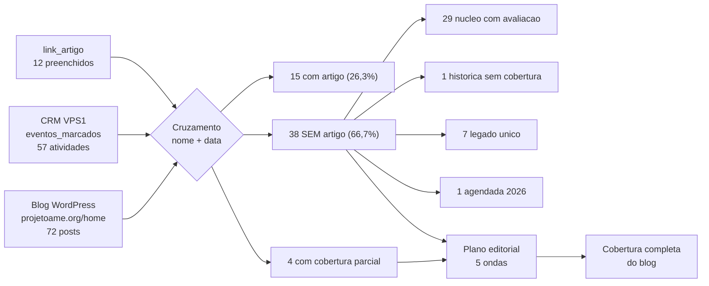

# Projeto AME — Cobertura do Blog x Base de Atividades

> Versao **2 — 18/09/2026**, apos a consolidacao das duplicatas legadas na producao. Blog: 72 posts publicos de `projetoame.org/home` (03/2016 a 09/2026). Base: tabela `eventos_marcados` do schema `projetoame` na **VPS1**, agora com **57 registros** (09/2017 a 10/2026).

## 1. Metodo

1. Coleta de **todos os posts publicos** via REST API do WordPress (`X-WP-Total = 72`). O feed `/home/rss` expoe apenas os 10 mais recentes e nao serve para auditoria completa.
2. Coleta da base de atividades em `eventos_marcados` na VPS1 (fonte de verdade — a copia local do XAMPP esta defasada).
3. Casamento por **nome do evento/projeto + janela de data** (atividade -> post ate 45 dias depois).
4. Validacao cruzada com o campo **`link_artigo`** da propria tabela (ver secao 6).

## 2. Panorama dos dois acervos

| Acervo | Volume | Periodo |
|---|---|---|
| Posts no blog | **72** | 03/03/2016 -> 15/09/2026 |
| Atividades em `eventos_marcados` | **57** | 01/09/2017 -> 06/10/2026 |
| — com ficha de avaliacao (UUID) = nucleo vivo | **40** | 11/03/2024 -> 15/09/2026 |
| — historicas 2017-2021 (sem UUID) | **6** | 2017 -> 2021 |
| — legado unico remanescente | **10** | 10/2023 -> 11/2025 |
| — agendada sem UUID | **1** | 15/09/2026 |

**Resultado do cruzamento:**

| Situacao | Registros | % da base |
|---|---|---|
| Com artigo proprio no blog | **15** | 26,3% |
| Com cobertura apenas parcial/duvidosa | **4** | 7,0% |
| **Sem nenhum artigo** | **38** | **66,7%** |

Os 38 sem artigo se decompõem em: **29** do nucleo com ficha de avaliacao, **7** registros legados unicos, **1** historica (Dr. Zan) e **1** agendada (3a turma do Curso de DJ).

## 3. Atividades COM artigo no blog (15)

| id | Data | Atividade | Local | Post que cobre |
|---|---|---|---|---|
| `70` | 13/11/2017 | Salão Duas Rodas 2017 | São Paulo Expo | _Salão Duas Rodas 2017_ (22/11/2017) |
| `69` | 21/05/2019 | FCE-Cosmetique | São Paulo Expo | _FCE-Cosmetique 2019_ (24/05/2019) |
| `44` | 13/12/2023 | Museu da Lingua Portuguesa | — | _Explorando as Raízes da Língua Portuguesa: Uma Jornada no Museu da Lín_ (28/01/2024) |
| `45` | 30/01/2024 | ABUP DECOR SHOW | — | _Atendentes Muito Especiais Brilham na ABUP DECOR SHOW 2024_ (04/02/2024) |
| `46` | 18/02/2024 | HOME & GIFT / TÊXTIL & HOME | — | _Atendentes Muito Especiais na ABUP HOME &amp; GIFT | TÊXTIL &amp; HOME_ (21/02/2024) |
| `2` | 11/03/2024 | FESPA DIGITAL PRINTING 2024 | Expo Center Norte | _Projeto AME Brilha na FESPA DIGITAL PRINTING 2024_ (14/03/2024) |
| `4` | 19/03/2024 | HOUS DECOR SHOW 2024 | São Paulo Expo | _Atendentes do Projeto AME Brilham no HOUS DECOR SHOW_ (23/03/2024) |
| `5` | 09/04/2024 | AUTOCOM | Expo Center Norte - Pavilhão Ama | _Atendentes Muito Especiais Encantam Visitantes na Feira AUTOCOM 2024_ (12/04/2024) |
| `11` | 19/10/2024 | ALPHAGRAPHICS SENAI | — | _Inclusão e acolhimento marcam o evento da AlphaGraphics com participaç_ (20/10/2024) |
| `14` | 18/01/2025 | CURSO BÁSICO | Faculdade Theobaldo de Nigris | _Capacitação e Planejamento para 2025: Projeto AME Realiza Cursos e Reu_ (27/01/2025) |
| `15` | 18/01/2025 | CURSO TECNOLOGIA PARA EVENTOS | Faculdade Theobaldo de Nigris | _Capacitação e Planejamento para 2025: Projeto AME Realiza Cursos e Reu_ (27/01/2025) |
| `16` | 18/01/2025 | CURSO FINANÇAS PARA VIDA | Faculdade Theobaldo de Nigris | _Capacitação e Planejamento para 2025: Projeto AME Realiza Cursos e Reu_ (27/01/2025) |
| `17` | 18/01/2025 | REUNIÃO DOS VOLUNTÁRIOS | Faculdade Theobaldo de Nigris | _Capacitação e Planejamento para 2025: Projeto AME Realiza Cursos e Reu_ (27/01/2025) |
| `20` | 08/02/2025 | CURSO DJ para Eventos | Faculdade Theobaldo de Nigris | _Projeto A.M.E. Lança Curso de DJ para Eventos: Inclusão e Oportunidade_ (01/02/2025) |
| `24` | 07/06/2025 | III Evento de Extensão Universitária | Faculdade Theobaldo de Nigris | _Quebrando Barreiras no Ritmo da Inclusão: DJs com Síndrome de Down For_ (08/06/2025) |

## 4. Atividades SEM artigo — LISTA PRINCIPAL (38)

### 4.1 Nucleo com ficha de avaliacao — 29 atividades

| id | Data | Atividade | Local | Prioridade |
|---|---|---|---|---|
| `72` | 15/09/2026 | MD MAKE A DIFFERENCE | MIRANTE PARQUE | ALTA (agendada) |
| `71` | 18/08/2026 | CONARH 2026 | São Paulo Expo | ALTA |
| `38` | 30/05/2026 | Evento de Extensão Universitária - SENAI OSASCO | Escola e Faculdade SENAI Nadir Dias  | ALTA |
| `37` | 17/05/2026 | DOWNLANDIA no MORUMBI TOWN | Studio 10 do SBT | ALTA |
| `36` | 05/05/2026 | FEBRATÊXTIL 2026 | EXPO CENTER NORTE | ALTA |
| `35` | 14/04/2026 | CURSO de Automaquiagem O Boticário | Centro de Revendedor  do Centro Empr | ALTA |
| `34` | 28/03/2026 | DOWNLANDIA no SBT | Studio 10 do SBT | ALTA |
| `33` | 20/03/2026 | EXPOPRINT CONVER FLEXO 2026 | Expo Center Norte | ALTA |
| `32` | 18/02/2026 | CURSO de Fotografia SENAI | Faculdade Theobaldo de Nigris | MEDIA |
| `31` | 13/02/2026 | CURSO de Fotografia SENAI | Faculdade Theobaldo de Nigris | MEDIA |
| `30` | 07/02/2026 | ALPHAGRAPHICS AGENTES DA TRANSFORMAÇÃO | SENAI - Faculdade Theobaldo de Nigri | ALTA |
| `26` | 16/09/2025 | MD MAKE A DIFFERENCE | MIRANTE PARQUE | BAIXA (recorrente) |
| `29` | 08/09/2025 | CURSO de Fotografia SENAI | Faculdade Theobaldo de Nigris | MEDIA |
| `28` | 26/08/2025 | Proyecto: Español para todos | St. Nicholas School | MEDIA |
| `27` | 18/08/2025 | ALELO - CONARH / MD MAKE A DIFFERENCE | MIRANTE PARQUE | BAIXA (recorrente) |
| `25` | 25/06/2025 | ABF EXPO 2025 | — | MEDIA |
| `21` | 14/03/2025 | FESPA DIGITAL PRINTING 2025 | Expo Center Norte | ALTA |
| `22` | 11/03/2025 | CURSO DJ para Eventos Turma I | Faculdade Theobaldo de Nigris | BAIXA (turma) |
| `23` | 11/03/2025 | CURSO DJ para Eventos Turma II | Faculdade Theobaldo de Nigris | BAIXA (turma) |
| `18` | 22/02/2025 | Aniversário Henri Zylberstajn | SWEET SECRETS | BAIXA |
| `19` | 18/02/2025 | FEBRATÊXTIL | EXPO CENTER NORTE | ALTA |
| `13` | 02/02/2025 | ABUP SHOW 2025 | DISTRITO ANHEMBI | ALTA |
| `12` | 01/02/2025 | ALPHAGRAPHICS AGENTES DA TRANSFORMAÇÃO | SENAI - Faculdade Theobaldo de Nigri | MEDIA |
| `10` | 12/08/2024 | ABUP DECOR SHOW 2024 | PROMAGNO CENTRO DE EVENTOS | ALTA |
| `9` | 26/06/2024 | ABF EXPO 2024 | — | ALTA |
| `8` | 28/05/2024 | MD MAKE A DIFFERENCE | MIRANTE PARQUE | BAIXA (recorrente) |
| `7` | 21/05/2024 | HOSPITALAR 2024 | São Paulo Expo | ALTA |
| `6` | 23/04/2024 | BETT BRAZIL 2024 | Expo Center Norte | ALTA |
| `3` | 15/03/2024 | II Summit de Responsabilidade Social – Diversidade e Inclusão no Ambiente de Trabalho | Fiesp - Federação das Indústrias do  | ALTA |

Caso a parte: a atividade `1` **Assembleia Geral Extraordinaria de 13/04/2024** (Hotel Sheraton WTC) tem apenas o edital de convocacao publicado em 30/03/2024 — nao existe artigo sobre a assembleia realizada.

### 4.2 Historicas 2017-2021 — 1 sem artigo + 3 com cobertura parcial

| id | Data | Atividade | Local | Observacao |
|---|---|---|---|---|
| `67` | 23/03/2019 | Dr. Zan | Hebraica | sem artigo proprio |
| `68` | 18/10/2021 | FESPA BRASIL | Expo Center Norte | post "FESPA BRASIL 2019" - edicao diferente da registrada (2021) |
| `65` | 01/09/2017 | Feiras & Negócios 2017 | São Paulo | post "Grande Encontro Feiras & Negocios" (2019) - aderencia incerta ao registro de 2017 |
| `66` | 08/07/2018 | Green Nations | Pavilhão da Bienal no Ibirapue | post "Green Nation 2019" - edicao diferente da registrada (2018) |

### 4.3 Registros legados unicos remanescentes — 7 atividades

| id | Data | Atividade | Local |
|---|---|---|---|
| `39` | 26/10/2023 | SINDIGRAF | — |
| `40` | 07/11/2023 | FOCUS FASHION SUMMIT | — |
| `41` | 23/11/2023 | CONGRAF | — |
| `42` | 24/11/2023 | PINI | — |
| `43` | 25/11/2023 | ASSEMBLEIA | — |
| `63` | 19/11/2025 | IX CONGRESSO BRASILEIRO SÍNDROME DE DOWN E VII CONGRESSO IBEROAMERICANO SÍNDROME | — |
| `64` | 22/11/2025 | ATIVIDADES | — |

### 4.4 Agendada (oportunidade imediata) — 1 atividade

| id | Data | Atividade | Local |
|---|---|---|---|
| `73` | 15/09/2026 a 06/10/2026 | 3ª turma CURSO DJ para Eventos | Faculdade Theobaldo de Nigris |

## 5. Consolidacao das duplicatas legadas (executada em 18/09/2026)

A tabela `eventos_marcados` continha **16 registros de um lote de importacao antiga** que refaziam registros do nucleo vivo (mesmo evento, mesma data, nome abreviado, sem ficha de avaliacao). Eles foram arquivados e as referencias filhas foram remapeadas.

| id legado | Nome legado | Data | Passou a apontar para |
|---|---|---|---|
| `47` | FESPA | 14/03/2024 | `2` (FESPA DIGITAL PRINTING 2024) |
| `48` | OLGA KOS / FIESP | 15/03/2024 | `3` (II Summit de Responsabilidade Social – Divers) |
| `49` | HOUS DECOR | 19/03/2024 | `4` (HOUS DECOR SHOW 2024) |
| `50` | AUTOCOM 2024 | 09/04/2024 | `5` (AUTOCOM) |
| `51` | BETT BRASIL | 23/04/2024 | `6` (BETT BRAZIL 2024) |
| `52` | HOSPITALAR | 21/05/2024 | `7` (HOSPITALAR 2024) |
| `53` | ABF Expo | 26/06/2024 | `9` (ABF EXPO 2024) |
| `54` | ABUP | 12/08/2024 | `10` (ABUP DECOR SHOW 2024) |
| `55` | ALPHAGRAPHICS | 18/10/2024 | `11` (ALPHAGRAPHICS SENAI) |
| `56` | Tecnologia para Eventos | 18/01/2025 | `15` (CURSO TECNOLOGIA PARA EVENTOS) |
| `57` | Financas para Vida | 18/01/2025 | `16` (CURSO FINANÇAS PARA VIDA) |
| `58` | Reuniao de Voluntarios | 18/01/2025 | `17` (REUNIÃO DOS VOLUNTÁRIOS) |
| `59` | CURSO DJ | 08/02/2025 | `20` (CURSO DJ para Eventos) |
| `60` | HENRI | 22/02/2025 | `18` (Aniversário Henri Zylberstajn) |
| `61` | FESPA - MONTAGEM | 14/03/2025 | `21` (FESPA DIGITAL PRINTING 2025) |
| `62` | MAKE THE DIFFERENCE | 16/09/2025 | `26` (MD MAKE A DIFFERENCE) |

| Efeito | Antes | Depois |
|---|---|---|
| `eventos_marcados` | 73 | **57** |
| `eventos_marcados_legado_20260918` (arquivo) | — | 16 |
| `horarios` | 189 | **141** |
| `horarios_legado_20260918` (arquivo) | — | 48 |
| `fotos_reconhecidas` | 668 | **365** |
| Referencias orfas | — | **0** |

Backup previo: `/root/backups/ame_pre_consolidacao_20260918.sql` (md5 `f35ee4dcfeedf7444dc3b38602312c37`), replicado em `scratch/backups/`. Nenhuma linha foi destruida — tudo esta nas tabelas de arquivo.

## 6. O campo `link_artigo` e o que ele revela

A tabela `eventos_marcados` **ja possui** a coluna `link_artigo` (varchar 255), feita para guardar a URL do post que cobre a atividade. Hoje ela esta preenchida em apenas **12 dos 57 registros (12 atividades distintas)** e com problemas:

| id | Atividade | link_artigo |
|---|---|---|
| `70` | Salão Duas Rodas 2017 | .../salao-duas-rodas-2017/ |
| `69` | FCE-Cosmetique | .../fce-cosmetique-2019/ |
| `45` | ABUP DECOR SHOW | .../atendentes-muito-especiais-brilham-na-abup-decor-show-2024/ |
| `46` | HOME & GIFT / TÊXTIL & HOME | .../atendentes-muito-especiais-na-abup-home-gift-textil-home-2024-uma- |
| `2` | FESPA DIGITAL PRINTING 2024 | .../projeto-ame-brilha-na-fespa-digital-printing-2024/ |
| `4` | HOUS DECOR SHOW 2024 | .../atendentes-do-projeto-ame-brilham-no-hous-decor-show/ |
| `5` | AUTOCOM | .../atendentes-muito-especiais-encantam-visitantes-na-feira-autocom-20 |
| `11` | ALPHAGRAPHICS SENAI | .../inclusao-e-acolhimento-marcam-o-evento-da-alphagraphics-com-partic |
| `14` | CURSO BÁSICO | .../projeto-a-m-e-lanca-curso-de-dj-para-eventos-inclusao-e-oportunida |
| `15` | CURSO TECNOLOGIA PARA EVENTOS | .../projeto-a-m-e-lanca-curso-de-dj-para-eventos-inclusao-e-oportunida |
| `16` | CURSO FINANÇAS PARA VIDA | .../projeto-a-m-e-lanca-curso-de-dj-para-eventos-inclusao-e-oportunida |
| `17` | REUNIÃO DOS VOLUNTÁRIOS | .../capacitacao-e-planejamento-para-2025-projeto-ame-realiza-cursos-e- |

**Problemas identificados:**

- O post do Curso de DJ (`.../projeto-a-m-e-lanca-curso-de-dj.../`) esta replicado em **4 atividades diferentes** (`14`, `15`, `16`, `20`), sendo que apenas `20` corresponde de fato ao lancamento do curso.
- `47` (legado), `49` (legado), `50` (legado), `55` (legado), `56` (legado) e `58` (legado) tinham o campo preenchido — agora arquivados; os valores foram herdados pelos nucleos `2`, `4`, `5`, `11`, `15` e `17`.
- Ficaram **sem preenchimento** atividades que TEM artigo, como `24` (III Evento de Extensao Universitaria) e `44` (Museu da Lingua Portuguesa).
- `link_artigo` deve virar a fonte de verdade operacional: e por ele que a esteira vai medir cobertura e evitar retrabalho.

## 7. Lacuna reversa: o blog registra o que o CRM nao cadastrou

| Post | Data |
|---|---|
| _Superação e Visibilidade: Projeto AME brilha em Evento na ALESP pelo Dia Internacional d_ | 21/03/2026 |
| _Maio Amarelo: Secretaria Municipal da Pessoa com Deficiência realiza ação Multa Moral co_ | 23/07/2023 |
| _Dia Internacional da Mulher no MASP_ | 08/03/2023 |
| _EPSON fecha parceria com associação de inclusão de pessoas com síndrome de down_ | 25/03/2023 |
| _Dia 21 de Março - Dia Internacional da Síndrome de Down_ | 21/03/2023 |
| _Sheraton e WTC apoiam o Projeto A.M.E._ | 29/07/2022 |
| _Grande Encontro Feiras & Negócios_ | 24/03/2019 |
| _Encontro ABEOC no Hotel Intercontinental em São Paulo_ | 20/12/2016 |

Casos notaveis: **evento na ALESP em 20/03/2026** (Dia Internacional da Sindrome de Down), **Maio Amarelo / Multa Moral**, **Dia Internacional da Mulher no MASP**, **barraca de cafe na FESPA 2023** e a participacao no **9o Simposio Internacional da Sindrome de Down**.

## 8. Plano editorial sugerido

| Onda | Foco | Atividades |
|---|---|---|
| 1 | Cobertura 2026 (retroativa curta) | `71` CONARH 2026, `38` SENAI Osasco, `37` DOWNLANDIA Morumbi, `36` FEBRATEXTIL 2026, `35` Curso Automaquiagem, `34` DOWNLANDIA no SBT, `33` EXPOPRINT 2026, `30` ALPHAGRAPHICS 2026 |
| 2 | Grandes feiras sem cobertura | `19` FEBRATEXTIL 2025, `13` ABUP SHOW 2025, `21` FESPA 2025, `10` ABUP DECOR SHOW 2024, `9` ABF EXPO 2024, `7` HOSPITALAR 2024, `6` BETT BRASIL 2024 |
| 3 | Trilha de capacitacao | `22`/`23` Turmas I e II de DJ, `29`/`31`/`32` Fotografia SENAI, `28` Espanhol, `12`/`30` Agentes da Transformacao |
| 4 | Recorrentes | `8`, `26`, `27`, `72` MD Make a Difference |
| 5 | Historico e governanca | `67`, `68`, `65`, `66`, `39`-`43`, `63`, `64`, `1` |

Padrao minimo por artigo de atividade: nome e data no titulo, local, numero de atendentes escalados, empresa/parceiro contratante, depoimento curto, galeria (alimentada por `fotos_reconhecidas`) e CTA para `contacte.me/projetoame`.

## 9. Fluxo do cruzamento

## 10. 🔗 Conexões & Ecossistema

- [[PROJETO_AME]] · [[GEMINI]] · [[HISTORY]] · [[REGRAS_DE_NEGOCIO]]
- Infra: `#infra/vps1` (site + WordPress + banco `projetoame`), `#infra/vps2` (Content Factory / n8n / LiteLLM), `#infra/vps3` (biometria / face_recognition)
- Modulos: `#modulo/crm` (`eventos_marcados`, `link_artigo`), `#modulo/biometria` (`fotos_reconhecidas`), `#modulo/content-factory` (tenant `projetoame` em `wp_content_factory_tenants.json`)
- Projetos irmaos: [[novaeraeditorial]] (recomendacao editorial), [[contacteme]] (cartao virtual do CTA)
