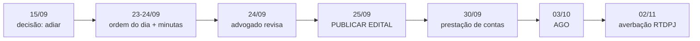
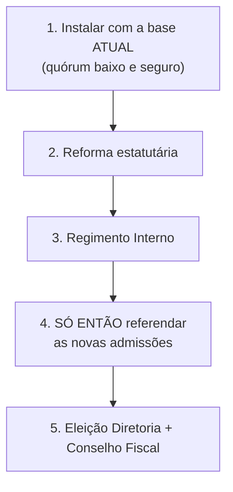

# 📋 Relatório de Encerramento — Sessão de Governança AME (15/09/2026)

> **Natureza:** relatório de encerramento de chat. Consolida **o que foi decidido**, **o que foi
> produzido**, **as orientações registradas**, **o que ficou pendente** e o **roteiro de retomada**
> para o próximo atendimento. Documentos técnicos completos: [[ANALISE_ESTATUTO_E_REFORMA_2026]] e
> [[ESTATUTO_VIGENTE_TEXTO_INTEGRAL]].

---

## 1. Decisão estrutural tomada nesta sessão

| Decisão | Antes | Depois |
|---|---|---|
| **Data da AGO** | 26/09/2026 | 🏛️ **03/10/2026 (sábado)** — adiada |
| **Motivo** | — | Fim do mandato 2024–2026 em **17/10/2026**; não havia tempo hábil para advogado, prestação de contas e reforma |
| **Prazo do edital** | 19/09/2026 | 🔴 **25/09/2026** (7 dias antes de 03/10) |
| **Estratégia de registro** | Averbar só a ata de 2024 | **Ratificação** na ata de 2026 + **averbação conjunta** das duas atas |

> ⚠️ **Os documentos `PARECER_CONVOCACAO_ASSEMBLEIA_26SET.md`,
> `PLANO_FORMALIZACAO_QUADRO_SOCIAL_E_GOVERNANCA.md` e
> `PLANO_ANALISE_COMPLIANCE_ASSEMBLEIA_26SET.md` continuam válidos no mérito**, mas as **datas de
> 26/09 e seus prazos retrocedidos estão superados** por este relatório.

---

## 2. Descoberta que destravou o trabalho

**Bloqueio de 09/09/2026:** *"os PDFs do estatuto são scans sem camada de texto — o OCR local
apresentou instabilidade"* → a análise estatutária estava parada.

**Solução (15/09/2026):** Paulo indicou o arquivo
`F:\OneDrive\Projeto A.M.E\01_Institucional_e_Legal\ATA E ESTATUTO ATUAL\PROJETO AME - ESTATUTO - 20240626_181102_OCR.pdf`,
que **possui camada de texto OCR** (Adobe Paper Capture, 6 págs.). Extração via `pdftotext`
funcionou de imediato → **38 artigos integrais recuperados**.

**Orientação para o futuro:** sempre que um PDF do acervo jurídico da AME for um scan, **procurar
primeiro a variante `_OCR.pdf`** na mesma pasta antes de acionar o modelo de visão local.

---

## 3. Achados estatutários relevantes (arts. que estavam pendentes)

| Artigo | Texto | Consequência |
|---|---|---|
| **art. 8º, §1º** | *"Votar é direito restrito aos associados família"* | 🔑 **Resolve a questão do quórum** — Honorários e Mantenedores não votam |
| **art. 15, §2º** | *"não poderá haver membros de uma mesma família"* na Diretoria | 🔴 **Provavelmente violado hoje** (Paulo e Regina são cônjuges) |
| **art. 11, §3º** | Veda cargo público na Diretoria | 🟡 Regra amplíssima — pode excluir voluntários qualificados |
| **arts. 10 §1º, 13 III/IV/V** | Citam **"Conselho de Administração"** | 🔴 **Órgão que não existe** no estatuto (é a Diretoria) |
| **art. 15, §3º** | 5 cargos fixos, sem "Captação" | 🔴 A ata de 2024 já cita *"diretora de captação"* **sem previsão estatutária** |
| **art. 14, §2º** | Antecedência mínima de **7 dias**, edital na sede **e no sítio** | ⚠️ Confirma o prazo; o "mito dos 15 dias" era só minuta |

---

## 4. Ordem de trabalhos obrigatória na AGO (evita circularidade de quórum)

> Como o **art. 8º, §1º** restringe o voto aos **Associados Família**, a AGO instalada com o quadro
> **ainda restrito aos fundadores** tem quórum **trivialmente alcançável — inclusive para alteração
> estatutária**:

| Base de Associados Família | Presença mínima (30%) | Votos p/ alterar o estatuto (50%+1) |
|---|---|---|
| **5 pessoas** | **2 pessoas** | **2 votos** |

> ⚠️ **Se as admissões forem votadas antes da reforma, a base de quórum se expande no meio do
> caminho** e o quórum passa a ser de risco. A sequência acima deve ser **consignada na ata**.

---

## 5. Ratificação da ATA de 04/10/2024 — orientação registrada

**Pergunta de Paulo:** *"A ratificação da ATA regulariza a lacuna por não termos registrado no tempo
certo? Entregamos as duas juntas?"*

**Orientação:**

1. ✅ **A ratificação é o caminho correto** e **as duas atas devem ser averbadas no mesmo requerimento**.
2. ⚠️ Mas ela **não retroage** — o registro em RTDPJ é **declarativo** e produz efeitos *ex nunc*.
3. ✅ O que a ratificação faz é **criar um título registrável novo**, em assembleia regularmente
   convocada, que **convalida** os atos de 2024 (prestação de contas, alteração do art. 15 §1º,
   eleição da Diretoria 2024–2026).
4. 🔴 O **edital de 04/10/2024 continua faltando** e **não é substituído** pela ratificação — a busca
   ativa deve continuar até 24/09. Se não for localizado, seguimos pela via da ratificação.
5. 📋 **Requerimento único** ao 6º RTDPJ (registro de origem nº **173.633**), com **6 documentos**:
   ata de 2024, ata de 2026, estatuto consolidado, editais (2026 e, se houver, 2024), listas de
   presença e **visto de advogado em ambas as atas**.
6. ✍️ **Cláusula de ratificação já redigida** e pronta para entrar na ata (ver
   [[ANALISE_ESTATUTO_E_REFORMA_2026]], item 1.4).

---

## 6. Conselho Consultivo — composição definida por Paulo

| Ex-presidente | Mandato | Forma de ingresso |
|---|---|---|
| **Marisa Evangelista** | **2018–2020** (1ª presidente) | **Automática** (art. 26, §2º) |
| **Paulo Addair Daniel Filho** | **2020–2022 e 2022–2024** | **Automática** (art. 26, §2º) |

**Pendências desta frente:**
- 🔎 Localizar o **nome civil completo de Marisa Evangelista** nas ATAs de 2018/2020 (necessário para
  o termo de aceite e o registro em ata).
- 🏢 Definir a lista de **entidades** do Conselho Consultivo (sugestões no plano: UBRAFE,
  WTC/Sheraton, SENAI/Theobaldo de Nigris, ABEOC).
- 👤 **Definir quem presidirá o Conselho Consultivo** (o estatuto atual **não diz** — omissão que
  precisa ser corrigida no Bloco VIII.2).
- 🔴 **Risco 8.14:** se **Paulo não se reeleger em 03/10**, ele **passa automaticamente ao Conselho
  Consultivo em 17/10** — órgão **não deliberativo e sem voto**. Mitigação: a cláusula do Bloco VIII.1,
  que devolve a **presidência da mesa ao Presidente da Diretoria**.

---

## 7. Gestão profissional remunerada (CLT) — orientação registrada

**Pergunta de Paulo:** *"Permitir a contratação de um diretor/gestor administrativo CLT, para
prospecção/administração, remunerado pela monetização/patrocínios. Não seriam membros da diretoria
ou conselhos. É viável? Precisa mudança estatutária?"*

**Orientação — veredito:** ✅ **SIM, é viável — e a arquitetura descrita é a correta.**

| Fundamento | Efeito |
|---|---|
| **art. 11, §1º** — vedação alcança **dirigentes** | Funcionário celetista **não é dirigente** → **não é alcançado** |
| **art. 16, V** — já autoriza *"admitir, contratar e dispensar funcionários"* | **Base já existe**; falta apenas disciplinar |

**🔴 RESTRIÇÃO CRÍTICA:** **CEBAS (Lei 12.101/2009, art. 30) VEDA a remuneração de dirigentes.**
→ **Remunera-se funcionário, NUNCA diretor.** Se o gestor precisar de poderes de gestão, usar
**procuração / delegação de competência** (prazo determinado, revogável), **não** cargo estatutário.

**Minuta já redigida** (Bloco XI): **art. 11 §§1º e 1º-A a 1º-D** · **art. 16, XI + §§1º a 3º** ·
**art. 13, XIII** · **art. 36, parágrafo único**.

**Implantação sugerida:** (1) **Gestor Administrativo CLT** — destrava a operação · (2) **Captador de
Recursos** ⚠️ remuneração variável sobre recurso público tem vedações · (3) Equipe de apoio ·
(4) Assessoria jurídica e contábil — **necessidade imediata**.

**⚠️ Cuidados:** **MROSC (Lei 13.019/2014)** exige **contabilidade segregada** por fonte (receita
própria × convênio); **Lei 9.608/1998** exige que o **termo do voluntário** afaste vínculo empregatício.

---

## 8. Reforma estatutária — 11 blocos propostos

| Bloco | Artigos | Matéria | Prioridade |
|---|---|---|---|
| I | 3º, 4º (+ 4º-A novo) | Objeto, receita própria, produtos | 🔴 |
| II | 1º | Sede eletrônica, mudança de endereço pela Diretoria | 🟡 |
| III | 6º–10º | Quadro social, Fundadores, Livro de Associados | 🔴 |
| IV | 13, 14 | Assembleia híbrida/eletrônica, procuração, mesa, convocação | 🔴 |
| V | 11 §3º, 15–19, 22 | Diretoria: composição, parentesco, cargos, assinaturas | 🔴 |
| **VI** | **4º-A (novo)** | **Marca, propriedade intelectual, licenciamento, produtos, uso de imagem** | 🔴 |
| VII | 24, 25 | Conselho Fiscal: parentesco, prazo de parecer, vacância | 🔴 |
| VIII | 26 | Conselho Consultivo: presidência, atribuições, ex-presidentes | 🔴 |
| IX | novos | LGPD, transparência, conflito de interesses, voluntariado, certidões | 🟡 |
| X | 29, 30, 33, 34 | Prazos, quórum de dissolução, auditoria, bens móveis | 🟡 |
| **XI** | **11 §§, 16 XI, 13 XIII, 36 § único** | **Gestão profissional remunerada (CLT)** | 🔴 |

**O Bloco VI é o que viabiliza o plano comercial de Paulo** (álbuns, álbum de figurinhas, portfólio,
mochilas, necessaires, cadernos, agendas, licenciamento de marca) — hoje **não há base estatutária
para nada disso**. Minuta completa no item 5 da [[ANALISE_ESTATUTO_E_REFORMA_2026]].

---

## 9. 🔴 Perguntas em aberto (bloqueiam a próxima etapa — precisam ser respondidas)

| # | Pergunta | Por que bloqueia |
|---|---|---|
| **1** | **Enquadramento fiscal atual da AME:** CEBAS? Utilidade Pública? OSCIP? Imunidade? | Condiciona **toda** a redação do Bloco XI (remuneração) |
| **2** | **Paulo concorre ao mandato 2026–2028?** | Define se ele entra no Conselho Consultivo em 17/10 e quem preside a mesa |
| **3** | **Confirmar 03/10/2026** como data da AGO e o **formato** (presencial / híbrida / online) | O edital precisa informar local, formato e link |
| 4 | **Composição da Diretoria 2026–2028** — quem são os 4 Associados Família + eventual Honorário? | Item de pauta com quórum qualificado |
| 5 | **Conselho Fiscal 2026–2028** — 3 efetivos + 1 suplente? | Órgão **vago desde out/2024** |
| 6 | **Presidente do Conselho Consultivo** — quem será? | O estatuto atual não define |
| 7 | **Entidades** do Conselho Consultivo | Constituição depende da lista |
| 8 | **Nome civil completo de Marisa Evangelista** | Termo de aceite e ata |
| 9 | **Regra de parentesco:** aceita "até 2 da mesma família, mínimo 2 famílias distintas"? | Corrige violação atual do art. 15, §2º |
| 10 | **Cargo público (art. 11, §3º):** atenuação para conflito específico? | Evita nulidade futura |
| 11 | **Contribuição social** de Associados Família — haverá? Qual valor? | Impacta o Regimento Interno |
| 12 | **Limite de licenciamento de marca** que a Diretoria pode contratar sem nova assembleia | Bloco VI / art. 13 |
| 13 | **Gestão remunerada:** perfil, faixa salarial, contratação em 2026 ou na próxima gestão? | Bloco XI / orçamento |
| 14 | **Auditoria externa** para o exercício 2026? | Reforça credibilidade perante patrocinadores |

---

## 10. Riscos críticos registrados (16 no total — os 5 prioritários)

| # | Risco | Ação |
|---|---|---|
| **8.2** | **Art. 15, §1º:** a alteração de 2024 **não averbada** — o estatuto *registrado* **ainda exige 5 Associados Família**, e a Diretoria atual tem **1 não-Família** | **Alteração expressa** em 03/10 (não só ratificação) |
| **8.3** | **Art. 15, §2º:** vedação de parentes na Diretoria **provavelmente violada** | Alterar **antes** da eleição 2026–2028 |
| **8.5** | **Livro de Associados inexistente** — o quórum de 03/10 não tem como ser provado | Produzir **antes** do edital (25/09) |
| **8.6** | **Edital de 04/10/2024 ausente** do acervo | Busca ativa até 24/09 |
| **8.13** | **Remuneração × CEBAS** — a linha entre "dirigente" e "empregado" precisa ser inequívoca | Levantar o enquadramento fiscal com o contador/advogado |

---

## 11. Artefatos produzidos nesta sessão

| Arquivo | Conteúdo | Situação |
|---|---|---|
| `ESTATUTO_VIGENTE_TEXTO_INTEGRAL.md` | **38 artigos** integralmente transcritos do OCR — para uso do advogado | ✅ commitado |
| `ANALISE_ESTATUTO_E_REFORMA_2026.md` | Parecer de ratificação + calendário + 11 blocos de reforma com redação proposta + ordem do dia (12 itens) + 16 riscos + 14 perguntas | ✅ commitado |
| `HISTORY.md` | 2 entradas novas (análise do estatuto; Bloco XI + Conselho Consultivo) | ✅ commitado |
| `GEMINI.md` | Quick Start Card atualizado (data da AGO, prazo do edital, documentos de governança) + bloco de prioridade no item 4 | ✅ commitado |
| `.gitignore` | Whitelist para os 2 novos documentos de raiz | ✅ commitado |
| `scratch/estatuto_OCR_raw.txt` | Texto bruto do OCR (não versionado) | 📁 local |
| `scratch/estatuto2022_FINAL.txt` | Extração das atas/edital de 2022 (não versionado) | 📁 local |

**Commits:** `bff0e68d` (análise inicial) · `3df35ac2` (Bloco XI + Conselho Consultivo) — ambos em
`origin/staging`.

---

## 12. Roteiro de retomada (próximo atendimento)

### Ordem sugerida, respeitando os prazos

| Ordem | Tarefa | Prazo | Depende de |
|---|---|---|---|
| **1** | **Livro de Associados** — cruzar fundadores (5) com os 13 presentes na AGO de 2024, classificar Família × Honorário | **até 22/09** | Base `usuarios`/`candidatos` (VPS1) |
| **2** | **Minuta do Edital de Convocação** — 12 itens da ordem do dia, artigo por artigo | **até 24/09** | Respostas 1–14 acima |
| **3** | **Minuta do Regimento Interno** (quadro social, ingresso, direito a voto, contribuições, suspensão e exclusão) | **até 24/09** | Resposta 11 (contribuição) |
| **4** | **Contratar o advogado** (substitui a Dra. Marta Rizzi Daniel, aposentada) — termo de referência já redigido | **até 24/09** | — |
| **5** | **Prestação de contas** out/2024–set/2026 (balanço, razão, conciliações, relatório de atividades) | **até 30/09** | Contador |
| **6** | **Publicar o edital** (sítio + afixação na sede, com foto datada) | **🔴 25/09** | Tarefas 2 e 4 |
| **7** | **Página de Transparência no site** (art. 14, §2º — "sítio da Associação") | até 03/10 | Site (VPS1) |
| **8** | **AGO** | **03/10** | Tudo acima |
| **9** | **Averbação conjunta** no 6º RTDPJ | **até 02/11** | Ata com visto |

### Comando de retomada

> *"Retomar governança AME: ler `ANALISE_ESTATUTO_E_REFORMA_2026.md` e este relatório; próxima
> tarefa = Livro de Associados."*

---

## 🔗 Conexões & Ecossistema
- **Análise e reforma (documento principal):** [[ANALISE_ESTATUTO_E_REFORMA_2026]]
- **Estatuto integral (fonte de consulta):** [[ESTATUTO_VIGENTE_TEXTO_INTEGRAL]]
- **Parecer de convocação (7 dias e quórum):** [[PARECER_CONVOCACAO_ASSEMBLEIA_26SET]]
- **Plano de formalização (4 frentes):** [[PLANO_FORMALIZACAO_QUADRO_SOCIAL_E_GOVERNANCA]]
- **Compliance, LGPD e transparência no site:** [[PLANO_ANALISE_COMPLIANCE_ASSEMBLEIA_26SET]]
- **Produtos, álbuns e Web-to-Print:** [[PLANO_AME_MAGAZINE_WEB_TO_PRINT]] · [[PRINTADVISOR]]
- **Contexto do projeto:** [[GEMINI]] · [[HISTORY]] · [[REGRAS_DE_NEGOCIO]]
- **Infra do sítio (sede eletrônica):** [[INFRA]] (VPS1 — `projetoame.org`)
- **Acervo legal de origem:** `F:\OneDrive\Projeto A.M.E\01_Institucional_e_Legal\ATA E ESTATUTO ATUAL\`
- **Cópia deste relatório em `apoio`:** `F:\01_Projetos\apoio\2026-09-15 — Encerramento Sessão Governança AME.md`
