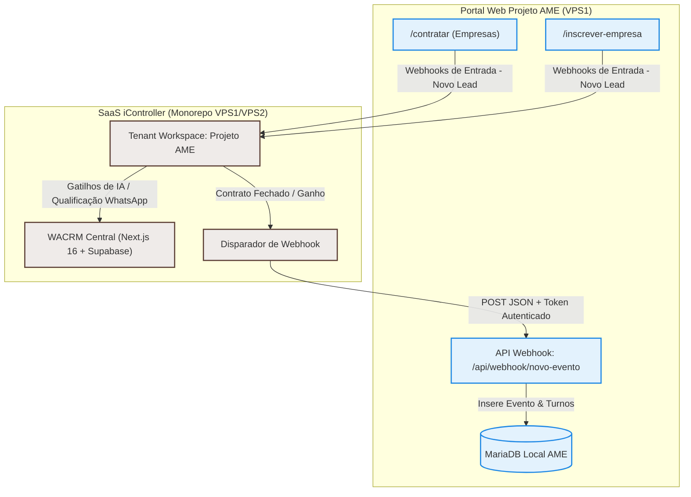

# Plano de Migração de CRM & Saneamento de Recursos - Projeto AME

Este documento detalha o planejamento estratégico para a desativação do CRM local e fragmentado do Projeto AME, a consolidação das prospecções no tenant AME do **iController (WACRM)**, a criação do fluxo de injeção de contratos e o saneamento dos recursos locais pendentes do AME para atingir 100% de estabilidade.

---

## 🗺️ 1. Nova Arquitetura de Fluxo de Dados

Com a migração do CRM, o site do **Projeto AME** deixa de fazer prospecção ativa de forma isolada e passa a operar como um **portal operacional de escala, currículos, e acompanhamento dos atendentes**. 



---

## 🗑️ 2. Componentes de CRM a Remover do Projeto AME

Para reduzir o inchaço técnico no código-fonte do Projeto AME, as seguintes implementações locais de CRM serão removidas ou adaptadas:

1. **Painel de Prospecção Administrativo:**
   - Remover a rota `/admin/prospeccao` e o arquivo correspondente `pages/adminprospeccao.php` (ou `pages/prospeccao.php`).
   - Apagar scripts Python locais de scraping de expositores (`find_exhibitors.py`, `api_find_exhibitors.php`) e desativar dependências venv do `duckduckgo_search`.
   - Remover o card/bloco de prospecção do Dashboard Administrativo principal (`pages/admin.php`).
2. **Tabela de Leads no Banco de Dados:**
   - Dropar a tabela local `leads_expositores` do banco de dados (os leads consolidados desta tabela já estarão mapeados no Supabase do WACRM).
3. **Páginas de Captação Pública (/contratar e /inscrever-empresa):**
   - Modificar os formulários destas páginas para que façam requisições `POST` (via cURL/AJAX) diretamente para os endpoints de captura do **WACRM do iController**, eliminando gravações locais no banco de dados do AME.

---

## 🔌 3. Fluxo de Injeção de Contratos (iController ➔ Projeto AME)

Quando uma oportunidade for marcada como **Contrato Fechado / Ganho** no pipeline do tenant AME do iController, o sistema fará a injeção do evento de forma automatizada.

### Especificação do Endpoint do Projeto AME:
* **Rota:** `POST https://projetoame.org/api/webhook/novo-evento`
* **Autenticação:** Header `Authorization: Bearer <AME_API_TOKEN>` configurado nas variáveis de ambiente.
* **Payload JSON Esperado:**
```json
{
  "nome_evento": "CONARH 2026",
  "local": "São Paulo Expo",
  "endereco": "Rodovia dos Imigrantes, 1,5 km",
  "inicio": "2026-08-18 14:00:00",
  "final": "2026-08-20 20:00:00",
  "obs": "Contrato fechado via iController. Trajes oficiais AME.",
  "horarios": [
    { "data_inicio": "2026-08-18 14:00:00", "data_final": "2026-08-18 20:00:00", "vagas": 4 },
    { "data_inicio": "2026-08-19 14:00:00", "data_final": "2026-08-19 20:00:00", "vagas": 4 },
    { "data_inicio": "2026-08-20 14:00:00", "data_final": "2026-08-20 20:00:00", "vagas": 4 }
  ]
}
```
* **Ações Internas no AME:**
  1. Insere o registro em `eventos_marcados` gerando um `UUID` automático.
  2. Varre a array de `horarios` e realiza a inserção dos postos de trabalho vinculando-os ao `evento_id` recém-criado.
  3. Dispara notificação no WhatsApp de capacitação informando que um novo evento está com escala aberta.

---

## 🧹 4. Saneamento e Recursos Operacionais a Consolidar (AME 100%)

Para estabilizar completamente o ecossistema local do Projeto AME, dividimos os recursos inacabados em 4 marcos críticos:

### 🌐 Marco A: Portal do Responsável & Wizard (UX Impeccable)
* [ ] **Wizard de Saúde e Cuidados:** Validar se os novos campos de saúde avançada (medicações, cuidados especiais/sensoriais e restrições) estão persistindo de forma estável no banco de dados e sincronizando via `api_perfil_save.php`.
* [ ] **GED & Envio de Documentos (/docs/{candidato_id}/):** Implementar formulário de upload de documentos obrigatórios (ASO, Laudo T21, Cessão de Direitos) com controle de data de validade dos arquivos.
* [ ] **Gestão Multidependentes & Co-responsável:** Finalizar fluxo de convite e autorização de co-responsável via link de WhatsApp.

### 📅 Marco B: Escalas, Presença e Rodízio Inteligente
* [ ] **Fila de Rodízio Dinâmica:** Implementar reordenação manual (Drag & Drop ou inputs numéricos) na visualização administrativa das filas para evitar correções via query direta.
* [ ] **Efetivação Pós-Evento:** Refatorar a ação de rodízio para que a movimentação do candidato para o final da fila de prioridade (`rodizio = MAX(rodizio) + 1`) ocorra **somente** após a confirmação presencial de atendimento (check-in/presença) no dia do evento, impedindo distorções no fluxo em caso de faltas justificadas.
* [ ] **Histórico Retroativo de Rodízio:** Concluir script de população da tabela `historico_rodizio` cruzando planilhas históricas de 2012 a 2025.

### 🤖 Marco C: Biometria, WordPress e Portfólio Impresso
* [ ] **Fase 2 de Foto Análise:** Criar script PHP no AME para servir as fotos reconhecidas (`fotos_reconhecidas`) ao frontend React para exibição dos álbuns individuais dos atendentes.
* [ ] **Portfólio Impresso (PrintAdvisor):** Criar tela de preview digital do portfólio físico com fotos biométricas, permitindo o fechamento e exportação de PDF de produção gráfica sob medida.

---

## 🔗 Conexões & Ecossistema
- **Integração:** [[iController]] (CRM Centralizador), [[PRINTADVISOR]] (Engine de Fechamento de PDFs & Produção Gráfica), [[AUTOMACAO]] (Monitoramento de Webhooks).
- **Diretrizes Técnicas:** [[GEMINI.md]], [[REGRAS_DE_NEGOCIO.md]], [[HISTORY.md]].
